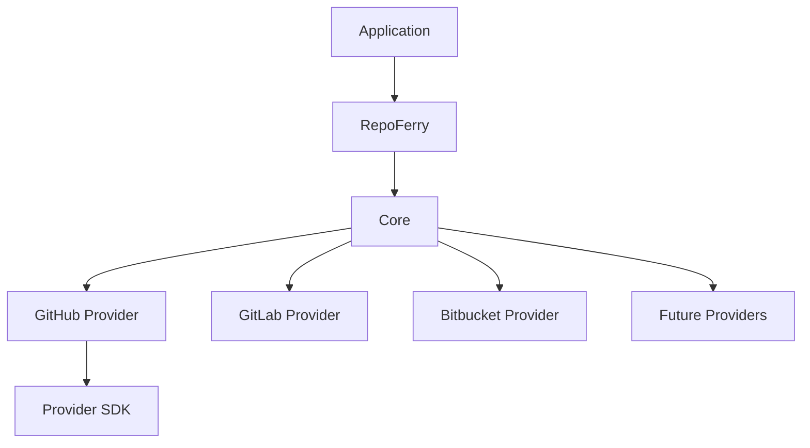

# ADR-001 — Project Vision, Goals & High-Level Architecture

**Status:** Accepted

**Version:** 1.0

**Date:** 2026-07-02

**Project:** RepoFerry

**Authors:** RepoFerry Architecture Team

**Related ADRs**

- None (Foundational ADR)

---

# 1. Context

Modern Git hosting providers expose different SDKs, APIs, authentication mechanisms, pagination models, and response formats.

Examples include:

| Provider | Official SDK |
|----------|--------------|
| GitHub | Octokit |
| GitLab | GitBeaker |
| Bitbucket | bitbucket |
| Azure DevOps | azure-devops-node-api |

Applications that support multiple providers often become tightly coupled to provider-specific SDKs. This increases maintenance costs, complicates testing, and makes adding new providers significantly more difficult.

RepoFerry addresses this problem by providing a single, provider-neutral abstraction layer for interacting with Git repositories.

Applications interact only with RepoFerry, regardless of where a repository is hosted.

---

# 2. Decision

RepoFerry will be designed as a provider-agnostic TypeScript library.

Applications communicate exclusively through RepoFerry's public API.

Provider SDKs remain private implementation details and must never be exposed through the public API.

This separation enables:

- consistent developer experience,
- long-term API stability,
- provider independence,
- simplified testing,
- future extensibility.

---

# 3. Vision

Build the standard JavaScript and TypeScript abstraction layer for Git repositories.

RepoFerry should allow developers to work with repositories through one intuitive API without needing to understand provider-specific SDKs or REST APIs.

The application should never need to know:

- which provider hosts the repository,
- how authentication differs,
- how pagination works,
- how provider responses are structured,
- which SDK performs the underlying operations.

---

# 4. Goals

RepoFerry aims to provide:

- A unified repository abstraction
- Provider-neutral APIs
- Excellent TypeScript support
- Rich IntelliSense
- Consistent naming conventions
- Predictable behavior
- High testability
- Extensible provider architecture
- Long-term API stability
- Outstanding developer experience

The library should feel comparable to mature SDKs such as:

- Axios
- Prisma Client
- Octokit
- TanStack Query

---

# 5. Non-Goals

RepoFerry is **not** intended to:

- replace Git,
- implement Git protocol operations,
- host repositories,
- expose provider SDKs,
- become a Git CLI replacement.

Provider-specific functionality remains available only through documented extension mechanisms.

---

# 6. Design Principles

The architecture is guided by the following principles.

## Provider Agnostic

The Core architecture must never depend on a specific Git provider.

Applications interact with a single, consistent API regardless of the repository host.

---

## Stable Public API

Public contracts are considered long-term compatibility commitments.

Internal implementations may evolve independently without affecting consumers.

---

## Separation of Concerns

Each subsystem has a clearly defined responsibility.

Examples include:

- Core
- Providers
- Authentication
- Transport
- Caching
- Diagnostics
- Testing

Each layer communicates only through well-defined abstractions.

---

## Extensibility

Adding a new provider should require no modifications to Core.

The architecture is designed to support official and community-developed providers through stable extension contracts.

---

## Developer Experience

The API should be:

- discoverable,
- intuitive,
- predictable,
- strongly typed,
- consistent across providers.

Excellent IntelliSense and clear documentation are considered core product features.

---

## Long-Term Maintainability

Architectural decisions prioritize:

- readability,
- explicit ownership,
- low coupling,
- high cohesion,
- semantic versioning,
- backward compatibility.

Short-term convenience must never compromise long-term maintainability.

---

# 7. Scope

## Initial Scope (v0.1)

The initial release focuses exclusively on GitHub.

Supported capabilities include:

- Opening repositories
- Reading repository metadata
- Browsing directories
- Reading text files
- Checking file or directory existence

GitHub integration is implemented internally using Octokit.

Octokit remains an implementation detail and is never exposed publicly.

---

## Future Scope

Future releases may support:

- GitLab
- Bitbucket
- Azure DevOps
- Gitea
- Local repositories
- ZIP archives
- Additional community-developed providers

These additions must not require breaking changes to existing public APIs.

---

# 8. High-Level Architecture

Applications communicate only with RepoFerry.

Provider implementations remain isolated behind stable abstractions.

---

# 9. Architectural Principles

RepoFerry follows these foundational principles.

- Architecture before implementation.
- Public contracts before implementation details.
- Stable abstractions over provider SDKs.
- Explicit ownership.
- Composition over inheritance.
- Provider isolation.
- Semantic Versioning.
- Progressive enhancement.
- Documentation-driven development.
- Long-term maintainability over short-term convenience.

These principles guide every subsequent architectural decision.

---

# 10. Expected Evolution

RepoFerry evolves incrementally.

The first release intentionally focuses on a single provider to validate the architecture before expanding the ecosystem.

Future providers integrate through the established extension architecture without redesigning Core.

Architectural evolution is governed through the Architecture Decision Record (ADR) process.

---

# 11. Consequences

## Benefits

- Clean provider abstraction
- Stable public contracts
- Excellent extensibility
- Improved developer experience
- Reduced vendor lock-in
- Easier testing
- Long-term maintainability

## Trade-offs

- Additional abstraction layer
- Slightly higher initial implementation complexity
- Provider adapters require disciplined maintenance

These trade-offs are accepted because they significantly improve long-term sustainability.

---

# 12. Alternatives Considered

## Expose Provider SDKs

**Rejected**

Reason:

Applications would become tightly coupled to provider implementations, defeating the purpose of RepoFerry.

---

## Build a GitHub-Only Library

**Rejected**

Reason:

Conflicts with the project's long-term vision of providing a universal Git repository abstraction.

---

## Runtime Provider Switching Without Abstraction

**Rejected**

Reason:

Provider-specific inconsistencies would leak into application code, reducing API consistency and increasing maintenance costs.

---

# 13. References

This ADR establishes the architectural foundation for RepoFerry.

Subsequent ADRs expand upon this vision without altering its core principles.

Related documents:

- ADR-002 — Domain Model & Public API
- ADR-003 — Package Architecture & Module Boundaries
- ADR-004 — Core Architecture, Internal Layering & Request Lifecycle
- ARCHITECTURE.md