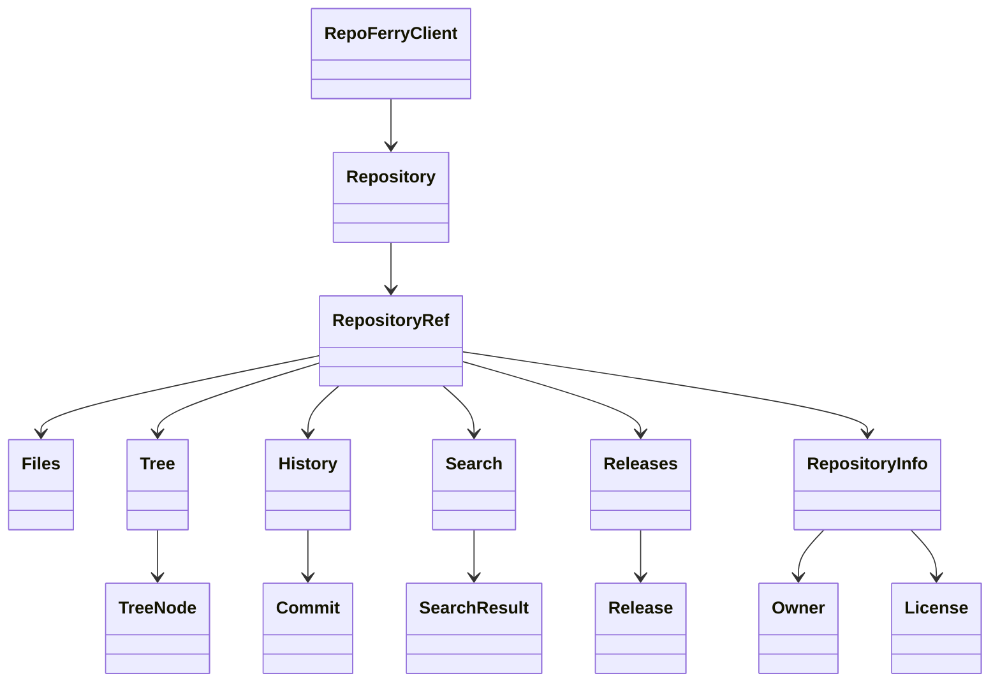
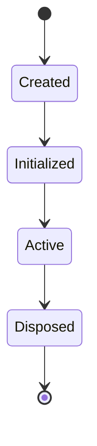
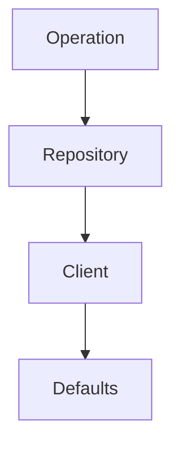
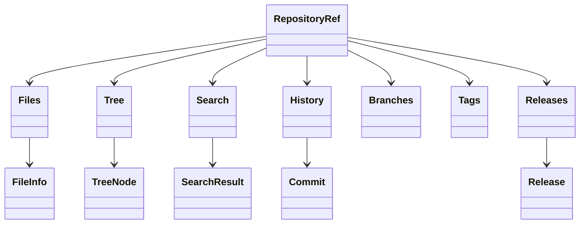

# ADR-002 — Domain Model & Public API Design

**Status:** Accepted

**Version:** 1.0

**Date:** 2026-07-02

**Project:** RepoFerry

**Authors:** RepoFerry Architecture Team

**Related ADRs**

- ADR-001 — Project Vision, Goals & High-Level Architecture
- ADR-003 — Package Architecture & Module Boundaries
- ADR-004 — Core Architecture, Internal Layering & Request Lifecycle
- ADR-005 — Provider Architecture, Ports & Adapters
- ADR-006 — Authentication, Identity & Credential Architecture
- ADR-011 — Type System, Serialization & Public Contracts

---

# 1. Context

RepoFerry aims to provide a provider-neutral API for interacting with Git repositories while remaining independent of any hosting platform.

The public API is the library's most valuable long-term asset.

Unlike internal implementation details, public contracts become part of RepoFerry's semantic versioning guarantees and must therefore prioritize:

- clarity,
- consistency,
- discoverability,
- backward compatibility,
- extensibility.

This ADR defines the complete domain model and public API philosophy that every future implementation must follow.

---

# 2. Decision

RepoFerry adopts a **service-oriented public API** centered around a small number of high-level service objects and immutable value models.

Applications interact with repositories through service objects, while retrieved data is represented by immutable value objects.

Provider-specific implementations remain hidden behind provider-neutral abstractions.

This separation allows the implementation to evolve independently without requiring changes to consumer code.

---

# 3. Public API Philosophy

The public API follows six fundamental principles.

## 3.1 Provider Neutrality

Applications should never depend on provider-specific SDKs or response models.

Every public contract must represent Git concepts rather than provider implementations.

Example:

```ts
const repository = await client.open(
    "https://github.com/facebook/react"
);
```

The application interacts only with RepoFerry.

Whether the repository is hosted on GitHub, GitLab, Bitbucket, or another provider remains an implementation detail.

---

## 3.2 Service Objects vs Value Objects

RepoFerry distinguishes between objects that perform work and objects that represent data.

### Service Objects

Service objects encapsulate behavior and maintain identity throughout their lifecycle.

Examples:

- RepoFerryClient
- Repository
- RepositoryRef

Responsibilities:

- execute operations,
- coordinate capabilities,
- access providers,
- expose fluent APIs.

---

### Value Objects

Value objects represent immutable data returned from operations.

Examples:

- RepositoryInfo
- Commit
- Branch
- Tag
- Release
- TreeNode
- FileInfo
- SearchResult

Characteristics:

- immutable,
- serializable,
- provider-neutral,
- free of runtime behavior.

This separation prevents identity confusion, simplifies caching, and improves serialization consistency.

---

## 3.3 Progressive Discovery

Developers should naturally discover functionality through IntelliSense.

Rather than exposing hundreds of unrelated methods, APIs are grouped into capability-oriented services.

Example:

```ts
repository.files.readText(...)

repository.tree.list(...)

repository.history.commits(...)
```

Grouping operations by capability improves discoverability and reduces cognitive load.

---

## 3.4 Explicit Context

Repository operations execute against an explicit Git reference.

Rather than requiring every operation to specify a branch or commit, RepoFerry introduces the concept of a Repository Reference.

Example:

```ts
const main = repository.ref("main");

const readme = await main.files.readText("README.md");
```

Once a reference is selected, subsequent operations inherit that context.

---

## 3.5 Immutable Public Contracts

All public value models are immutable.

Consumers receive readonly objects that cannot be modified.

Benefits include:

- thread safety,
- predictable caching,
- stable serialization,
- simpler reasoning,
- improved API consistency.

---

## 3.6 Stable Evolution

Public APIs are designed to evolve without breaking consumers.

Rules include:

- additive changes are preferred,
- optional properties preserve compatibility,
- provider-specific concerns remain isolated,
- breaking changes require a major release.

---

# 4. Core Domain Model

RepoFerry models Git concepts rather than provider concepts.



The model intentionally mirrors how developers reason about repositories.

---

# 5. Core Domain Entities

## RepoFerryClient

Entry point into the library.

Owns:

- configuration,
- provider registry,
- authentication,
- transport,
- diagnostics,
- cache manager.

A client may manage multiple repositories simultaneously.

---

## Repository

Represents a Git repository independent of any specific reference.

Owns:

- repository identity,
- provider session,
- repository metadata,
- reference creation.

A Repository does **not** directly expose file operations.

---

## RepositoryRef

Represents a repository viewed at a specific Git reference.

Examples:

- branch,
- tag,
- commit,
- pull request head (future).

All repository operations execute through RepositoryRef.

---

## Capability Services

RepositoryRef exposes capability-oriented service objects.

Examples:

- Files
- Tree
- History
- Search
- Releases
- Branches
- Tags

Each service owns a cohesive set of operations.

---

## Value Models

Examples include:

- RepositoryInfo
- Commit
- Branch
- Tag
- Release
- FileInfo
- TreeNode
- SearchResult
- Owner
- Organization

These models contain data only and are immutable.

---

# 6. Public Entry Point

RepoFerry exposes a single primary entry point.

```ts
import { RepoFerryClient } from "repoferry";
```

Applications create one or more clients.

Example:

```ts
const client = new RepoFerryClient({
    authentication,
    cache,
    transport
});
```

The client acts as the root of the runtime object graph.

---

# 7. Client Construction

RepoFerry intentionally avoids global mutable configuration.

Instead of static APIs:

```ts
RepoFerry.open(...)
```

applications create isolated client instances.

Example:

```ts
const client = new RepoFerryClient({
    authentication,
    cache,
    diagnostics
});
```

Benefits include:

- configuration isolation,
- improved testability,
- multiple concurrent clients,
- dependency injection friendliness,
- no hidden global state.

This architecture scales naturally to enterprise applications requiring multiple provider configurations.

---

# 8. Repository Lifecycle

Repositories follow a well-defined lifecycle.



## Created

Repository instance exists.

Provider session has been established.

No provider requests have yet been executed.

---

## Initialized

Repository metadata has been resolved.

Capabilities are available.

Lazy services remain uninitialized.

---

## Active

Repository performs operations normally.

Caches may populate during this phase.

---

## Disposed

Underlying resources have been released.

Further operations are invalid.

Calling `dispose()` multiple times is safe and has no additional effect.

---

# 9. Repository Identity

A Repository is uniquely identified by:

- provider,
- repository owner,
- repository name.

Identity remains constant throughout its lifetime.

Git references do not alter repository identity.

---

# 10. Repository References

Every repository operation executes within a reference context.

References may represent:

- branches,
- commits,
- tags,
- future pull request heads,
- future detached revisions.

Example:

```ts
const repository = await client.open(url);

const develop = repository.ref("develop");

const file = await develop.files.readText(
    "README.md"
);
```

This design avoids repeatedly specifying branches for every operation.

---

# 11. RepositoryRef Lifecycle

RepositoryRef instances are lightweight immutable service objects.

Characteristics:

- inexpensive to create,
- safe to reuse,
- cache-friendly,
- reference-specific,
- share underlying provider session.

Multiple RepositoryRef objects may coexist simultaneously.

Example:

```ts
const main = repository.ref("main");

const release = repository.ref("v2.0");

const commit = repository.ref(
    "0d34fa..."
);
```

Each represents an independent view of the same repository.

---

# 12. Configuration Hierarchy

Configuration is resolved through a four-level precedence model.



Highest precedence:

1. Operation configuration
2. Repository overrides
3. Client configuration
4. Library defaults

This hierarchy provides flexibility while maintaining predictable behavior.

---

# 13. Configuration Isolation

Every RepoFerryClient owns an independent configuration graph.

Example:

```ts
const publicClient = new RepoFerryClient({
    authentication: anonymous
});

const enterpriseClient = new RepoFerryClient({
    authentication: enterprisePAT
});
```

Each client maintains independent:

- authentication,
- provider registry,
- transport,
- caches,
- diagnostics.

No configuration is shared unless explicitly configured by the application.

---

# 14. Consequences (Part 1 & 2)

This design provides:

- provider-neutral APIs,
- explicit repository context,
- immutable public models,
- isolated client configuration,
- clean separation between behavior and data,
- strong IntelliSense,
- predictable API evolution,
- improved serialization,
- simpler testing,
- scalable runtime architecture.

The remaining sections of this ADR define the capability APIs, authentication surface, pagination model, asynchronous patterns, extension strategy, and API evolution guarantees.

---

# 15. Capability-Oriented API Design

RepoFerry organizes repository operations into cohesive capability services rather than exposing a large collection of unrelated methods.

Each capability owns a specific domain of responsibility.



Benefits:

- discoverability,
- clear ownership,
- extensibility,
- reduced API surface complexity.

---

# 16. Files Capability

The Files capability owns every operation related to repository files.

Responsibilities include:

- reading text files,
- reading JSON,
- reading binary content,
- downloading files,
- metadata retrieval,
- existence checks.

Files never expose provider-specific concepts.

---

## Design Philosophy

RepoFerry distinguishes between content formats instead of returning a single ambiguous type.

Instead of:

```ts
await ref.read("README.md");
```

RepoFerry exposes explicit operations.

Examples:

```ts
await ref.files.readText("README.md");

await ref.files.readJson("package.json");

await ref.files.readBinary("logo.png");

await ref.files.download("archive.zip");
```

Explicit methods improve:

- readability,
- IntelliSense,
- static typing,
- future extensibility.

---

## File Operations

The Files capability provides operations conceptually equivalent to:

| Operation | Purpose |
|-----------|---------|
| readText | Read UTF-8 text |
| readJson | Read and deserialize JSON |
| readBinary | Read binary data |
| download | Download file contents |
| exists | Determine whether a file exists |
| metadata | Retrieve file metadata |
| stream | Stream large files |

---

## File Metadata

Metadata is represented independently from file contents.

Examples include:

- SHA
- size
- content type
- last modified
- download URL (provider permitting)

Metadata retrieval does not require downloading the file.

---

# 17. Tree Capability

The Tree capability represents repository structure.

Responsibilities include:

- listing directories,
- traversing trees,
- recursive traversal,
- locating nodes.

The Tree capability owns hierarchy.

The Files capability owns content.

---

## Directory Operations

Examples include:

```ts
ref.tree.list();

ref.tree.list("src");

ref.tree.list("packages/core");
```

---

## Recursive Traversal

Traversal supports recursive enumeration.

Conceptually:

```ts
ref.tree.walk({
    recursive: true
});
```

Traversal returns immutable TreeNode value objects.

---

## TreeNode

TreeNode represents a node within the repository tree.

Examples:

- file
- directory
- symbolic link (future)

TreeNode never performs operations itself.

Behavior belongs to capability services.

---

# 18. Search Capability

Search provides provider-neutral repository search.

Search is intentionally separated from tree traversal.

Traversal discovers structure.

Search discovers content.

---

## Search Model

RepoFerry supports both simple and advanced search.

Simple:

```ts
ref.search.text("binary tree");
```

Advanced:

```ts
ref.search.query({
    text: "...",
    caseSensitive: false,
    regex: false,
    limit: 20
});
```

---

## SearchResult Hierarchy

Search results contain structured information.

```text
SearchResult
    │
    ├── File
    ├── Score
    └── Matches
            │
            └── MatchedLine
```

Each matched line contains:

- line number,
- matched text,
- surrounding context.

This hierarchy allows future provider implementations to improve search quality without changing the public model.

---

# 19. History Capability

History owns repository history.

Examples include:

- commits,
- commit lookup,
- file history,
- repository history.

---

## Commit Enumeration

History operations support filtering.

Examples include:

- author,
- date range,
- reference,
- pagination.

History returns immutable Commit value objects.

---

## File History

History may be scoped to a specific file.

Conceptually:

```ts
ref.history.file("README.md");
```

This operation remains provider-neutral.

---

# 20. Branches Capability

Branches represent mutable references.

Responsibilities:

- enumerate branches,
- retrieve branch information,
- future branch metadata.

Branch creation and mutation remain outside the initial scope.

---

# 21. Tags Capability

Tags represent immutable repository references.

Responsibilities include:

- listing tags,
- retrieving tag metadata.

Tag operations remain read-only.

---

# 22. Releases Capability

Releases represent published repository releases.

Responsibilities include:

- enumerate releases,
- retrieve release metadata,
- future release assets.

Provider-specific release concepts remain hidden.

---

# 23. README Convenience API

README is one of the most frequently accessed repository resources.

RepoFerry exposes a dedicated convenience operation.

Conceptually:

```ts
ref.readme();
```

Internally this remains a specialized file operation.

The convenience exists purely for developer experience.

---

# 24. Download & Streaming

Small files and large files have different requirements.

RepoFerry therefore distinguishes:

Buffered operations

↓

Streaming operations

---

## Buffered Operations

Appropriate for:

- Markdown
- source code
- configuration files
- JSON

---

## Streaming Operations

Appropriate for:

- archives,
- binaries,
- media,
- large datasets.

Streaming avoids loading the complete resource into memory.

---

## Streaming Philosophy

Streaming should propagate naturally through:

Provider

↓

Transport

↓

Application

The transport layer remains responsible for efficient delivery.

---

# 25. Authentication Surface

Authentication is intentionally absent from Repository and RepositoryRef.

Authentication belongs exclusively to RepoFerryClient configuration.

Example:

```ts
const client = new RepoFerryClient({
    authentication
});
```

Repository operations never accept credentials.

This keeps authentication:

- centralized,
- consistent,
- replaceable.

See ADR-006.

---

# 26. Provider Extensions

RepoFerry's public API remains provider-neutral.

Some providers expose unique capabilities.

Examples:

- GitHub Discussions
- GitLab Epics
- Azure Work Items

These features integrate through extension contracts rather than Core APIs.

Conceptually:

```ts
repository.extensions.github
```

or

```ts
repository.extensions.gitlab
```

Core remains unaware of provider-specific behavior.

See ADR-005.

---

# 27. Async Programming Model

Every operation that may require I/O is asynchronous.

Examples include:

- repository opening,
- file reading,
- history,
- search,
- downloads.

The API consistently adopts Promise-based asynchronous programming.

---

## Async Principles

- no synchronous network operations,
- predictable async behavior,
- cancellation support,
- provider-neutral execution.

---

# 28. Cancellation

Every long-running operation may accept an AbortSignal.

Examples:

- search,
- traversal,
- downloads,
- history,
- streaming.

Cancellation propagates through:

Application

↓

RepoFerry

↓

Provider

↓

Transport

↓

Underlying SDK

See ADR-007.

---

# 29. Pagination

Repository history and other large collections require provider-neutral pagination.

RepoFerry does not expose provider pagination models.

Instead, pagination is abstracted through consistent collection interfaces.

Pagination may internally use:

- page numbers,
- cursors,
- continuation tokens.

Applications remain unaware of provider-specific implementations.

---

## Pagination Philosophy

Collections should support:

- incremental loading,
- lazy enumeration,
- predictable continuation,
- provider-neutral semantics.

Future versions may expose AsyncIterable-based traversal.

---

# 30. Fluent API Opportunities

RepoFerry adopts selective fluency.

Good:

```ts
repository
    .ref("main")
    .files
    .readText("README.md");
```

Avoid:

```ts
repository
    .files()
    .metadata()
    .download()
    .cache()
```

Fluent APIs should improve readability without obscuring ownership.

---

# 31. Public API Consistency Rules

Every public capability follows consistent naming.

Read operations:

- readText
- readJson
- readBinary

Enumeration:

- list

Lookup:

- get

Existence:

- exists

Traversal:

- walk

Search:

- search

Download:

- download

Streaming:

- stream

Consistency is preferred over provider terminology.

---

# 32. Provider Neutrality

Every public contract models Git concepts.

Never provider concepts.

Examples:

Good:

- Repository
- Commit
- Branch
- Tag
- Release

Bad:

- PullRequestNode
- GitHubBlob
- GitLabTree

Provider-specific terminology belongs exclusively to extension contracts.

---

# 33. Capability Responsibilities

| Capability | Owns |
|------------|------|
| Files | File contents & metadata |
| Tree | Repository hierarchy |
| Search | Repository search |
| History | Commit history |
| Branches | Branch metadata |
| Tags | Tag metadata |
| Releases | Release metadata |

Capability ownership is exclusive.

Responsibilities should never overlap.

---

---

# 34. TypeScript Design Philosophy

TypeScript is considered a first-class design tool rather than merely a language feature.

Public types are part of RepoFerry's compatibility contract and therefore receive the same level of stability as runtime APIs.

The type system is designed to maximize:

- readability,
- IntelliSense,
- compile-time safety,
- long-term maintainability.

See ADR-011 for the complete type system architecture.

---

## Public Generics

Generics are exposed only when they represent genuine domain variability.

Example:

```ts
const pkg = await ref.files.readJson<PackageJson>(
    "package.json"
);
```

The generic represents the expected domain model.

Generics must **never** expose implementation details or provider-specific types.

---

## Avoiding Type Complexity

RepoFerry intentionally avoids exposing advanced TypeScript constructs unless they significantly improve developer experience.

Examples intentionally avoided in the public API include:

- deeply nested conditional types,
- provider-specific generic parameters,
- complex mapped types,
- branded primitive types.

Public contracts should remain approachable for the majority of TypeScript developers.

---

# 35. Result & Exception Philosophy

RepoFerry adopts an **exception-based programming model**.

Operations return successful values directly.

Failures are communicated through typed exceptions.

Example:

```ts
try {
    const readme = await ref.files.readText("README.md");
} catch (error) {
    // Handle failure
}
```

This approach aligns with the conventions of:

- JavaScript,
- TypeScript,
- Fetch API,
- Axios,
- Node.js.

It also integrates naturally with `async` / `await`.

---

## Why Not Result<T, Error>?

Alternative approaches such as `Result<T, Error>` were considered.

They were rejected because they:

- complicate common workflows,
- reduce readability,
- require additional branching for every operation,
- diverge from established JavaScript ecosystem conventions.

Internally, implementations may use Result-style patterns where beneficial, but the public API exposes exceptions.

See ADR-008 for the complete error architecture.

---

# 36. Public Contract Stability

Public APIs are treated as long-term compatibility commitments.

The following are considered stable public contracts:

- exported classes,
- exported interfaces,
- public methods,
- method signatures,
- parameter semantics,
- return types,
- documented behavior,
- documented error semantics.

Changes to these contracts follow Semantic Versioning.

---

# 37. API Evolution Rules

The public API evolves incrementally.

The following rules govern future changes.

## Allowed Without Breaking Changes

- Add optional properties.
- Add new capability services.
- Add overloads.
- Add optional parameters.
- Add new provider extensions.
- Add new immutable value models.

---

## Requires a Major Release

- Remove public APIs.
- Rename public members.
- Change method semantics.
- Change return types incompatibly.
- Remove documented behavior.
- Change public error contracts.

---

## Deprecation Process

Public APIs are never removed immediately.

The lifecycle is:

```text
Stable
   │
   ▼
Deprecated
   │
   ▼
Migration Guide
   │
   ▼
Major Release
   │
   ▼
Removed
```

Every deprecated API must include:

- a replacement,
- migration guidance,
- removal timeline.

See ADR-015 for governance details.

---

# 38. Naming Conventions

Consistency is prioritized over provider terminology.

## Services

Services use singular nouns.

Examples:

- Files
- Tree
- Search
- History
- Branches
- Tags
- Releases

---

## Operations

Operations use verbs.

Examples:

- readText
- readJson
- readBinary
- list
- walk
- search
- exists
- metadata
- download
- stream

---

## Value Objects

Value objects use descriptive nouns.

Examples:

- RepositoryInfo
- FileInfo
- TreeNode
- Commit
- Branch
- Release
- SearchResult

---

## References

Contextual objects use explicit names.

Examples:

- Repository
- RepositoryRef
- RepoFerryClient

Names should communicate intent without requiring documentation.

---

# 39. Example Usage

## Opening a Repository

```ts
import { RepoFerryClient } from "repoferry";

const client = new RepoFerryClient();

const repository = await client.open(
    "https://github.com/facebook/react"
);
```

---

## Selecting a Reference

```ts
const main = repository.ref("main");
```

---

## Reading a File

```ts
const readme = await main.files.readText(
    "README.md"
);
```

---

## Reading JSON

```ts
const pkg = await main.files.readJson<PackageJson>(
    "package.json"
);
```

---

## Traversing the Repository

```ts
const files = await main.tree.walk({
    recursive: true
});
```

---

## Searching

```ts
const results = await main.search.query({
    text: "binary tree"
});
```

---

## Reading History

```ts
const commits = await main.history.commits();
```

---

## Reading Releases

```ts
const releases = await main.releases.list();
```

---

## Streaming a Large File

```ts
const stream = await main.files.stream(
    "archive.tar.gz"
);
```

These examples intentionally use only public APIs and avoid provider-specific behavior.

---

# 40. Architectural Consequences

The adopted public API provides:

## Benefits

- Strong separation between behavior and data.
- Provider-neutral programming model.
- Explicit repository context.
- High discoverability.
- Excellent IntelliSense.
- Stable public contracts.
- Consistent naming.
- Clean extensibility.
- Improved testability.
- Predictable API evolution.

---

## Trade-offs

The design intentionally accepts:

- additional abstraction,
- more service objects,
- slightly higher initial learning curve,

in exchange for:

- long-term maintainability,
- architectural consistency,
- ecosystem scalability.

These trade-offs align with the goals established in ADR-001.

---

# 41. Alternatives Considered

## Static Global API

Example:

```ts
RepoFerry.open(...)
```

**Rejected**

Reason:

Global mutable state complicates testing, configuration isolation, and multi-client scenarios.

---

## Repository-Centric API

Example:

```ts
repository.read(...)
```

**Rejected**

Reason:

Mixes unrelated responsibilities into a single object and reduces API discoverability.

Capability-oriented services provide clearer ownership.

---

## Branch Parameter on Every Operation

Example:

```ts
repository.files.readText(
    "README.md",
    {
        branch: "main"
    }
);
```

**Rejected**

Reason:

Repeating reference information on every operation is verbose and error-prone.

`RepositoryRef` provides explicit and reusable context.

---

## Provider-Specific Public Models

Example:

```ts
GitHubCommit

GitLabCommit
```

**Rejected**

Reason:

Violates provider neutrality and couples applications to implementation details.

---

## Mutable Public Models

**Rejected**

Reason:

Mutable models complicate caching, serialization, and reasoning about application state.

Immutable value objects provide more predictable behavior.

---

# 42. References

This ADR defines the public programming model for RepoFerry.

Subsequent ADRs expand on the internal implementation of these contracts.

Related documents:

- ADR-001 — Project Vision, Goals & High-Level Architecture
- ADR-003 — Package Architecture & Module Boundaries
- ADR-004 — Core Architecture, Internal Layering & Request Lifecycle
- ADR-005 — Provider Architecture, Ports & Adapters
- ADR-006 — Authentication, Identity & Credential Architecture
- ADR-007 — Transport Architecture, Request Pipeline & Middleware
- ADR-008 — Error Model, Failure Semantics & Exception Architecture
- ADR-011 — Type System, Serialization & Public Contracts
- ADR-015 — Security, Compatibility & Long-Term Evolution

---

# ADR Summary

This ADR establishes the complete public programming model for RepoFerry.

It defines:

- the service-oriented object model,
- immutable value objects,
- capability-oriented APIs,
- repository reference semantics,
- client configuration,
- asynchronous programming model,
- provider-neutral contracts,
- public compatibility guarantees,
- naming conventions,
- API evolution rules.

Together with ADR-001, this document forms the foundation upon which all internal implementation decisions are built.