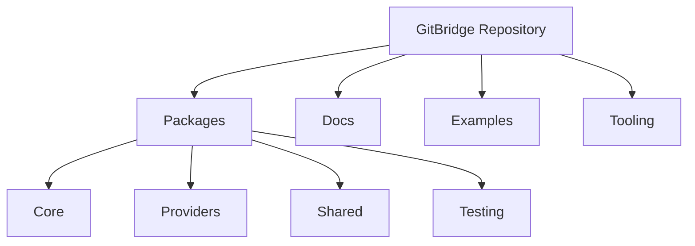
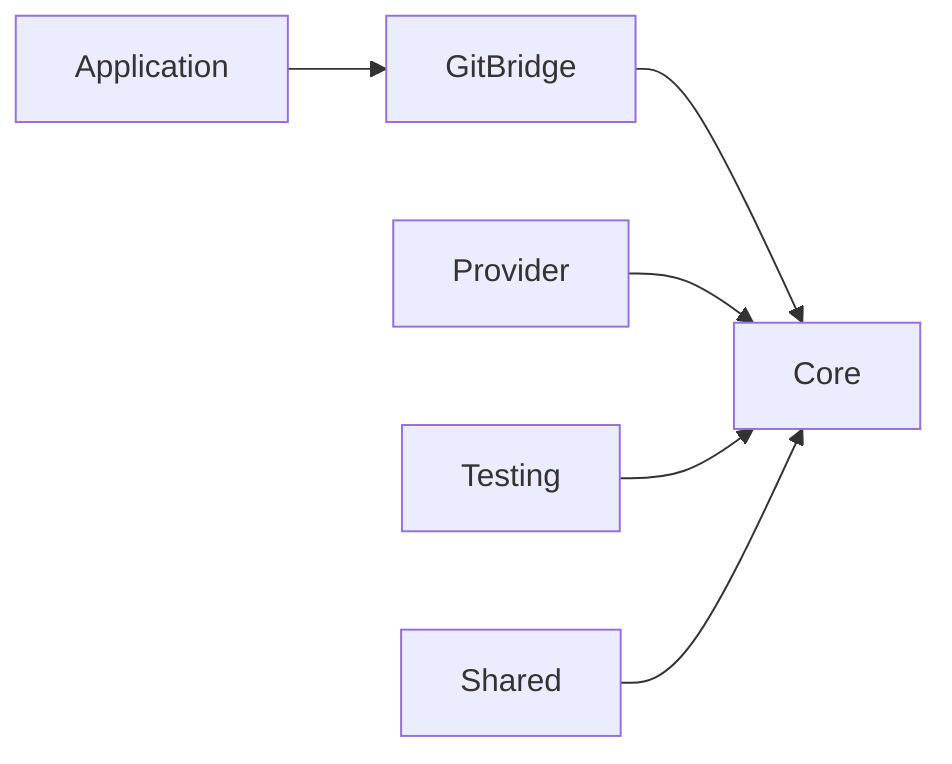
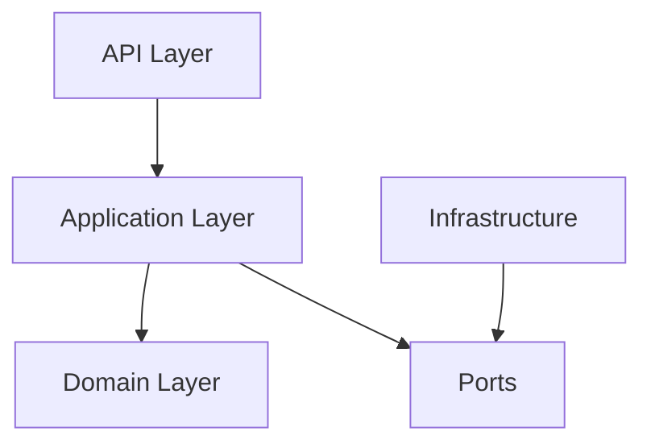
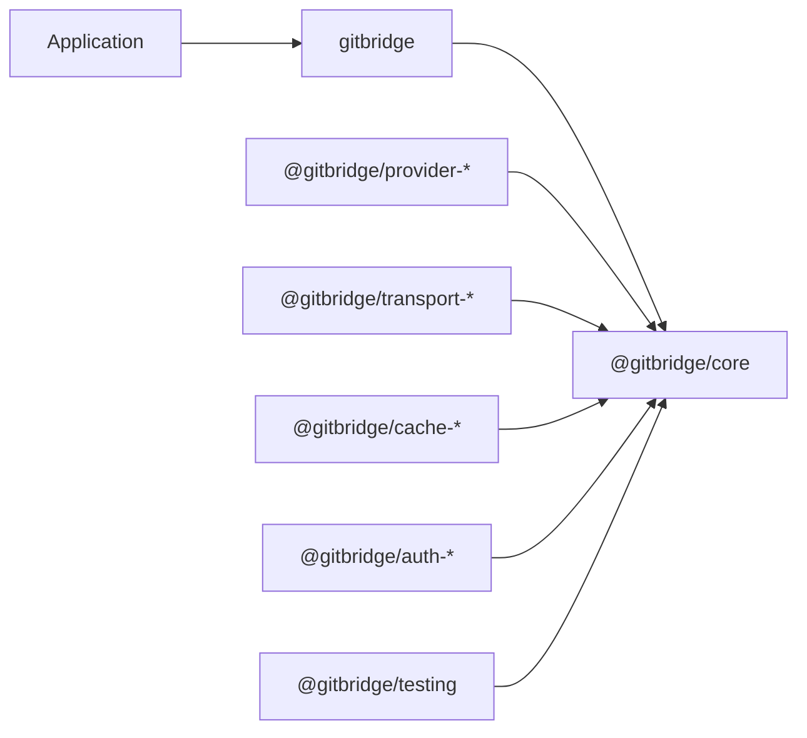

# ADR-003 — Package Architecture, Module Boundaries & Dependency Graph

**Status:** Accepted

**Version:** 1.0

**Date:** 2026-07-02

**Project:** GitBridge

**Authors:** GitBridge Architecture Team

**Related ADRs**

- ADR-001 — Project Vision, Goals & High-Level Architecture
- ADR-002 — Domain Model & Public API Design
- ADR-004 — Core Architecture, Internal Layering & Request Lifecycle
- ADR-005 — Provider Architecture, Ports & Adapters
- ADR-012 — Testing, Contract Verification & Quality Gates
- ADR-013 — Build System, Packaging, Versioning & Release Engineering

---

# 1. Context

GitBridge is designed as a long-lived open-source ecosystem rather than a single npm package.

The project must support:

- multiple providers,
- future capabilities,
- community-maintained packages,
- independent testing,
- clear ownership,
- long-term maintainability.

Without explicit package boundaries, responsibilities naturally become blurred, resulting in:

- circular dependencies,
- duplicated logic,
- provider leakage,
- unstable public APIs,
- difficult contributor onboarding.

This ADR defines the package architecture that protects the architectural boundaries established in ADR-001 and ADR-002.

---

# 2. Decision

GitBridge adopts a **multi-package monorepo** architecture.

Each package owns a single responsibility and communicates with other packages only through explicit public contracts.

The package architecture follows:

- Separation of Concerns
- Open/Closed Principle
- Dependency Inversion
- Stable Dependencies Principle
- Explicit Ownership

The Core package remains completely provider-neutral.

Provider packages depend on Core.

Core never depends on providers.

---

# 3. Package Architecture Philosophy

The package architecture is designed around four principles.

---

## 3.1 Clear Ownership

Every capability belongs to exactly one package.

Examples:

| Capability | Owner |
|------------|-------|
| Core runtime | @gitbridge/core |
| GitHub integration | @gitbridge/provider-github |
| Shared testing | @gitbridge/testing |
| Common utilities | @gitbridge/shared |

Packages should never compete for ownership.

---

## 3.2 High Cohesion

Packages group related responsibilities together.

Examples:

Provider packages own:

- SDK integration
- Mapping
- Provider sessions
- Capability implementations

Core owns:

- public runtime
- contracts
- orchestration
- lifecycle
- repositories

---

## 3.3 Low Coupling

Packages communicate through stable public contracts.

Implementation details remain private.

Internal modules are never imported directly by another package.

---

## 3.4 Extensibility

The package graph must support future additions without modifying existing packages.

Examples include:

- new providers,
- new cache implementations,
- new transports,
- new authentication strategies,
- new testing tools.

---

# 4. Monorepo Strategy

GitBridge adopts a **multi-package monorepo** managed through a shared workspace.



The repository is a single source of truth.

Each package remains independently testable and releasable while sharing infrastructure.

---

## Why a Monorepo?

Compared with separate repositories, a monorepo provides:

- consistent tooling,
- shared CI,
- shared linting,
- shared TypeScript configuration,
- easier refactoring,
- atomic architectural changes,
- simplified contributor workflow.

These benefits outweigh the increased repository size.

---

# 5. Package Strategy

GitBridge distinguishes between **public**, **internal**, and **future** packages.

---

## Public Packages

Published for application developers.

Examples:

```text
gitbridge

@gitbridge/core

@gitbridge/provider-github

@gitbridge/testing
```

Public packages follow Semantic Versioning.

---

## Internal Packages

Implementation details.

Examples:

```text
@gitbridge/internal-build

@gitbridge/internal-config

@gitbridge/internal-devtools
```

Internal packages are never consumed directly by applications.

They may evolve independently.

---

## Future Packages

Architecture reserves space for future expansion.

Examples include:

```text
@gitbridge/provider-gitlab

@gitbridge/provider-bitbucket

@gitbridge/provider-azure

@gitbridge/provider-gitea

@gitbridge/provider-local

@gitbridge/provider-zip

@gitbridge/cache-memory

@gitbridge/cache-redis
```

Their existence does not require architectural changes.

---

# 6. Package Dependency Philosophy

Dependencies always point toward stable abstractions.



Rules:

- Applications depend only on public packages.
- Providers depend on Core.
- Core never depends on providers.
- Internal packages never become public dependencies.

This direction protects architectural stability.

---

# 7. Public Package Overview

The initial ecosystem consists of four primary public packages.

```text
gitbridge
│
├── @gitbridge/core
├── @gitbridge/provider-github
├── @gitbridge/testing
└── @gitbridge/shared
```

The root package acts as the primary developer entry point.

Most applications import only:

```ts
import { GitBridgeClient } from "gitbridge";
```

Advanced consumers may reference individual packages where appropriate.

---

# 8. Root Package (gitbridge)

The root package provides the primary developer experience.

Responsibilities include:

- exporting public APIs,
- assembling default providers,
- exposing stable entry points,
- simplifying onboarding.

It intentionally contains very little implementation logic.

---

## Public Exports

Examples include:

- GitBridgeClient
- public types
- public errors
- stable utility functions

The root package does **not** expose provider internals.

---

## Responsibilities It Must Not Own

The root package must never own:

- provider implementations,
- transport implementations,
- authentication implementations,
- cache implementations,
- testing utilities.

Its purpose is composition, not implementation.

---

# 9. Core Package (@gitbridge/core)

The Core package is the architectural heart of GitBridge.

Every public runtime abstraction originates here.

Core owns:

- GitBridgeClient
- Repository
- RepositoryRef
- Provider contracts
- Authentication contracts
- Transport contracts
- Cache abstractions
- Diagnostics abstractions
- Public domain models
- Lifecycle orchestration

Core intentionally contains no provider-specific knowledge.

---

## Responsibilities

Core coordinates:

- repository creation,
- provider resolution,
- capability composition,
- request orchestration,
- configuration,
- object lifecycles.

Core defines interfaces but delegates implementation.

---

## What Core Must Never Know

Core must never know:

- Octokit,
- GitHub REST models,
- GitLab APIs,
- Bitbucket SDKs,
- HTTP implementations,
- provider authentication formats.

These responsibilities belong exclusively to provider packages.

---

# 10. Provider Packages

Each provider package adapts one hosting platform to GitBridge's provider contracts.

Examples include:

```text
@gitbridge/provider-github

@gitbridge/provider-gitlab

@gitbridge/provider-bitbucket

@gitbridge/provider-azure
```

Every provider implements the same provider contract defined by Core.

---

## Responsibilities

Provider packages own:

- SDK integration,
- API mapping,
- model translation,
- provider sessions,
- capability implementations,
- provider-specific optimizations.

Providers translate external systems into GitBridge concepts.

---

## Responsibilities They Must Never Own

Providers must never own:

- Repository objects,
- RepositoryRef objects,
- public domain models,
- lifecycle orchestration,
- configuration hierarchy,
- global caching.

Those responsibilities belong to Core.

---

# 11. Shared Package (@gitbridge/shared)

The Shared package contains reusable implementation building blocks.

Typical contents include:

- internal utility functions,
- common constants,
- reusable helper abstractions,
- lightweight implementation utilities.

The Shared package intentionally excludes domain behavior.

---

## Shared Package Principles

Shared exists to reduce duplication.

It is **not** a dumping ground.

Anything placed into Shared must satisfy two conditions:

- reusable across multiple packages,
- independent of business behavior.

---

## Shared Must Never Contain

Shared must never own:

- provider logic,
- repository logic,
- public runtime state,
- application workflows.

---

# 12. Testing Package (@gitbridge/testing)

The testing package supports verification of architectural contracts.

Responsibilities include:

- provider certification,
- reusable test fixtures,
- mock providers,
- contract verification,
- architecture test helpers,
- golden repositories.

Community providers depend on this package to validate compliance.

See ADR-012.

---

# 13. Reserved Future Packages

The architecture intentionally reserves namespaces for future capabilities.

Examples include:

```text
@gitbridge/auth-*

@gitbridge/cache-*

@gitbridge/transport-*

@gitbridge/plugin-*

@gitbridge/provider-*
```

These namespaces provide a predictable ecosystem structure while allowing independent evolution.

Reserved namespaces do not imply immediate implementation.

---

---

# 14. Internal Layering

Each package follows a consistent internal layering strategy.

The goal is to maximize cohesion while preventing architectural leakage.



Not every package must implement every layer.

Layers exist only when justified by package complexity.

---

## API Layer

Owns:

- public entry points,
- exported services,
- package façades.

Responsibilities:

- expose public contracts,
- translate user intent into application operations.

The API layer never contains business logic.

---

## Application Layer

Coordinates use cases.

Examples:

- opening repositories,
- resolving providers,
- composing capabilities,
- orchestrating workflows.

The Application layer owns behavior.

It never owns infrastructure.

---

## Domain Layer

Owns:

- domain concepts,
- business rules,
- immutable value models,
- domain services.

The Domain layer has no knowledge of:

- HTTP,
- SDKs,
- providers,
- serialization,
- transport.

---

## Ports Layer

Ports define stable interfaces.

Examples include:

- Provider
- Transport
- Cache
- Authentication
- Diagnostics

Ports describe *what* the system requires.

They never describe *how* it is implemented.

---

## Infrastructure Layer

Infrastructure implements Ports.

Examples include:

- GitHub SDK adapter
- Memory cache
- HTTP transport
- Diagnostics implementation

Infrastructure depends on Ports.

Ports never depend on Infrastructure.

---

# 15. Module Boundaries

Every module has explicit ownership.

| Module | Owns | Consumes | Exposes |
|---------|------|----------|----------|
| Core | Runtime orchestration | Ports | Public runtime |
| Provider | SDK integration | Core contracts | Provider registration |
| Transport | Request execution | Transport contracts | Transport implementation |
| Authentication | Authentication strategy | Authentication contracts | Strategies |
| Cache | Cache implementation | Cache contracts | Cache provider |
| Diagnostics | Telemetry implementation | Diagnostics contracts | Diagnostics services |

Ownership is exclusive.

Modules should never overlap in responsibility.

---

# 16. Dependency Graph

The dependency graph always points toward stable abstractions.



The graph intentionally contains no reverse dependencies.

---

## Forbidden Dependencies

The following dependencies are prohibited.

```text
Core
    X
Provider

Provider
    X
Provider

Transport
    X
Authentication

Shared
    X
Core Runtime

Application
    X
Internal Packages
```

Violations are considered architectural regressions.

Architecture tests verify these rules continuously.

See ADR-012.

---

# 17. Circular Dependency Prevention

Circular dependencies are prohibited.

Prevention relies on three principles.

---

## Stable Dependency Direction

Dependencies always point inward.

Core never depends on implementations.

---

## Explicit Ports

Packages communicate through contracts.

Never through implementation types.

---

## Public APIs Only

Packages consume only documented public exports.

Internal modules remain inaccessible.

---

# 18. Extension Strategy

GitBridge is designed for ecosystem growth.

Extension points exist at package boundaries.

Examples include:

```text
Provider

Authentication

Transport

Cache

Diagnostics

Testing
```

Extensions integrate through stable contracts defined by Core.

No modification of Core is required.

---

## Community Providers

External providers implement the Provider contract.

Example:

```text
@gitbridge/provider-gitea
```

Requirements:

- implement provider interfaces,
- pass contract certification,
- document compatibility.

See ADR-005 and ADR-012.

---

# 19. Public Export Strategy

Applications consume stable entry points.

Example:

```ts
import { GitBridgeClient } from "gitbridge";
```

Advanced users may consume package-specific APIs.

Example:

```ts
import { Provider } from "@gitbridge/core";
```

---

## Export Rules

Packages export only documented APIs.

Everything else remains private.

Internal folder structures are never part of the compatibility contract.

---

## Subpath Exports

Subpath exports may exist for stable public modules.

Examples:

```text
gitbridge/errors

gitbridge/testing

gitbridge/types
```

Undocumented subpaths are not public contracts.

---

# 20. Module Format Strategy

GitBridge targets modern JavaScript ecosystems.

Recommended strategy:

- Native ESM
- Dual ESM/CJS distribution
- Tree-shakeable modules
- Explicit package exports

This provides compatibility while aligning with the long-term direction of the Node.js ecosystem.

---

# 21. Repository Layout

The repository follows a predictable structure.

```text
gitbridge/
│
├── packages/
│   ├── gitbridge/
│   ├── core/
│   ├── provider-github/
│   ├── shared/
│   ├── testing/
│   └── ...
│
├── docs/
│   └── architecture/
│
├── examples/
│
├── scripts/
│
├── .github/
│
├── package.json
│
├── pnpm-workspace.yaml
│
└── turbo.json
```

Every top-level directory has a clearly defined responsibility.

---

## Package Structure

Each package follows a consistent layout.

```text
package/
│
├── src/
│
├── tests/
│
├── package.json
│
├── README.md
│
└── tsconfig.json
```

Additional directories are introduced only when justified.

---

# 22. Documentation Layout

Architecture documentation resides under:

```text
docs/
└── architecture/
```

Contents include:

```text
ADR Index

Architecture Guide

Diagrams

Glossary

Contribution Guide
```

Documentation is versioned alongside source code.

See ADR-014.

---

# 23. Architectural Constraints

The package architecture follows the following constraints.

1. Core never imports Providers.
2. Providers never expose SDK models.
3. Packages communicate only through public contracts.
4. Internal modules never become public dependencies.
5. Shared never owns business behavior.
6. Circular dependencies are prohibited.
7. Architecture tests continuously verify dependency rules.
8. Extension packages never require Core modifications.
9. Package ownership remains explicit.
10. Package exports define the public compatibility boundary.

---

# 24. Architectural Consequences

## Benefits

The package architecture provides:

- strong separation of concerns,
- independent testing,
- provider isolation,
- clean dependency graph,
- scalable ecosystem,
- predictable ownership,
- simplified contributor onboarding,
- maintainable codebase.

---

## Trade-offs

The architecture intentionally introduces:

- additional packages,
- stricter boundaries,
- more interfaces.

These costs are accepted because they improve:

- long-term maintainability,
- extensibility,
- architectural consistency.

---

# 25. Alternatives Considered

## Single Package

**Rejected**

Reason:

Responsibilities would become tightly coupled, reducing maintainability and extensibility.

---

## Multiple Independent Repositories

**Rejected**

Reason:

Cross-package refactoring, shared tooling, and architectural consistency become significantly more difficult.

---

## Shared Utility Package for Everything

**Rejected**

Reason:

Creates a "god package" with unclear ownership and weak cohesion.

---

## Provider-Owned Runtime

**Rejected**

Reason:

Violates provider neutrality and introduces reverse dependencies into Core.

---

# 26. References

This ADR defines the package-level architecture of GitBridge.

Related documents:

- ADR-001 — Project Vision, Goals & High-Level Architecture
- ADR-002 — Domain Model & Public API Design
- ADR-004 — Core Architecture, Internal Layering & Request Lifecycle
- ADR-005 — Provider Architecture, Ports & Adapters
- ADR-012 — Testing, Contract Verification & Quality Gates
- ADR-013 — Build System, Packaging, Versioning & Release Engineering

---

# ADR Summary

This ADR establishes the package architecture that supports the long-term evolution of GitBridge.

It defines:

- multi-package monorepo strategy,
- package ownership,
- dependency direction,
- internal layering,
- module boundaries,
- extension strategy,
- export policy,
- repository structure,
- architectural constraints.

Together with ADR-001 and ADR-002, this document provides the structural foundation upon which the remainder of GitBridge is implemented.

The package architecture intentionally favors explicit ownership, stable abstractions, and provider isolation to ensure that the ecosystem can grow without compromising maintainability or architectural integrity.