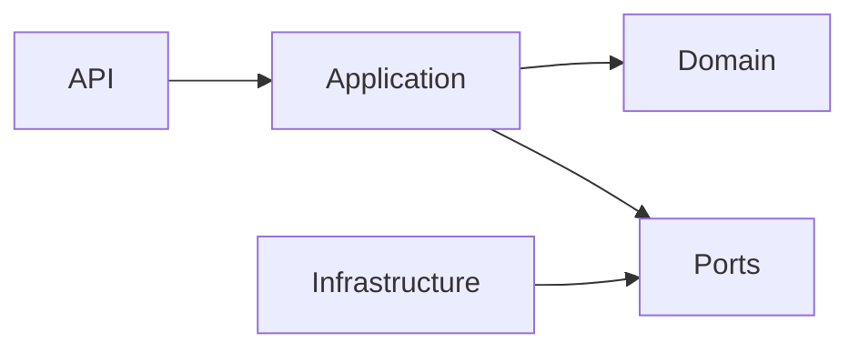
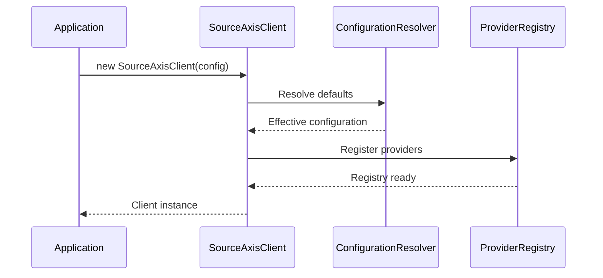
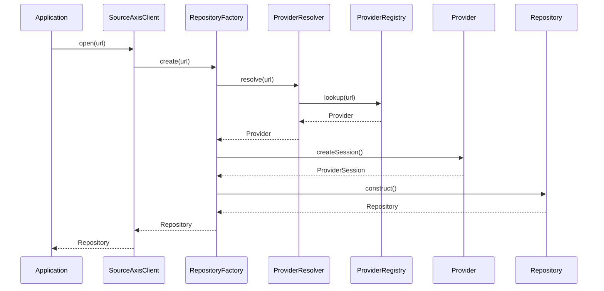
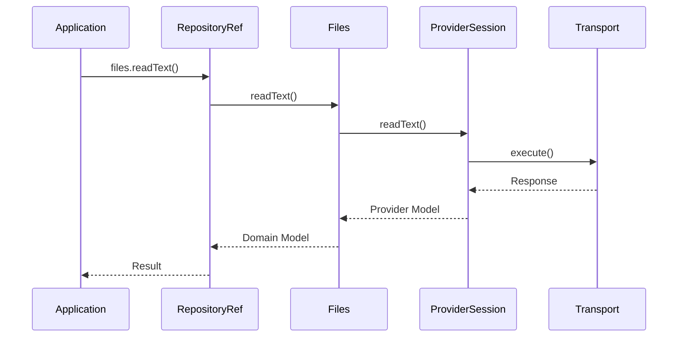

# ADR-004 — Core Architecture, Internal Layering & Request Lifecycle

**Status:** Accepted

**Version:** 1.0

**Date:** 2026-07-02

**Project:** SourceAxis

**Authors:** SourceAxis Architecture Team

**Related ADRs**

- ADR-001 — Vision & High-Level Architecture
- ADR-002 — Domain Model & Public API
- ADR-003 — Package Architecture & Module Boundaries
- ADR-005 — Provider Architecture, Ports & Adapters
- ADR-006 — Authentication, Identity & Credential Architecture
- ADR-007 — Transport Architecture & Middleware
- ADR-008 — Error Model
- ADR-009 — Caching & Performance

---

# 1. Context

ADR-003 defines **how the project is organized**.

This ADR defines **how the Core runtime behaves**.

The Core package is the execution engine of SourceAxis.

It coordinates:

- repository creation,
- provider selection,
- capability composition,
- configuration,
- object lifecycles,
- request orchestration,
- extension points.

Core deliberately contains **no provider-specific knowledge**.

Instead, it orchestrates independent components through stable contracts.

---

# 2. Decision

SourceAxis adopts a **Ports & Adapters runtime** implemented using a **layered architecture**.

Core owns orchestration.

Providers own implementation.

Infrastructure owns execution.

The runtime is intentionally composed from small services with explicit ownership.

Every runtime object has:

- one responsibility,
- one lifecycle,
- one owner.

---

# 3. Core Responsibilities

The Core package owns every provider-neutral runtime concern.

```mermaid
flowchart TD

Client

↓

RepositoryFactory

↓

Repository

↓

RepositoryRef

↓

Capabilities

↓

Provider Contracts
```

---

## Core Owns

Core owns:

- SourceAxisClient
- Repository
- RepositoryRef
- ProviderRegistry
- ProviderResolver
- RepositoryFactory
- ConfigurationResolver
- Lifecycle orchestration
- Domain models
- Public contracts
- Runtime coordination
- Object composition
- Extension registration

---

## Core Never Owns

Core must never own:

- GitHub SDK
- GitLab SDK
- HTTP implementation
- OAuth implementation
- Cache implementation
- Logging framework
- Serialization format
- Provider-specific models

Those belong to infrastructure packages.

---

# 4. Architectural Philosophy

Core follows five architectural principles.

---

## Explicit Ownership

Every runtime object has one owner.

Examples:

| Object | Owner |
|---------|-------|
| Repository | RepositoryFactory |
| RepositoryRef | Repository |
| ProviderSession | Provider |
| Transport | Transport Package |
| Authentication Strategy | Authentication Package |

Ownership is never shared.

---

## Composition Over Inheritance

Runtime behavior is composed from collaborating services.

Large inheritance hierarchies are intentionally avoided.

---

## Stable Dependencies

Core depends only on abstractions.

Implementations remain replaceable.

---

## Immutable Domain

Domain models remain immutable.

Runtime services coordinate behavior.

---

## Lazy Execution

Objects should defer expensive work until required.

Opening a repository should not immediately:

- download trees,
- fetch README,
- enumerate commits.

Resources load on demand.

---

# 5. Evaluated Architectural Styles

Several runtime architectures were considered.

---

## Traditional Layered Architecture

```
API

↓

Application

↓

Domain

↓

Infrastructure
```

### Pros

- simple
- familiar
- easy onboarding

### Cons

- infrastructure often leaks upward
- weaker extensibility

---

## Clean Architecture

```
Infrastructure

↓

Application

↓

Domain
```

### Pros

- dependency inversion
- strong separation
- excellent testing

### Cons

- additional abstractions
- steeper learning curve

---

## Onion Architecture

```
Infrastructure

↓

Application

↓

Domain
```

Conceptually similar to Clean Architecture.

Benefits:

- strong boundaries
- replaceable infrastructure

---

## Hexagonal Architecture

```
Ports

↓

Application

↓

Domain

↑

Adapters
```

### Pros

- ideal for provider abstraction
- natural extension model
- transport independence

### Cons

- additional interfaces
- more files

---

# 6. Chosen Architecture

SourceAxis adopts a **hybrid Layered + Hexagonal Architecture**.

```mermaid
flowchart TD

API

↓

Application

↓

Domain

↓

Ports

↑

Infrastructure
```

Why?

Layered Architecture provides readability.

Hexagonal Architecture provides replaceable providers.

The combination aligns naturally with:

- Providers
- Authentication
- Transport
- Cache
- Diagnostics

All of which are implemented through Ports.

---

# 7. Runtime Dependency Rules

Runtime dependencies always point toward abstractions.



Forbidden:

```
Domain

×

Infrastructure
```

```
API

×

Infrastructure
```

```
Ports

×

Infrastructure
```

---

# 8. Internal Runtime Overview

The runtime is intentionally composed from small collaborating services.

```mermaid
flowchart TD

Client

↓

RepositoryFactory

↓

Repository

↓

RepositoryRef

↓

Capabilities

↓

ProviderSession

↓

Transport
```

Each object owns one responsibility.

---

# 9. Internal Layer Overview

The Core package is internally divided into logical layers.

Not every feature touches every layer.

Layers exist to protect responsibilities.

---

# 10. API Layer

The API layer owns public entry points.

Examples:

- SourceAxisClient
- Repository
- RepositoryRef

Responsibilities:

- expose public methods,
- validate obvious misuse,
- delegate to application services.

The API layer contains almost no business logic.

---

## API Layer Rules

Allowed imports:

- Application

Forbidden imports:

- Infrastructure
- Provider implementations

---

# 11. Application Layer

The Application layer coordinates runtime workflows.

Examples:

- opening repositories,
- creating RepositoryRef,
- resolving providers,
- merging configuration,
- composing capabilities.

Application owns orchestration.

It does not own persistence.

---

## Responsibilities

Application coordinates:

- RepositoryFactory
- ProviderResolver
- ConfigurationResolver
- ExtensionRegistry

The layer never performs network requests directly.

---

# 12. Domain Layer

The Domain layer models SourceAxis concepts.

Examples:

- RepositoryInfo
- Commit
- Branch
- Release
- SearchResult
- TreeNode

Domain models remain immutable.

Behavior belongs to services.

---

## Domain Services

Examples:

- Path normalization
- Reference parsing
- Repository identity
- Capability validation

Domain services remain provider-neutral.

---

# 13. Ports Layer

Ports define the runtime contracts.

Examples include:

```text
Provider

Transport

AuthenticationStrategy

Cache

Diagnostics
```

Ports describe capabilities.

They never describe implementations.

---

## Port Principles

Ports should:

- remain stable,
- remain provider-neutral,
- evolve through Semantic Versioning,
- avoid implementation assumptions.

---

# 14. Infrastructure Layer

Infrastructure implements Ports.

Examples:

- GitHub Provider
- HTTP Transport
- Memory Cache
- OpenTelemetry Adapter

Infrastructure depends on Ports.

Ports never depend on Infrastructure.

---

## Infrastructure Responsibilities

Infrastructure owns:

- SDK integration,
- serialization,
- HTTP,
- retries,
- provider sessions,
- diagnostics adapters.

Infrastructure never owns Repository.

---

# 15. Internal Services

Core runtime is composed from focused services.

Major services include:

| Service | Responsibility |
|----------|----------------|
| RepositoryFactory | Repository construction |
| ProviderResolver | Provider selection |
| ProviderRegistry | Provider registration |
| ConfigurationResolver | Configuration precedence |
| ExtensionRegistry | Extension discovery |

These services remain internal.

Applications interact only through SourceAxisClient.

---

# 16. Internal Dependency Graph

```mermaid
flowchart TD

SourceAxisClient

↓

RepositoryFactory

↓

ProviderResolver

↓

ProviderRegistry

↓

Provider

↓

ProviderSession

↓

Transport
```

No runtime object bypasses this chain.

Every dependency is explicit.

---

# 17. Layer Constraints

The following rules are mandatory.

1. API never imports Infrastructure.
2. Domain never imports Infrastructure.
3. Providers never construct Repository.
4. RepositoryFactory exclusively owns Repository creation.
5. Repository exclusively owns RepositoryRef creation.
6. Ports remain stable abstractions.
7. Infrastructure implements Ports only.
8. Internal services are never publicly exported.
9. Runtime state remains encapsulated.
10. Cross-layer shortcuts are prohibited.

Architecture tests continuously verify these constraints.

See ADR-012.

---

---

# 18. Request Lifecycle

The runtime is designed around a deterministic request lifecycle.

Every public operation follows the same high-level flow:

```text
Application
    │
    ▼
SourceAxisClient
    │
    ▼
Application Service
    │
    ▼
Provider Resolution
    │
    ▼
Repository / RepositoryRef
    │
    ▼
Capability
    │
    ▼
Provider Session
    │
    ▼
Transport
```

The lifecycle is intentionally identical regardless of provider.

---

# 19. Client Creation Lifecycle

Client creation performs **composition**, not expensive initialization.

Responsibilities:

- validate configuration,
- create internal services,
- register providers,
- create registries,
- initialize immutable client state.

No network communication occurs during client construction.

---

## Sequence Diagram



---

# 20. Repository Opening Lifecycle

Opening a repository is the primary runtime workflow.

Conceptually:

```ts
const repository = await client.open(url);
```

Internally, several services collaborate.

---

## Responsibilities

Opening a repository includes:

1. URL validation
2. Configuration resolution
3. Provider selection
4. Provider session creation
5. Repository construction
6. Capability composition
7. Lazy initialization

Repository opening intentionally avoids unnecessary remote requests.

---

## Sequence Diagram



---

# 21. Provider Resolution

Provider selection is deterministic.

The resolver evaluates registered providers in priority order.

Each provider determines whether it supports the supplied repository.

Example:

```text
github.com

↓

GitHub Provider
```

Future examples:

```text
gitlab.company.com

↓

GitLab Provider
```

Providers never compete for ownership.

Exactly one provider must accept a repository.

---

## Resolution Rules

Resolution considers:

- URL
- host
- protocol
- repository pattern
- provider registration

Authentication never participates in provider selection.

---

# 22. Provider Registry

The ProviderRegistry owns provider discovery.

Responsibilities include:

- registration,
- lookup,
- capability discovery,
- lifecycle management.

The registry never creates repositories.

Repository creation belongs exclusively to RepositoryFactory.

---

## Registration Flow

```mermaid
flowchart LR

Provider

↓

ProviderRegistry

↓

ProviderResolver

↓

RepositoryFactory
```

Community providers integrate through the same registry.

See ADR-005.

---

# 23. RepositoryFactory

RepositoryFactory is the exclusive owner of Repository construction.

This ownership rule is fundamental to SourceAxis.

Providers never construct Repository objects.

---

## Responsibilities

RepositoryFactory performs:

- validation,
- provider resolution,
- session acquisition,
- configuration injection,
- capability composition,
- repository construction.

The resulting Repository is fully initialized but lazily loaded.

---

## Why a Factory?

Alternatives considered:

Repository constructor

↓

Provider construction

↓

Factory

Recommendation:

Factory

Reasons:

- centralized validation,
- deterministic creation,
- easier testing,
- future dependency injection,
- lifecycle ownership.

---

# 24. Repository Lifecycle

Repository is a long-lived runtime object.

Lifecycle:

```text
Constructed

↓

Initialized

↓

Referenced

↓

Used

↓

Disposed
```

---

## Construction

Repositories are created only by RepositoryFactory.

Applications never instantiate Repository directly.

---

## Initialization

Initialization creates:

- ProviderSession reference,
- configuration,
- capability services.

Repository initialization performs no expensive provider operations.

---

## Lazy Loading

Repository metadata is loaded only when requested.

Examples:

```ts
await repository.info();

await repository.ref("main");

await repository.readme();
```

The repository remains lightweight until used.

---

## Disposal

Repositories may release owned resources.

Future resources include:

- provider sessions,
- transport handles,
- cache registrations.

Disposal is idempotent.

Calling dispose() multiple times is always safe.

---

# 25. RepositoryRef Lifecycle

RepositoryRef represents an immutable repository context.

Creation:

```text
Repository

↓

RepositoryRef(main)
```

RepositoryRef never changes after creation.

Switching branches creates a new RepositoryRef.

---

## Example

```ts
const main = repository.ref("main");

const develop = repository.ref("develop");
```

These are independent runtime objects.

---

## Benefits

Immutable RepositoryRef provides:

- thread safety,
- simpler caching,
- deterministic behavior,
- explicit context.

---

# 26. Configuration Resolution

Configuration is resolved hierarchically.

Priority:

```text
Operation

↓

Repository

↓

Client

↓

Defaults
```

Higher levels override lower levels.

---

## Example

```text
Defaults

↓

Client Timeout

↓

Repository Override

↓

Operation Override
```

ConfigurationResolver owns this logic.

---

## Merge Principles

Configuration merging follows:

- immutable inputs,
- deterministic output,
- explicit precedence,
- provider neutrality.

---

# 27. Capability Composition

Repositories expose behavior through capability services.

Examples:

```text
RepositoryRef

├── Files

├── Tree

├── Search

├── History

├── Branches

├── Tags

└── Releases
```

Capabilities receive:

- RepositoryRef,
- ProviderSession,
- effective configuration.

Capabilities never resolve providers.

---

# 28. Capability Request Flow

Example:

```ts
await repository
    .ref("main")
    .files
    .readText("README.md");
```

Runtime flow:



Capabilities remain provider-neutral.

---

# 29. Lazy Initialization

Runtime objects initialize expensive resources only when necessary.

Examples:

Repository:

- ProviderSession reference only

Files:

- no initialization

Search:

- no initialization

History:

- no initialization

Actual provider communication occurs only when executing operations.

---

# 30. Runtime State

Runtime state is intentionally minimal.

Examples:

Mutable:

- caches,
- diagnostics,
- provider sessions.

Immutable:

- Repository,
- RepositoryRef,
- value models,
- configuration snapshots.

Mutable state remains encapsulated.

---

# 31. Dependency Injection

SourceAxis intentionally avoids heavyweight IoC containers.

Instead, runtime composition uses **manual constructor injection**.

Benefits:

- explicit dependencies,
- predictable construction,
- no reflection,
- faster startup,
- easier debugging.

Service Locator was rejected because it obscures runtime dependencies.

---

# 32. Object Lifetimes

Runtime objects have explicit lifetimes.

| Object | Lifetime |
|---------|----------|
| SourceAxisClient | Long-lived |
| Repository | Scoped |
| RepositoryRef | Scoped |
| ProviderRegistry | Client |
| ProviderResolver | Client |
| RepositoryFactory | Client |
| ConfigurationResolver | Client |
| ProviderSession | Repository |
| Capability | RepositoryRef |
| Domain Models | Immutable Value |

Object ownership determines lifecycle.

---

# 33. Internal Communication

Runtime services communicate through direct method invocation.

SourceAxis intentionally avoids:

- message buses,
- mediators,
- event-driven orchestration.

Reasons:

- simpler debugging,
- predictable call stacks,
- lower overhead.

Observability events are separate and never drive business behavior.

See ADR-010.

---

# 34. State Management

Runtime state exists only where required.

Examples:

ConfigurationResolver:

- stateless

ProviderResolver:

- stateless

RepositoryFactory:

- stateless

Repository:

- scoped state

ProviderSession:

- scoped state

Caches:

- mutable

Stateless services improve reuse and testing.

---

---

# 35. Error Propagation

The Core runtime is responsible for preserving architectural boundaries while propagating failures.

Errors always flow upward through the same architectural layers.

```text
Infrastructure
        │
        ▼
Provider
        │
        ▼
Core
        │
        ▼
Application
```

Each boundary is responsible for translating errors into its own abstraction.

Errors are translated **exactly once per architectural boundary**.

See ADR-008.

---

## Translation Responsibilities

| Layer | Responsibility |
|--------|----------------|
| Transport | Translate transport failures |
| Provider | Translate provider SDK failures |
| Core | Translate runtime failures |
| Public API | Expose stable SourceAxis errors |

Core never exposes provider exceptions directly.

---

# 36. Logging & Diagnostics

The Core runtime is **logging-agnostic**.

It never writes to:

- console,
- files,
- logging frameworks.

Instead, Core publishes diagnostics through the diagnostics abstraction.

```text
Core

↓

DiagnosticsService

↓

Observers

↓

Logging Framework (optional)
```

See ADR-010.

---

## Responsibilities

Core emits diagnostic events for:

- repository opening,
- provider resolution,
- configuration resolution,
- lifecycle changes,
- failures,
- capability execution.

Diagnostics never modify runtime behavior.

---

# 37. Extension Points

Core exposes explicit extension points.

They are implemented through stable contracts rather than inheritance.

Current extension categories:

```text
Providers

Authentication

Transport

Caching

Diagnostics

Testing
```

Future extension categories:

```text
Middleware

Plugins

Offline Support

GraphQL Providers
```

Core owns the extension contracts.

Extension packages own implementations.

---

## Extension Principles

Every extension must:

- implement published contracts,
- remain provider-neutral where applicable,
- avoid runtime patching,
- avoid modifying Core.

Extensions are additive, not invasive.

---

# 38. Architectural Constraints

The following runtime constraints are mandatory.

## Runtime Ownership

1. RepositoryFactory exclusively creates Repository.
2. Repository exclusively creates RepositoryRef.
3. Provider creates ProviderSession only.
4. Capabilities never resolve providers.
5. ProviderRegistry never creates repositories.

---

## Layer Isolation

6. Domain never imports Infrastructure.
7. Ports never depend on implementations.
8. API never bypasses Application.
9. Infrastructure never bypasses Ports.
10. Internal services are never public APIs.

---

## Runtime Behavior

11. Runtime objects initialize lazily whenever practical.
12. Public value models remain immutable.
13. Expensive work is deferred until required.
14. Configuration resolution is deterministic.
15. Runtime state remains encapsulated.

---

## Extensibility

16. Core never imports provider packages.
17. Extension packages require no Core modification.
18. Public contracts evolve through Semantic Versioning.
19. Runtime composition is explicit.
20. Architectural boundaries are enforced through architecture tests.

See ADR-012.

---

# 39. Internal Runtime Dependency Graph

The following graph summarizes the runtime composition.

```mermaid
flowchart TD

Application

↓

SourceAxisClient

↓

RepositoryFactory

↓

ProviderResolver

↓

ProviderRegistry

↓

Provider

↓

ProviderSession

↓

Capability

↓

Transport

↓

Remote Repository
```

Each runtime object owns a single responsibility.

No object bypasses its designated collaborator.

---

# 40. Runtime Design Principles

The Core runtime follows these principles.

## Single Responsibility

Every runtime object has one owner and one reason to change.

---

## Explicit Composition

Runtime dependencies are injected explicitly.

Hidden global state is prohibited.

---

## Provider Neutrality

Core models Git concepts rather than provider concepts.

---

## Lazy Execution

Expensive operations occur only when requested.

---

## Deterministic Behavior

Identical inputs produce identical runtime behavior.

This improves:

- testing,
- debugging,
- caching,
- diagnostics.

---

## Replaceable Infrastructure

Infrastructure components are replaceable without changing Core.

Examples:

- Provider
- Transport
- Authentication
- Cache
- Diagnostics

---

# 41. Alternatives Considered

## Provider-Owned Repository Creation

Example:

```text
Provider

↓

Repository
```

**Rejected**

Reason:

Repository ownership belongs to Core.

Keeping creation centralized prevents provider leakage and preserves lifecycle consistency.

---

## Service Locator

**Rejected**

Reason:

Hides dependencies, complicates testing, and obscures runtime composition.

Manual constructor injection provides greater clarity.

---

## Eager Initialization

Example:

Repository opening immediately loads:

- metadata,
- tree,
- README,
- branches.

**Rejected**

Reason:

Introduces unnecessary latency and resource consumption.

Lazy initialization better supports large repositories.

---

## Event-Driven Runtime

Example:

Repository

↓

Event Bus

↓

Capabilities

**Rejected**

Reason:

Adds unnecessary complexity.

Direct collaboration is simpler, easier to debug, and sufficient for the current architecture.

Observability remains event-driven, but business behavior does not.

---

# 42. References

This ADR defines the internal runtime architecture of the `@sourceaxis/core` package.

Related documents:

- ADR-001 — Vision & High-Level Architecture
- ADR-002 — Domain Model & Public API Design
- ADR-003 — Package Architecture & Module Boundaries
- ADR-005 — Provider Architecture, Ports & Adapters
- ADR-006 — Authentication, Identity & Credential Architecture
- ADR-007 — Transport Architecture, Request Pipeline & Middleware
- ADR-008 — Error Model, Failure Semantics & Exception Architecture
- ADR-009 — Caching, Performance & Resource Management
- ADR-010 — Observability, Diagnostics & Telemetry
- ADR-012 — Testing, Contract Verification & Quality Gates

---

# ADR Summary

ADR-004 defines the internal runtime architecture of SourceAxis Core.

It establishes:

- the layered runtime structure,
- runtime ownership,
- service responsibilities,
- repository lifecycle,
- repository reference lifecycle,
- provider resolution,
- repository construction,
- configuration resolution,
- capability composition,
- dependency injection strategy,
- object lifetimes,
- state management,
- extension points,
- runtime constraints.

The central architectural principle is that **Core orchestrates, Providers implement, and Infrastructure executes**.

Repository creation remains the exclusive responsibility of `RepositoryFactory`, while Providers own only `ProviderSession` creation and provider-specific behavior.

Together with ADR-001 through ADR-003, this document defines the execution model that every implementation of SourceAxis Core must follow.

Future ADRs build upon this runtime foundation by specifying provider architecture, authentication, transport, error handling, caching, observability, and testing without altering the responsibilities established here.