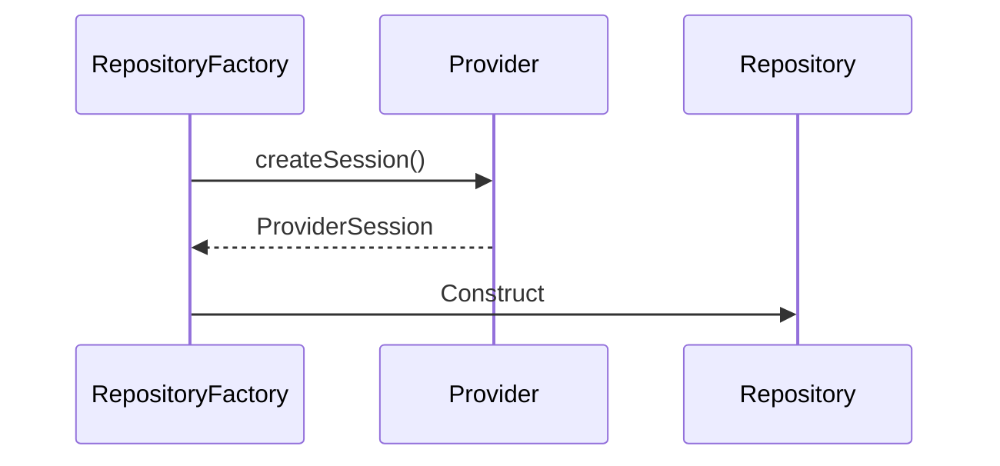
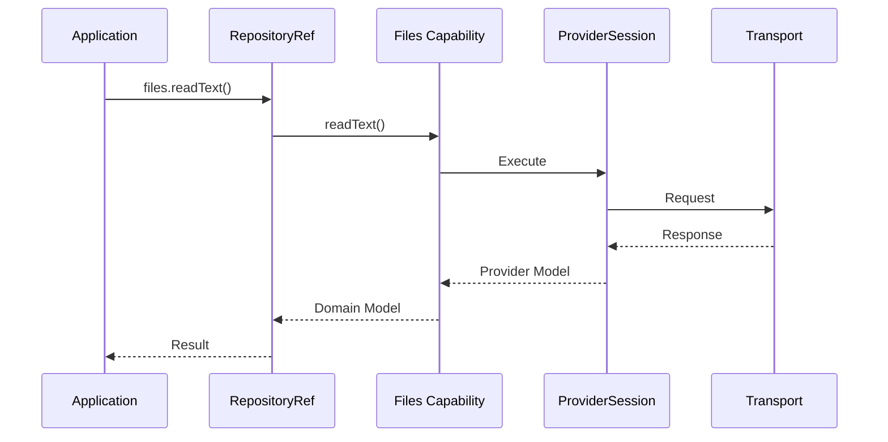

# ADR-005 — Provider Architecture, Ports & Adapters

**Status:** Accepted

**Version:** 1.0

**Date:** 2026-07-02

**Project:** RepoFerry

**Authors:** RepoFerry Architecture Team

**Related ADRs**

- ADR-001 — Vision & High-Level Architecture
- ADR-002 — Domain Model & Public API
- ADR-003 — Package Architecture & Module Boundaries
- ADR-004 — Core Architecture, Internal Layering & Request Lifecycle
- ADR-006 — Authentication, Identity & Credential Architecture
- ADR-007 — Transport Architecture & Middleware
- ADR-008 — Error Model

---

# 1. Context

RepoFerry is designed to support multiple Git repository providers without exposing provider-specific implementation details to applications.

Supported providers include:

- GitHub
- GitLab
- Bitbucket
- Azure DevOps
- Gitea
- Local repositories
- ZIP archives
- Community-developed providers

The Core package must remain completely provider-neutral.

This ADR defines how providers integrate with Core through stable contracts.

---

# 2. Decision

RepoFerry adopts a **Ports & Adapters** provider architecture.

Core owns:

- provider contracts,
- provider lifecycle,
- provider discovery,
- provider resolution,
- repository construction.

Providers own:

- provider sessions,
- capability implementations,
- SDK integration,
- provider model translation.

Provider implementations are replaceable without changing Core.

---

# 3. Provider Philosophy

A Provider represents a Git hosting platform.

Examples include:

```text
GitHub

GitLab

Bitbucket

Azure DevOps

Gitea

Local

ZIP
```

A provider translates provider-specific behavior into RepoFerry domain concepts.

Providers are adapters.

They are not part of the public programming model.

Applications interact with RepoFerry abstractions rather than providers directly.

---

## Provider Responsibilities

Providers own:

- provider identification,
- provider sessions,
- capability implementations,
- SDK integration,
- model mapping,
- provider-specific optimizations,
- feature discovery.

Providers execute operations.

They do not orchestrate the runtime.

---

## Provider Must Never Own

Providers must never own:

- Repository
- RepositoryRef
- RepositoryFactory
- Provider resolution
- Client configuration
- Global caches
- Public domain models
- Runtime orchestration

Those responsibilities belong to Core.

---

# 4. Ports & Adapters Philosophy

RepoFerry separates abstractions from implementations.

```mermaid
flowchart LR

Application

↓

Core Contracts

↓

Provider Adapter

↓

Provider SDK

↓

Remote Repository
```

Core defines ports.

Providers implement adapters.

SDKs remain completely isolated.

---

# 5. Ports

Ports define what Core expects.

Examples:

```text
Provider

ProviderSession

Capability

Transport

AuthenticationStrategy
```

Ports are:

- stable,
- provider-neutral,
- implementation-independent.

Ports evolve through Semantic Versioning.

---

# 6. Adapters

Adapters implement Ports.

Examples:

```text
GitHubProvider

GitLabProvider

LocalProvider

ZipProvider
```

Each adapter translates between:

Provider SDK

↓

RepoFerry Contracts

Adapters own translation.

Core remains unaware of SDKs.

---

# 7. Mapping Layer

Every provider contains an explicit mapping layer.

```text
GitHub REST Model

↓

Mapper

↓

RepositoryInfo
```

Mapping responsibilities include:

- model translation,
- property normalization,
- provider abstraction,
- domain object creation.

Mapping never occurs inside Core.

---

# 8. Provider Contract

Every provider implements the Provider contract.

Conceptually, the contract defines responsibilities rather than implementation.

Responsibilities include:

- provider identification,
- repository matching,
- session creation,
- capability creation,
- feature discovery.

Providers never expose SDK clients.

---

## Provider Lifecycle

```text
Registered

↓

Resolved

↓

ProviderSession Created

↓

Capability Execution

↓

Disposed
```

Provider instances are typically long-lived.

Provider sessions are repository-scoped.

---

# 9. Provider Identity

Every provider exposes immutable identity.

Examples:

```text
github

gitlab

bitbucket

azure

gitea

local
```

Identity is used for:

- diagnostics,
- capability reporting,
- provider selection,
- extension discovery.

Identity never changes during provider lifetime.

---

# 10. Provider Registration

Providers register with ProviderRegistry.

```mermaid
flowchart TD

Provider

↓

ProviderRegistry

↓

ProviderResolver

↓

RepositoryFactory
```

Registration is explicit.

Automatic discovery is intentionally avoided.

---

## Registration Principles

Providers should be registered during client construction.

Example workflow:

```text
RepoFerryClient

↓

ProviderRegistry

↓

Registered Providers
```

This guarantees deterministic runtime behavior.

---

# 11. Community Providers

Community packages integrate using the same registration mechanism.

Example:

```text
@repoferry/provider-gitea
```

No Core modifications are required.

Requirements include:

- implementing Provider contracts,
- passing contract certification,
- documenting supported capabilities.

See ADR-012.

---

# 12. Provider Resolution

ProviderResolver determines which provider owns a repository.

Resolution uses immutable repository information.

Examples:

```text
https://github.com/facebook/react

↓

GitHub Provider
```

Enterprise installations are also supported.

Example:

```text
https://git.company.com/team/project

↓

GitLab Provider
```

---

## Resolution Inputs

Resolution considers:

- protocol,
- host,
- URL structure,
- repository pattern,
- provider registration.

Authentication is intentionally excluded from provider resolution.

---

# 13. Provider Resolution Rules

Resolution follows deterministic rules.

1. Registered providers are evaluated in priority order.
2. Each provider determines whether it supports the repository.
3. The first matching provider is selected.
4. Multiple matches are treated as configuration errors.
5. No match produces a ProviderNotFound failure.

Resolution behavior is deterministic for identical inputs.

---

# 14. Provider Context

Every ProviderSession owns a ProviderContext.

ProviderContext contains immutable runtime dependencies.

Examples include:

- provider configuration,
- authentication abstraction,
- transport reference,
- diagnostics,
- cache references,
- provider metadata.

ProviderContext never contains mutable application state.

---

## Lifecycle

```text
ProviderSession

↓

ProviderContext

↓

Capability Execution
```

ProviderContext lives exactly as long as its ProviderSession.

---

# 15. ProviderSession

ProviderSession represents provider-specific runtime state.

ProviderSession is created by the Provider.

RepositoryFactory requests a session.



This ownership rule is fundamental.

Providers create sessions.

Core creates repositories.

---

## Responsibilities

ProviderSession owns:

- authenticated SDK client,
- provider runtime state,
- capability implementations,
- provider caches,
- transport integration.

ProviderSession never owns Repository lifecycle.

---

# 16. ProviderSession Lifetime

ProviderSession is repository-scoped.

```text
Repository

↓

ProviderSession

↓

Disposed
```

Sessions are reused by capability services.

Sessions are never shared between repositories.

This improves:

- isolation,
- configuration consistency,
- lifecycle clarity.

---

---

# 17. Capability Architecture

Provider functionality is organized into **capabilities**.

A capability implements one area of repository behavior.

Examples include:

```text
Files

Tree

History

Search

Branches

Tags

Releases
```

Capabilities implement RepoFerry contracts while internally using provider-specific APIs.

---

## Capability Responsibilities

Each capability owns one responsibility.

| Capability | Responsibility |
|------------|----------------|
| Files | File operations |
| Tree | Repository hierarchy |
| History | Commit history |
| Search | Repository search |
| Branches | Branch metadata |
| Tags | Tag metadata |
| Releases | Release metadata |

Capabilities never overlap.

Ownership is explicit.

---

## Capability Composition

Capabilities are created by **ProviderSession**.

```mermaid
flowchart TD

ProviderSession

├── FilesCapability

├── TreeCapability

├── SearchCapability

├── HistoryCapability

├── BranchesCapability

├── TagsCapability

└── ReleasesCapability
```

ProviderSession owns capability lifetimes.

Core never constructs provider capabilities.

---

# 18. Capability Request Flow

A capability executes one repository operation.

Example:

```ts
await repository
    .ref("main")
    .files
    .readText("README.md");
```

Runtime flow:



Capabilities remain completely provider-neutral from the application's perspective.

---

# 19. Mapping Architecture

Every provider contains a dedicated mapping layer.

Mapping is never performed inside Core.

```text
Provider SDK

↓

Provider Model

↓

Mapper

↓

RepoFerry Domain Model
```

---

## Mapping Responsibilities

The mapping layer owns:

- property normalization,
- naming normalization,
- enum translation,
- value conversion,
- provider abstraction.

It never performs business logic.

---

## Centralized Mapping

Each provider centralizes mapping within dedicated mapper modules.

Benefits include:

- consistency,
- easier testing,
- reusable translation,
- isolated provider evolution.

---

# 20. Provider Model Translation

Applications never receive provider SDK models.

Example:

```text
GitHub Repository

↓

GitHubRepositoryMapper

↓

RepositoryInfo
```

This translation boundary protects the public API from provider evolution.

---

# 21. Error Translation

Providers translate SDK failures into RepoFerry provider failures.

Translation occurs exactly once.

```text
SDK Exception

↓

Provider Error

↓

Core Error

↓

Application
```

Providers preserve useful diagnostics while hiding SDK-specific details.

See ADR-008.

---

## Translation Responsibilities

Providers translate:

- authentication failures,
- permission failures,
- rate limits,
- missing repositories,
- missing files,
- validation failures,
- provider-specific failures.

SDK exception types never escape provider boundaries.

---

# 22. Pagination Translation

Different providers expose different pagination models.

Examples:

GitHub:

- page
- per_page

GitLab:

- page
- per_page

Azure DevOps:

- continuation token

Future providers may use cursors.

RepoFerry exposes a provider-neutral abstraction.

---

## Pagination Principles

Pagination should support:

- lazy enumeration,
- incremental loading,
- provider neutrality,
- future AsyncIterable support.

Provider pagination models remain internal.

---

# 23. Provider Features

Some providers expose unique functionality.

Examples:

```text
GitHub

↓

Discussions

Projects

Actions

Security Alerts
```

```text
GitLab

↓

Epics

Milestones

Merge Requests
```

These features must not pollute Core.

---

## Provider Extension Contracts

Provider-specific functionality integrates through extension contracts.

Conceptually:

```ts
repository.extensions.github
```

or

```ts
repository.extensions.gitlab
```

Applications explicitly opt into provider-specific behavior.

Core remains provider-neutral.

---

# 24. Community Provider Architecture

Community providers integrate identically to official providers.

Example:

```text
@repoferry/provider-gitea
```

Requirements:

- implement Provider contract,
- pass provider certification,
- document supported capabilities.

No special extension mechanism exists for official providers.

Official and community providers are architecturally equal.

---

# 25. Provider Testing

Every provider must prove contract compliance.

Testing categories include:

- unit tests,
- contract tests,
- integration tests,
- end-to-end tests.

See ADR-012.

---

## Contract Verification

Every provider executes the same certification suite.

```text
Provider

↓

Contract Test Kit

↓

Certification Result
```

This guarantees behavioral consistency.

---

## Community Certification

Community providers may advertise compatibility after passing the published Provider Contract Test Kit.

Certification verifies:

- provider lifecycle,
- capability behavior,
- error translation,
- pagination,
- diagnostics.

---

# 26. Provider Dependency Graph

```mermaid
flowchart TD

Core

↓

Provider Contract

↓

Provider

↓

ProviderSession

↓

Capabilities

↓

Transport

↓

Remote Provider
```

Dependencies always point toward abstractions.

---

# 27. Architectural Constraints

The provider architecture follows these rules.

1. Core never imports providers.
2. Providers never expose SDK models.
3. Providers create ProviderSession only.
4. RepositoryFactory exclusively creates Repository.
5. Providers never construct RepositoryRef.
6. Providers never bypass Transport.
7. Capabilities communicate only through ProviderSession.
8. Mapping remains isolated.
9. Provider extensions never modify Core.
10. SDK clients never escape provider boundaries.

Architecture tests continuously verify these constraints.

See ADR-012.

---

# 28. Architectural Consequences

## Benefits

The provider architecture provides:

- complete provider isolation,
- replaceable implementations,
- SDK independence,
- clean extension model,
- deterministic provider resolution,
- consistent capabilities,
- reusable contract testing.

---

## Trade-offs

The architecture intentionally introduces:

- additional adapters,
- mapping layers,
- provider contracts.

These abstractions improve long-term maintainability and provider independence.

---

# 29. Alternatives Considered

## Provider-Owned Repository

**Rejected**

Reason:

Repository lifecycle belongs to Core.

Keeping RepositoryFactory as the exclusive creator preserves runtime consistency.

---

## SDK Models as Public Contracts

**Rejected**

Reason:

Would tightly couple applications to provider implementations and make provider replacement impossible.

---

## Automatic Provider Discovery

**Rejected**

Reason:

Explicit registration provides deterministic behavior and simpler debugging.

---

## Provider-to-Provider Dependencies

**Rejected**

Reason:

Providers are independent implementations and must never depend on each other.

---

# 30. References

This ADR defines how providers integrate with RepoFerry.

Related documents:

- ADR-001 — Vision & High-Level Architecture
- ADR-002 — Domain Model & Public API
- ADR-003 — Package Architecture & Module Boundaries
- ADR-004 — Core Architecture, Internal Layering & Request Lifecycle
- ADR-006 — Authentication, Identity & Credential Architecture
- ADR-007 — Transport Architecture, Request Pipeline & Middleware
- ADR-008 — Error Model, Failure Semantics & Exception Architecture
- ADR-012 — Testing, Contract Verification & Quality Gates

---

# ADR Summary

ADR-005 establishes the provider architecture of RepoFerry.

It defines:

- the Provider contract,
- Ports & Adapters architecture,
- provider registration,
- provider resolution,
- ProviderSession ownership,
- capability architecture,
- mapping layer,
- provider-specific extensions,
- pagination translation,
- error translation,
- provider testing,
- architectural constraints.

The fundamental architectural rule established by this ADR is:

> **Core owns orchestration and Repository creation. Providers own ProviderSession creation and provider-specific implementations.**

This separation preserves provider neutrality while allowing RepoFerry to support an arbitrary number of official and community-developed providers without requiring changes to Core.