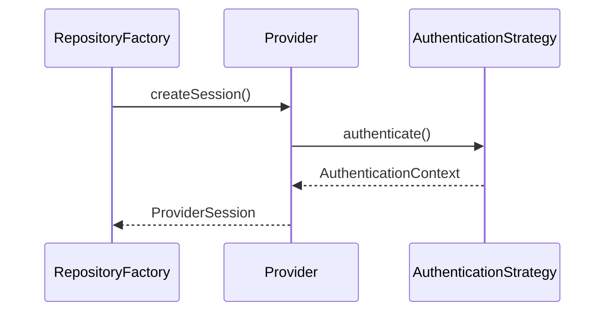
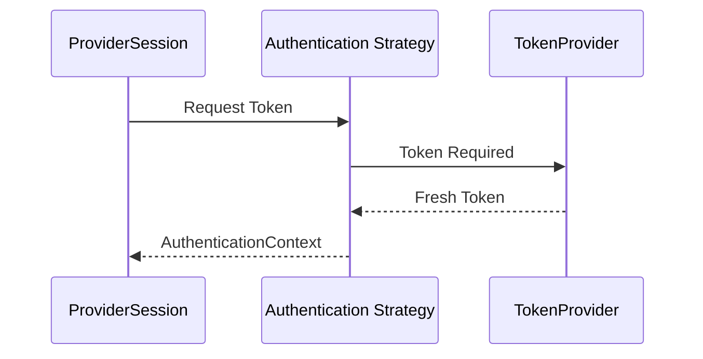
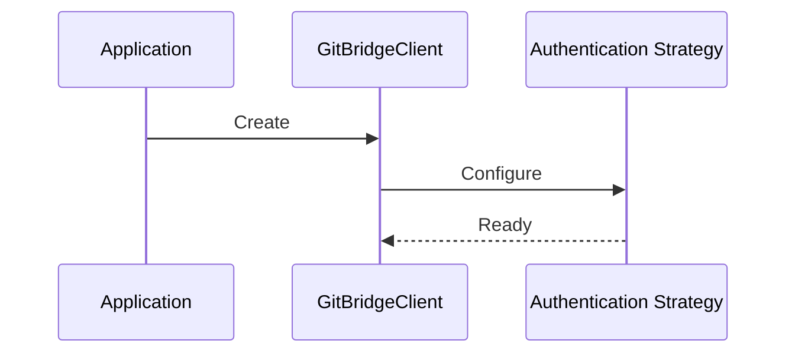
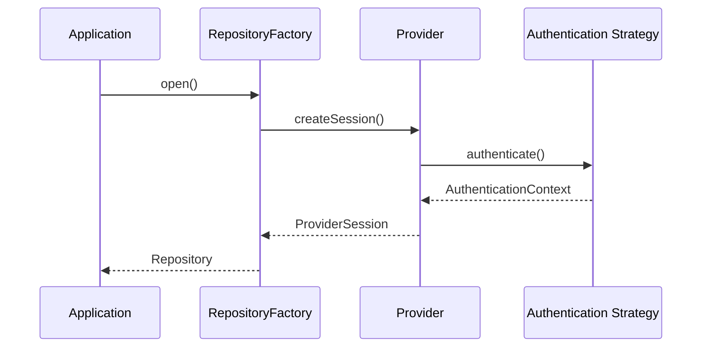
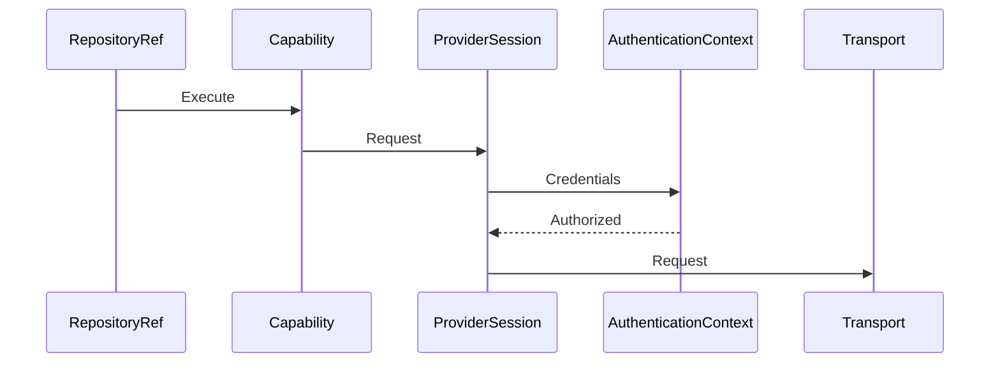
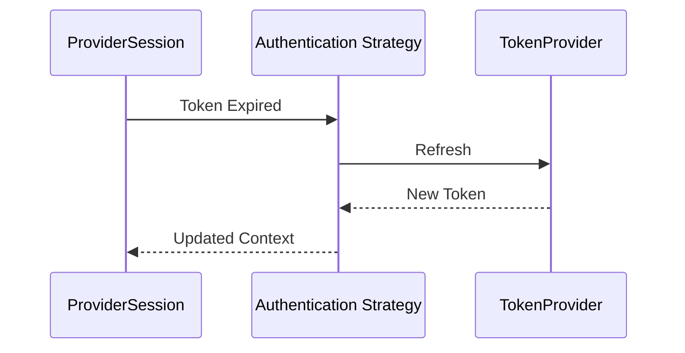
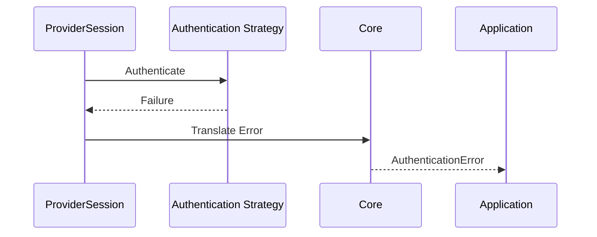

# ADR-006 — Authentication, Identity & Credential Architecture

**Status:** Accepted

**Version:** 1.0

**Date:** 2026-07-02

**Project:** GitBridge

**Authors:** GitBridge Architecture Team

**Related ADRs**

- ADR-001 — Vision & High-Level Architecture
- ADR-004 — Core Architecture, Internal Layering & Request Lifecycle
- ADR-005 — Provider Architecture, Ports & Adapters
- ADR-007 — Transport Architecture, Request Pipeline & Middleware
- ADR-008 — Error Model, Failure Semantics & Exception Architecture
- ADR-015 — Security, Compatibility & Long-Term Evolution

---

# 1. Context

GitBridge supports multiple Git hosting providers.

Each provider supports different authentication mechanisms.

Examples include:

- Anonymous access
- Personal Access Tokens
- OAuth 2.0
- GitHub App authentication
- GitLab Access Tokens
- Azure DevOps PAT
- Enterprise authentication

The Core runtime must remain completely provider-neutral.

Authentication must integrate cleanly with Providers while remaining replaceable and extensible.

---

# 2. Terminology

| Term | Meaning |
|------|---------|
| Authentication | Verifying identity before accessing provider resources |
| Credentials | Immutable authentication data |
| Authentication Strategy | Provider-neutral authentication implementation |
| Authentication Context | Runtime authentication state associated with a ProviderSession |
| Token Provider | Component responsible for acquiring or refreshing tokens |
| Credential Resolver | Component that determines which credentials apply |
| ProviderSession | Repository-scoped authenticated runtime owned by a Provider |

---

# 3. Decision

GitBridge adopts a **Strategy-based Authentication Architecture**.

Authentication is treated as a provider-neutral cross-cutting concern.

Core owns:

- authentication contracts,
- lifecycle,
- credential resolution,
- authentication context.

Authentication implementations own:

- provider-specific authentication,
- token acquisition,
- token refresh,
- SDK authentication.

Providers consume authenticated contexts but never manage credential lifecycles.

---

# 4. Authentication Philosophy

Authentication exists to establish identity for provider operations.

Its responsibilities are intentionally narrow.

Authentication answers:

> "Who is making this request?"

It does **not** answer:

- what provider to use,
- how requests are transported,
- how repositories are created,
- how caching works.

Those concerns belong to other architectural layers.

---

## Core Responsibilities

Core owns:

- authentication contracts,
- lifecycle orchestration,
- credential resolution,
- authentication context,
- dependency composition.

Core never authenticates directly.

---

## Authentication Responsibilities

Authentication implementations own:

- credential validation,
- token acquisition,
- token refresh,
- provider SDK integration,
- expiration tracking.

---

## Authentication Must Never Own

Authentication must never own:

- Repository
- RepositoryRef
- Provider resolution
- Transport
- Cache
- Diagnostics
- Runtime orchestration

Those remain responsibilities of Core.

---

# 5. Architectural Principles

Authentication follows five principles.

---

## Provider Neutrality

Authentication models identity rather than provider implementations.

Core never understands:

- GitHub OAuth,
- GitLab OAuth,
- Azure PAT formats.

Only authentication implementations understand provider formats.

---

## Immutable Credentials

Credential objects are immutable.

Updating credentials always produces new credential objects.

Mutation is prohibited.

---

## Least Privilege

Authentication should request only the permissions required for an operation.

GitBridge never expands permissions automatically.

---

## Explicit Configuration

Authentication is configured explicitly.

Implicit credential discovery is intentionally avoided.

Applications remain in control of authentication behavior.

---

## Replaceability

Authentication strategies remain replaceable.

Changing providers or authentication mechanisms must not require changes to Core.

---

# 6. Authentication Architecture

GitBridge adopts a Strategy Pattern.

```mermaid
flowchart TD

GitBridgeClient

↓

Authentication Strategy

↓

Authentication Context

↓

ProviderSession

↓

Provider SDK
```

Strategies authenticate providers.

Core orchestrates strategies.

Providers consume authenticated sessions.

---

# 7. Strategy Pattern

Authentication strategies implement a common contract.

Examples:

```text
Anonymous Strategy

Personal Access Token Strategy

OAuth Strategy

GitHub App Strategy

Custom Enterprise Strategy
```

Strategies are interchangeable.

Applications depend on abstractions rather than concrete implementations.

---

# 8. Authentication Contracts

Authentication is built around a small set of stable contracts.

Examples include:

```text
AuthenticationStrategy

Credentials

AuthenticationContext

CredentialResolver

TokenProvider
```

Contracts define responsibilities only.

Implementations remain independent.

---

# 9. AuthenticationStrategy

AuthenticationStrategy represents the primary extension point.

Responsibilities include:

- validating credentials,
- creating authenticated context,
- refreshing authentication,
- exposing authentication metadata.

Strategies never interact directly with Repository.

---

## Lifecycle

```text
Configured

↓

Validated

↓

AuthenticationContext

↓

Consumed

↓

Disposed
```

Strategies are generally long-lived.

AuthenticationContext objects are scoped.

---

# 10. Credentials

Credentials represent immutable authentication data.

Examples include:

```text
Personal Access Token

OAuth Credentials

GitHub App Credentials

Anonymous Credentials
```

Credentials contain data only.

Behavior belongs to AuthenticationStrategy.

---

## Credential Principles

Credentials are:

- immutable,
- serializable where safe,
- provider-neutral,
- comparable by value.

Sensitive information must never be exposed through diagnostics.

---

# 11. CredentialResolver

CredentialResolver determines which credentials should be used.

Responsibilities include:

- resolving effective credentials,
- applying configuration precedence,
- validating configuration,
- supporting multiple clients.

CredentialResolver never communicates with providers.

---

## Resolution Order

Credential resolution follows:

```text
Operation

↓

Repository

↓

Client

↓

Defaults
```

This mirrors the configuration hierarchy defined in ADR-004.

---

# 12. TokenProvider

Some authentication mechanisms require temporary tokens.

Examples:

- OAuth
- GitHub App
- Future enterprise identity systems

TokenProvider abstracts token acquisition.

Responsibilities include:

- acquiring tokens,
- refreshing tokens,
- expiration awareness.

TokenProvider does not own authentication strategy.

---

# 13. AuthenticationContext

AuthenticationContext represents authenticated runtime state.

It is created after successful authentication.

AuthenticationContext contains immutable runtime information.

Examples include:

- authentication type,
- effective credentials,
- expiration metadata,
- provider metadata,
- scopes (future).

---

## Lifecycle

```text
Authentication Strategy

↓

AuthenticationContext

↓

ProviderSession

↓

Capability Execution
```

AuthenticationContext lives as long as its ProviderSession.

---

# 14. Provider Integration

Authentication integrates with Providers through AuthenticationContext.



Providers consume AuthenticationContext.

Providers never manage authentication lifecycles.

---

# 15. Multiple Clients

GitBridge supports multiple independent clients.

Example:

```ts
const publicClient = new GitBridgeClient(...);

const enterpriseClient = new GitBridgeClient(...);
```

Each client owns:

- ProviderRegistry,
- AuthenticationStrategy,
- Configuration,
- CacheManager,
- Diagnostics.

No authentication state is shared automatically.

---

# 16. Authentication Isolation

Authentication is isolated at the client level.

```text
GitBridgeClient

↓

Authentication Strategy

↓

Authentication Context

↓

ProviderSession
```

Credential leakage between clients is prohibited.

This enables:

- public access,
- enterprise access,
- multiple identities,

to coexist safely within the same process.

---

# 17. Dependency Graph

Authentication depends only on abstractions.

```mermaid
flowchart TD

GitBridgeClient

↓

Authentication Strategy

↓

Authentication Context

↓

ProviderSession

↓

Provider SDK
```

Core remains unaware of provider-specific authentication implementations.

---

# 18. Architectural Constraints

The authentication architecture follows these rules.

1. Core never understands provider credential formats.
2. Credentials remain immutable.
3. Authentication strategies are replaceable.
4. Providers consume AuthenticationContext only.
5. Providers never manage credential lifecycles.
6. Authentication never owns Repository.
7. Authentication never bypasses ProviderSession.
8. Authentication remains provider-neutral.
9. Authentication contracts evolve through Semantic Versioning.
10. Sensitive credential data never appears in diagnostics.

These constraints are enforced through architecture tests.

See ADR-012.

---

---

# 19. Supported Authentication Types

GitBridge supports multiple authentication mechanisms through the same
Authentication Strategy abstraction.

Authentication type is an implementation detail.

Applications interact only with GitBridge contracts.

---

## Anonymous

Used for:

- public repositories
- read-only operations
- documentation browsing

Characteristics:

- no credentials
- no refresh
- lowest privileges

This is the default strategy when no authentication is configured.

---

## Personal Access Token (PAT)

Supports providers including:

- GitHub
- GitLab
- Azure DevOps
- Gitea

Characteristics:

- static credentials
- user-managed lifecycle
- no automatic refresh

PAT strategies treat tokens as immutable credentials.

---

## OAuth 2.0

OAuth authentication supports:

- access tokens
- refresh tokens
- expiration metadata

Responsibilities include:

- token acquisition
- refresh
- expiration awareness

Refresh behavior is delegated to the Authentication Strategy.

---

## GitHub App

GitHub App authentication uses installation tokens.

Characteristics:

- short-lived tokens
- automatic renewal
- repository-scoped permissions

Authentication Strategy owns installation token acquisition.

Core remains unaware of GitHub App semantics.

---

## API Keys (Future)

Some future providers may authenticate using API keys.

GitBridge treats API keys as another credential type.

No architectural changes are required.

---

## Custom Enterprise Authentication

Enterprise providers may require:

- SSO
- Kerberos
- custom OAuth flows
- internal identity providers

These integrate by implementing Authentication Strategy.

Core remains unchanged.

---

# 20. Token Refresh

Some authentication mechanisms require credential renewal.

Examples:

- OAuth
- GitHub App
- future enterprise identity systems

GitBridge delegates refresh responsibility to Authentication Strategy.

---

## Refresh Flow



Core never refreshes credentials.

Providers never refresh credentials.

---

## Refresh Principles

Refresh operations must:

- occur transparently,
- preserve immutability,
- avoid leaking provider details,
- update AuthenticationContext atomically.

Failed refresh operations invalidate the current context.

---

# 21. Credential Storage

Credential storage is intentionally outside the Core runtime.

GitBridge accepts credentials.

It does not persist them.

Examples of external storage include:

- environment variables,
- operating system credential stores,
- cloud secret managers,
- application configuration.

---

## Future Credential Stores

Future extensions may provide secure credential stores.

Example:

```text
Credential Store

↓

Credential Resolver

↓

Authentication Strategy
```

Core depends only on CredentialResolver.

Storage implementations remain replaceable.

---

# 22. Security Principles

Authentication follows strict security rules.

---

## Immutable Credentials

Credential objects are immutable.

Updating credentials always creates a new instance.

---

## Least Privilege

Applications should grant only the permissions required for their operations.

GitBridge never expands permissions automatically.

---

## No Credential Logging

Credentials must never appear in:

- logs,
- diagnostics,
- traces,
- exceptions,
- serialized models.

Sensitive values remain private.

---

## Credential Isolation

Authentication state belongs to a single GitBridgeClient.

Credential sharing between clients is never automatic.

---

## Provider Isolation

Authentication implementations understand provider credential formats.

Core never does.

---

## Explicit Authentication

Authentication is always configured explicitly.

Implicit discovery is intentionally avoided.

---

# 23. Authentication Error Flow

Authentication failures follow the standard GitBridge error pipeline.

```text
Provider SDK

↓

Authentication Strategy

↓

Provider Error

↓

Core Error

↓

Application
```

Translation occurs once per architectural boundary.

See ADR-008.

---

## Authentication Failures

Examples include:

- invalid credentials,
- expired credentials,
- missing credentials,
- permission failures,
- refresh failures.

Authentication implementations preserve diagnostic information while exposing provider-neutral errors.

---

# 24. Testing Strategy

Authentication architecture is verified through multiple testing layers.

---

## Unit Tests

Validate:

- credential validation,
- strategy behavior,
- refresh logic,
- configuration resolution.

---

## Contract Tests

Every Authentication Strategy must satisfy the published authentication contract.

Examples:

- immutable credentials,
- refresh semantics,
- authentication context creation,
- error translation.

---

## Integration Tests

Integration tests verify interaction between:

- Authentication,
- ProviderSession,
- Transport,
- Diagnostics.

---

## Security Tests

Security testing verifies:

- no credential leakage,
- immutable credentials,
- secure serialization,
- diagnostics redaction.

See ADR-012.

---

# 25. Sequence Diagrams

## Client Creation



---

## Repository Opening



---

## Authenticated Request



---

## Token Refresh



---

## Authentication Failure



---

# 26. Alternatives Considered

## Provider-Owned Authentication

**Rejected**

Reason:

Authentication lifecycle belongs to Authentication Strategy.

Providers consume authentication rather than own it.

---

## Global Credential Store

**Rejected**

Reason:

Introduces hidden global state and complicates testing.

Client-scoped authentication provides better isolation.

---

## Mutable Credentials

**Rejected**

Reason:

Mutation complicates concurrency, caching, and diagnostics.

Immutable credentials produce deterministic behavior.

---

## Provider-Specific Authentication Contracts

**Rejected**

Reason:

Would tightly couple Core to provider implementations.

Stable provider-neutral contracts better support extensibility.

---

# 27. References

This ADR defines the authentication architecture of GitBridge.

Related documents:

- ADR-001 — Vision & High-Level Architecture
- ADR-004 — Core Architecture, Internal Layering & Request Lifecycle
- ADR-005 — Provider Architecture, Ports & Adapters
- ADR-007 — Transport Architecture, Request Pipeline & Middleware
- ADR-008 — Error Model, Failure Semantics & Exception Architecture
- ADR-010 — Observability, Diagnostics & Telemetry
- ADR-012 — Testing, Contract Verification & Quality Gates
- ADR-015 — Security, Compatibility & Long-Term Evolution

---

# ADR Summary

ADR-006 establishes the authentication architecture of GitBridge.

It defines:

- provider-neutral authentication,
- Strategy-based authentication,
- immutable credential model,
- AuthenticationContext,
- CredentialResolver,
- TokenProvider,
- credential isolation,
- multiple client support,
- token refresh architecture,
- security principles,
- authentication error flow,
- testing strategy,
- architectural constraints.

The central architectural principle is:

> **Core orchestrates authentication through stable contracts, Authentication Strategies manage identity, and Providers consume authenticated contexts without owning credential lifecycles.**

Authentication remains completely decoupled from provider implementations, allowing new authentication mechanisms to be introduced without modifying Core or existing Providers.

Together with ADR-004 and ADR-005, this document completes GitBridge's runtime identity architecture and provides the foundation for the Transport, Error, Caching, and Observability subsystems defined in subsequent ADRs.