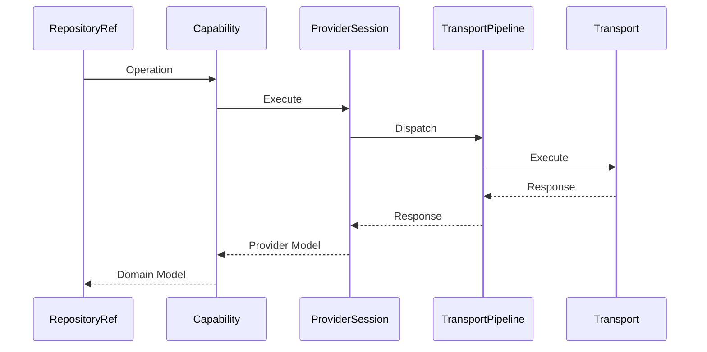
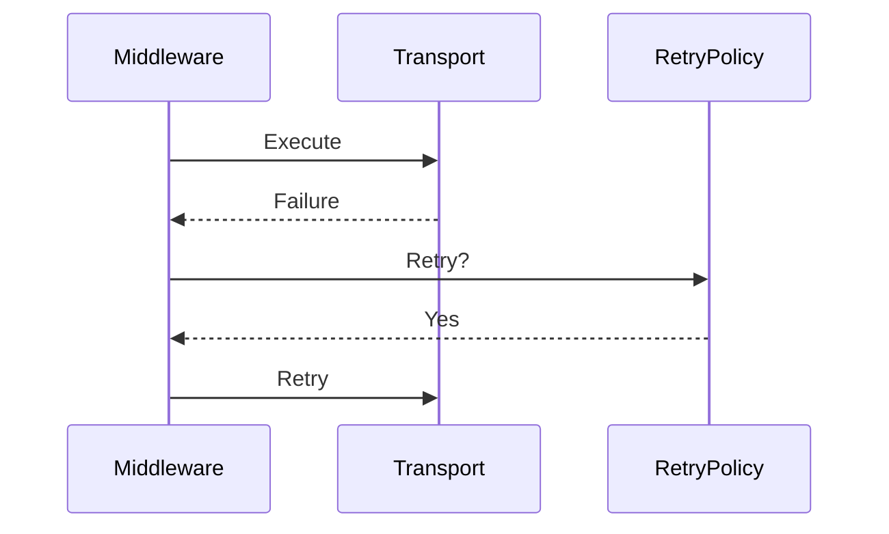
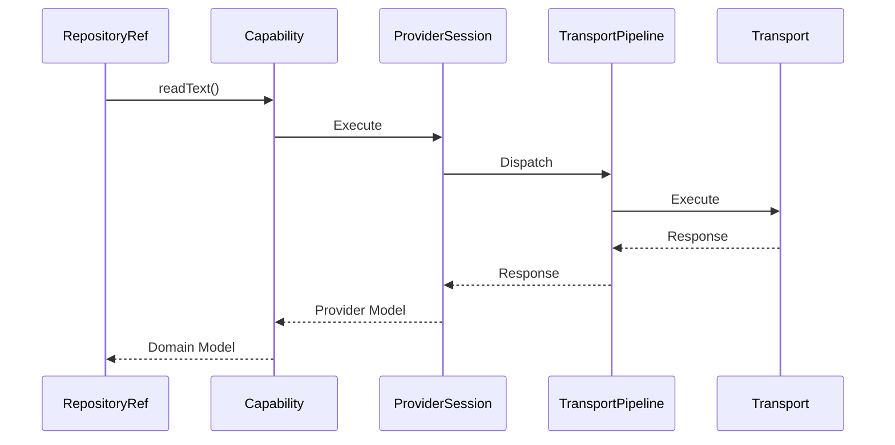
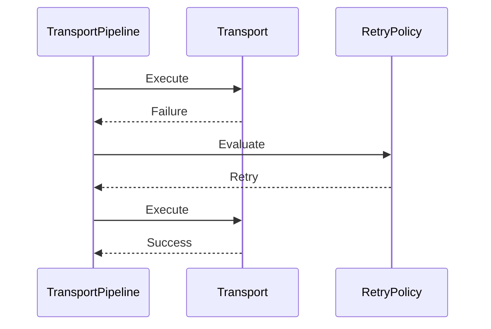
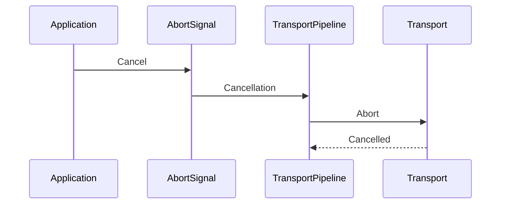
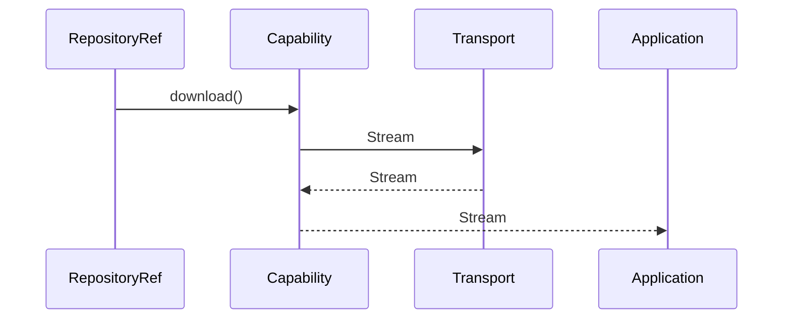
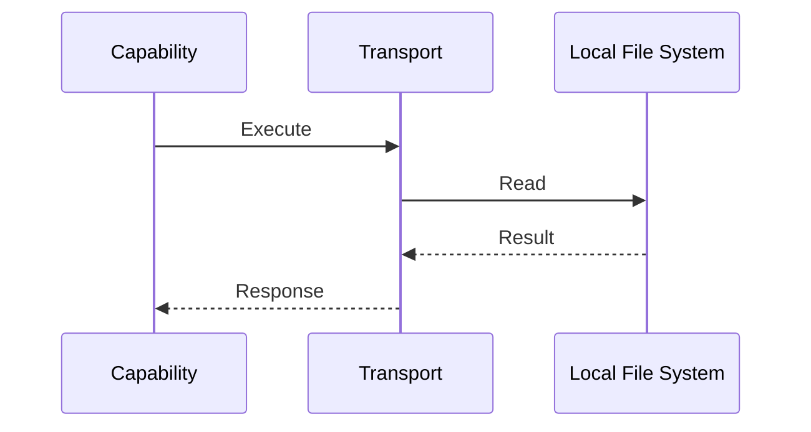

# ADR-007 — Transport Architecture, Request Pipeline & Middleware

**Status:** Accepted

**Version:** 1.0

**Date:** 2026-07-02

**Project:** SourceAxis

**Authors:** SourceAxis Architecture Team

**Related ADRs**

- ADR-001 — Vision & High-Level Architecture
- ADR-004 — Core Architecture, Internal Layering & Request Lifecycle
- ADR-005 — Provider Architecture, Ports & Adapters
- ADR-006 — Authentication, Identity & Credential Architecture
- ADR-008 — Error Model, Failure Semantics & Exception Architecture
- ADR-009 — Caching, Performance & Resource Management
- ADR-010 — Observability, Diagnostics & Telemetry

---

# 1. Context

SourceAxis supports multiple repository providers and multiple repository sources.

Some repositories are accessed through HTTP.

Others may originate from:

- local file systems,
- ZIP archives,
- in-memory repositories,
- future custom transports.

The Core runtime must remain completely transport-neutral.

Providers should express *what* operation they require without knowing *how* the request is executed.

This ADR defines the transport abstraction used throughout SourceAxis.

---

# 2. Terminology

| Term | Meaning |
|------|---------|
| Transport | Executes requests against a repository source |
| Transport Request | Immutable request issued by a Provider |
| Transport Response | Immutable response returned by a Transport |
| Transport Context | Runtime information required by a Transport |
| Middleware | Component that intercepts request execution |
| Pipeline | Ordered chain of middleware surrounding a Transport |
| Transport Adapter | Concrete implementation for HTTP, Local FS, ZIP, etc. |

---

# 3. Decision

SourceAxis adopts a **Transport Abstraction with a Middleware Pipeline**.

Core owns:

- transport contracts,
- request pipeline,
- middleware composition,
- transport lifecycle.

Transport implementations own:

- request execution,
- protocol handling,
- streaming,
- compression,
- connection management.

Providers never communicate directly with HTTP clients, file systems, or ZIP readers.

They communicate only through Transport contracts.

---

# 4. Transport Philosophy

Transport exists solely to execute repository operations.

It answers:

> "How does this request reach the repository?"

It does **not** answer:

- which provider should execute,
- how authentication works,
- how repositories are created,
- how models are mapped,
- how errors are exposed publicly.

Those responsibilities belong elsewhere.

---

## Transport Responsibilities

Transport owns:

- request execution,
- response delivery,
- protocol adaptation,
- cancellation,
- streaming,
- timeout handling,
- middleware execution.

---

## Transport Must Never Own

Transport must never own:

- Repository
- RepositoryRef
- Provider resolution
- Authentication lifecycle
- Domain models
- Capability logic
- Error translation beyond transport boundaries

Transport executes infrastructure concerns only.

---

# 5. Architectural Principles

Transport follows six architectural principles.

---

## Protocol Neutrality

Transport abstracts protocols rather than HTTP.

Supported implementations include:

```text
HTTP

↓

Local File System

↓

ZIP Archive

↓

In-Memory Repository
```

Future transports require no Core changes.

---

## Immutable Requests

TransportRequest objects are immutable.

Middleware may derive new requests but never mutate existing ones.

---

## Streaming First

Large content should stream whenever practical.

Transport should avoid unnecessary buffering.

---

## Middleware Composition

Cross-cutting concerns execute through middleware.

Examples:

- retry,
- diagnostics,
- compression,
- caching (future).

Business logic never belongs in middleware.

---

## Cancellation Support

Every request supports cooperative cancellation.

Cancellation propagates through the complete pipeline.

---

## Replaceability

Transport implementations are replaceable.

Changing protocol implementations requires no changes to Providers or Core.

---

# 6. Transport Architecture

SourceAxis adopts a layered transport architecture.

```mermaid
flowchart TD

Capability

↓

ProviderSession

↓

Transport Pipeline

↓

Transport

↓

Repository Source
```

Middleware surrounds the Transport implementation.

Transport remains unaware of business behavior.

---

# 7. Request Pipeline

Every request flows through the same execution pipeline.

```mermaid
flowchart LR

Capability

↓

ProviderSession

↓

Middleware

↓

Transport

↓

Repository Source

↓

Transport Response

↓

Capability
```

This guarantees consistent execution regardless of protocol.

---

# 8. Response Pipeline

Responses follow the reverse path.

```text
Repository Source

↓

Transport

↓

Middleware

↓

ProviderSession

↓

Capability

↓

Domain Model
```

Response processing remains symmetrical with request execution.

---

# 9. Transport Contracts

Transport is defined through a small set of stable contracts.

Examples:

```text
Transport

TransportRequest

TransportResponse

TransportContext

TransportPipeline
```

Contracts describe responsibilities only.

Implementations remain independent.

---

# 10. TransportRequest

TransportRequest represents an immutable infrastructure request.

Responsibilities include:

- target resource,
- operation metadata,
- headers,
- cancellation token,
- timeout configuration,
- streaming options.

TransportRequest contains no provider SDK objects.

---

## Principles

TransportRequest is:

- immutable,
- serializable where appropriate,
- protocol-neutral,
- provider-neutral.

---

# 11. TransportResponse

TransportResponse represents an immutable execution result.

Responsibilities include:

- payload,
- metadata,
- response status,
- streaming handle (when applicable),
- diagnostics.

TransportResponse does not expose protocol-specific implementation details.

---

# 12. TransportContext

TransportContext contains runtime dependencies required for execution.

Examples include:

- AuthenticationContext
- DiagnosticsService
- RetryPolicy
- TimeoutPolicy
- CompressionPolicy

TransportContext is immutable.

It is created once and shared throughout request execution.

---

# 13. TransportPipeline

TransportPipeline coordinates middleware execution.

Responsibilities include:

- middleware ordering,
- request dispatch,
- response propagation,
- cancellation propagation,
- diagnostics integration.

TransportPipeline owns orchestration.

Middleware owns behavior.

---

# 14. Request Lifecycle

A repository operation follows this lifecycle.



Every request follows the same deterministic lifecycle regardless of protocol.

---

# 15. Dependency Graph

```mermaid
flowchart TD

Capability

↓

ProviderSession

↓

TransportPipeline

↓

Transport

↓

Protocol Adapter
```

Dependencies always point toward abstractions.

Protocol implementations never leak upward.

---

# 16. Architectural Constraints

Transport follows these rules.

1. Core never understands HTTP.
2. Providers never bypass Transport.
3. Middleware never contains business logic.
4. Transport never owns authentication.
5. Transport never owns Repository lifecycle.
6. Requests remain immutable.
7. Responses remain immutable.
8. Transport implementations remain replaceable.
9. Transport contracts evolve through Semantic Versioning.
10. Protocol-specific types never escape Transport boundaries.

These constraints are continuously verified through architecture tests.

See ADR-012.
---

# 17. Middleware Pipeline

SourceAxis executes every transport request through a middleware pipeline.

Middleware surrounds Transport execution.

```mermaid
flowchart LR

Capability

↓

ProviderSession

↓

Middleware 1

↓

Middleware 2

↓

Middleware N

↓

Transport

↓

Repository Source
```

Middleware is composable.

Each middleware has one responsibility.

---

## Pipeline Philosophy

SourceAxis adopts a **Pipeline / Chain of Responsibility** architecture.

Every middleware:

- receives a request,
- performs work,
- invokes the next middleware,
- optionally processes the response.

Middleware must never bypass the pipeline.

---

## Responsibilities

Middleware may:

- inspect requests,
- enrich requests,
- measure latency,
- retry operations,
- enforce timeouts,
- emit diagnostics,
- cache responses (future).

Middleware must never:

- resolve providers,
- map domain models,
- authenticate repositories,
- implement business logic.

---

# 18. Built-in Middleware

SourceAxis includes several built-in middleware components.

```text
Diagnostics

↓

Request ID

↓

Authentication

↓

Retry

↓

Timeout

↓

Transport
```

Additional middleware may be introduced without changing Transport contracts.

---

## Authentication Middleware

Authentication middleware attaches authenticated context to TransportRequest.

Responsibilities include:

- obtaining AuthenticationContext,
- validating authentication,
- attaching authentication metadata.

Authentication middleware never refreshes credentials.

Refresh remains the responsibility of Authentication Strategy.

See ADR-006.

---

## Retry Middleware

Retry middleware transparently retries eligible requests.

Responsibilities include:

- retry policy execution,
- backoff,
- jitter,
- retry diagnostics.

Retry decisions are policy-driven.

Transport remains unaware of retry behavior.

---

## Timeout Middleware

Timeout middleware enforces execution limits.

Responsibilities include:

- operation timeout,
- request timeout,
- cancellation propagation.

Timeout behavior remains consistent across all transports.

---

## Diagnostics Middleware

Diagnostics middleware emits runtime events.

Examples:

- request started,
- request completed,
- retries,
- failures,
- streaming events.

Diagnostics never change execution behavior.

See ADR-010.

---

## Request ID Middleware

Each request receives a unique request identifier.

Request identifiers improve:

- tracing,
- debugging,
- diagnostics,
- supportability.

Identifiers remain transport-neutral.

---

# 19. Retry Architecture

Retry behavior belongs to middleware rather than Transport.



Transport executes exactly one request.

Retry middleware determines whether additional attempts occur.

---

## Retry Principles

Retries should support:

- exponential backoff,
- configurable jitter,
- retry budgets,
- idempotent operations,
- provider-neutral policies.

Retry configuration remains explicit.

---

## Retryability

Retry decisions consider both:

- RetryPolicy
- Error retryability metadata

Error retryability follows ADR-008.

Possible classifications:

```text
Never

Maybe

Always
```

Policy evaluates retryability together with runtime context.

---

# 20. Timeout & Cancellation

SourceAxis supports cooperative cancellation.

Cancellation propagates throughout the complete request pipeline.

```text
Application

↓

AbortSignal

↓

TransportPipeline

↓

Transport

↓

Repository Source
```

---

## Timeout Types

SourceAxis distinguishes:

### Request Timeout

Maximum duration for a single transport execution.

### Operation Timeout

Maximum duration for an entire repository operation including retries.

---

## Cancellation Principles

Cancellation:

- is cooperative,
- is deterministic,
- immediately stops additional retries,
- releases runtime resources.

Cancellation is not considered a successful completion.

See ADR-008.

---

# 21. Streaming

Streaming is a first-class capability.

Streaming should be preferred for:

- large files,
- archives,
- future uploads.

Transport exposes streaming abstractions rather than protocol-specific streams.

---

## Streaming Principles

Streaming should:

- avoid buffering,
- support cancellation,
- integrate with diagnostics,
- minimize memory allocations.

Streaming bypasses unnecessary intermediate copies whenever practical.

---

## Streaming Lifecycle

```text
Transport

↓

Stream

↓

Consumer

↓

Dispose
```

Streams are disposed deterministically.

---

# 22. Compression

Compression is treated as an infrastructure concern.

Transport implementations may support:

- gzip,
- brotli,
- deflate.

Providers remain unaware of compression.

Compression negotiation belongs entirely to Transport.

---

# 23. Diagnostics Integration

Transport emits diagnostics through DiagnosticsService.

Examples include:

- request started,
- request completed,
- latency,
- retries,
- streaming,
- cancellation,
- timeout.

Transport never logs directly.

See ADR-010.

---

# 24. Error Flow

Transport failures terminate at the Transport boundary.

```text
Transport Failure

↓

Transport Error

↓

Provider

↓

Core

↓

Application
```

Transport does not expose:

- HTTP client exceptions,
- socket exceptions,
- protocol-specific failures.

These are translated before leaving Transport.

---

# 25. Local Providers

Transport is protocol-neutral.

Examples include:

```text
HTTP

Local File System

ZIP Archive

In-Memory Repository
```

Each implementation satisfies the same Transport contract.

Providers require no changes when new transports are introduced.

---

# 26. Middleware Ordering

Middleware executes in a deterministic order.

Recommended ordering:

```text
Diagnostics

↓

Request ID

↓

Authentication

↓

Retry

↓

Timeout

↓

Compression

↓

Transport
```

Response processing occurs in reverse order.

Ordering is fixed during pipeline construction.

Applications should not modify middleware ordering unless explicitly supported.

---

# 27. Middleware Design Rules

Every middleware must satisfy the following rules.

1. Own exactly one responsibility.
2. Be independently testable.
3. Remain transport-neutral.
4. Never mutate immutable requests.
5. Never contain business logic.
6. Preserve cancellation semantics.
7. Preserve diagnostic context.
8. Delegate execution exactly once.
9. Avoid hidden global state.
10. Support deterministic execution.

These rules ensure middleware remains composable and maintainable.

---

---

# 28. Provider Integration

Providers never communicate directly with protocol implementations.

Instead, every provider delegates infrastructure concerns to Transport through stable contracts.

```mermaid
flowchart TD

Capability

↓

ProviderSession

↓

TransportPipeline

↓

Transport

↓

Repository Source
```

This separation ensures providers remain protocol-independent.

---

## Responsibilities

Providers own:

- repository operations,
- capability execution,
- model mapping,
- provider-specific semantics.

Transport owns:

- protocol execution,
- streaming,
- retries,
- timeouts,
- compression,
- cancellation.

The boundary between Provider and Transport is explicit and stable.

---

## SDK Isolation

Provider SDKs must never bypass the Transport abstraction.

For example:

```text
GitHub Capability

↓

TransportRequest

↓

Transport

↓

HTTP Adapter

↓

GitHub REST API
```

Even when a provider internally uses an SDK (such as Octokit), all outbound communication must be expressed through the Transport abstraction.

This preserves:

- consistent middleware behavior,
- diagnostics,
- retry policies,
- cancellation,
- future transport replacement.

---

# 29. Performance Principles

Transport is designed for predictable performance rather than premature optimization.

Performance optimizations include:

- lazy request construction,
- connection reuse,
- minimal allocations,
- immutable request sharing,
- streaming-first design.

---

## Connection Reuse

Transport implementations should reuse underlying connections whenever supported by the protocol.

Benefits include:

- reduced latency,
- fewer connection handshakes,
- improved throughput.

Connection management remains an implementation concern.

---

## Lazy Execution

TransportRequest objects are inexpensive to construct.

Expensive work should occur only when execution begins.

This minimizes unnecessary allocations and improves responsiveness.

---

## Future Optimizations

The architecture reserves extension points for:

- request batching,
- background prefetch,
- speculative loading,
- HTTP/3,
- multiplexed transports.

These features can be introduced without changing Transport contracts.

---

# 30. Sequence Diagrams

## Standard Request



---

## Retried Request



---

## Cancelled Request



---

## Streaming Request



---

## Local Provider Request



The same execution model applies regardless of the underlying protocol.

---

# 31. Internal Dependency Graph

```mermaid
flowchart TD

Capability

↓

ProviderSession

↓

TransportPipeline

↓

Middleware

↓

Transport

↓

Protocol Adapter

↓

Repository Source
```

Dependencies always flow toward abstractions.

No layer bypasses another.

---

# 32. Architectural Constraints

The Transport subsystem follows these mandatory rules.

## Ownership

1. Transport owns protocol execution.
2. TransportPipeline owns middleware orchestration.
3. Middleware owns one cross-cutting concern.
4. Providers never own protocol implementations.

---

## Layer Isolation

5. Core never imports protocol libraries.
6. Providers never bypass Transport.
7. Middleware never performs business logic.
8. Protocol adapters never expose implementation details.

---

## Runtime Behavior

9. Requests remain immutable.
10. Responses remain immutable.
11. Streaming is preferred for large payloads.
12. Cancellation propagates deterministically.
13. Middleware execution is deterministic.

---

## Extensibility

14. New transports require no Core modifications.
15. Middleware remains composable.
16. Transport contracts evolve through Semantic Versioning.
17. Protocol-specific types never escape Transport.

Architecture tests enforce these constraints.

See ADR-012.

---

# 33. Architectural Consequences

## Benefits

The Transport architecture provides:

- protocol neutrality,
- reusable middleware,
- consistent request execution,
- streaming support,
- deterministic cancellation,
- extensibility,
- improved diagnostics.

---

## Trade-offs

The architecture introduces:

- additional abstraction layers,
- middleware composition,
- immutable request objects.

These trade-offs intentionally favor:

- maintainability,
- extensibility,
- provider independence,
- long-term stability.

---

# 34. Alternatives Considered

## Provider-Owned HTTP Clients

**Rejected**

Reason:

Would duplicate retry, timeout, diagnostics, and middleware behavior across providers.

---

## HTTP-Centric Transport

**Rejected**

Reason:

SourceAxis supports Local, ZIP, and future repository sources.

Transport must abstract protocols rather than HTTP.

---

## Middleware Embedded in Providers

**Rejected**

Reason:

Cross-cutting concerns belong to the Transport pipeline, not provider implementations.

---

## Mutable Requests

**Rejected**

Reason:

Mutation complicates retries, diagnostics, concurrency, and testing.

Immutable requests produce deterministic execution.

---

# 35. References

This ADR defines the Transport subsystem of SourceAxis.

Related documents:

- ADR-001 — Vision & High-Level Architecture
- ADR-004 — Core Architecture, Internal Layering & Request Lifecycle
- ADR-005 — Provider Architecture, Ports & Adapters
- ADR-006 — Authentication, Identity & Credential Architecture
- ADR-008 — Error Model, Failure Semantics & Exception Architecture
- ADR-009 — Caching, Performance & Resource Management
- ADR-010 — Observability, Diagnostics & Telemetry
- ADR-012 — Testing, Contract Verification & Quality Gates

---

# ADR Summary

ADR-007 establishes the Transport architecture of SourceAxis.

It defines:

- provider-neutral Transport contracts,
- immutable request and response models,
- TransportPipeline orchestration,
- middleware composition,
- retry architecture,
- timeout and cancellation,
- streaming support,
- compression,
- diagnostics integration,
- protocol abstraction,
- performance principles,
- architectural constraints.

The central architectural principle is:

> **Providers describe repository operations, Transport executes infrastructure concerns, and Middleware composes cross-cutting behavior without affecting business logic.**

This architecture enables SourceAxis to support HTTP, Local File System, ZIP archives, in-memory repositories, and future transport mechanisms through a single, stable abstraction while preserving the provider-neutral design established in previous ADRs.