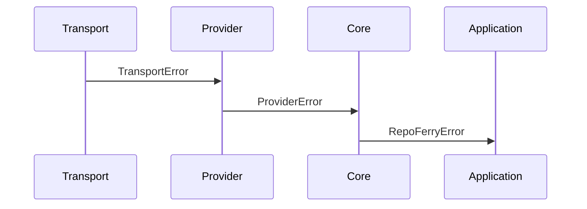
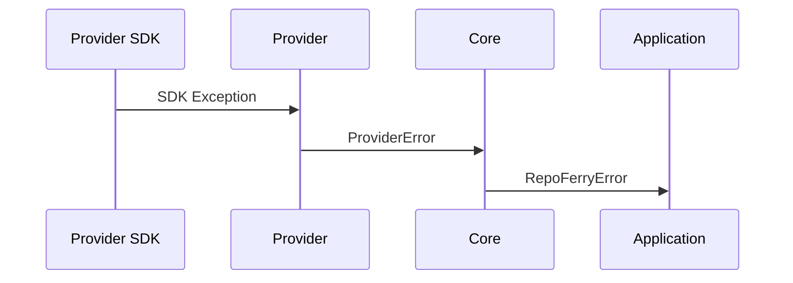
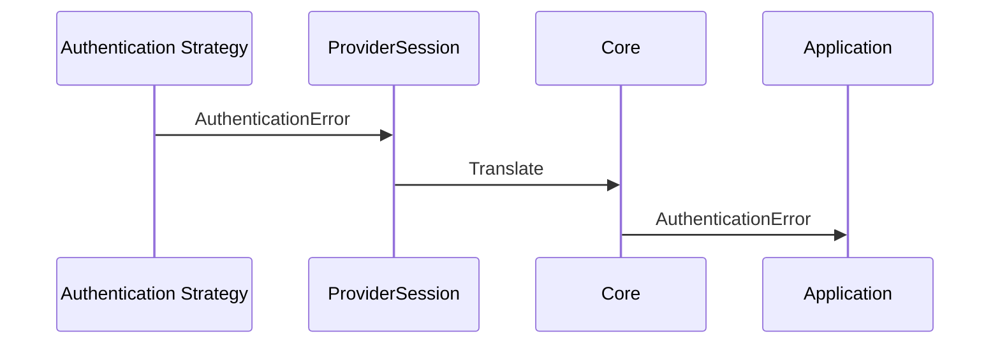
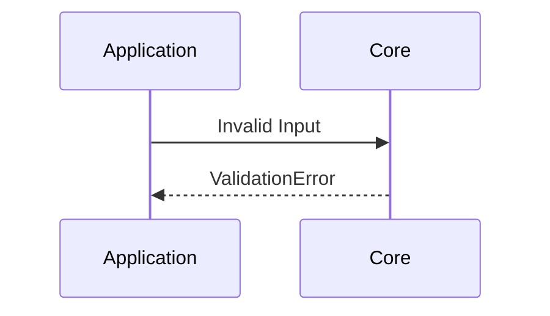
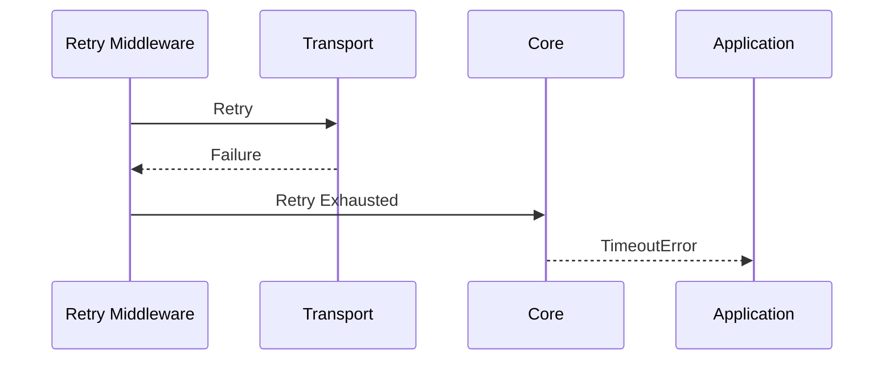
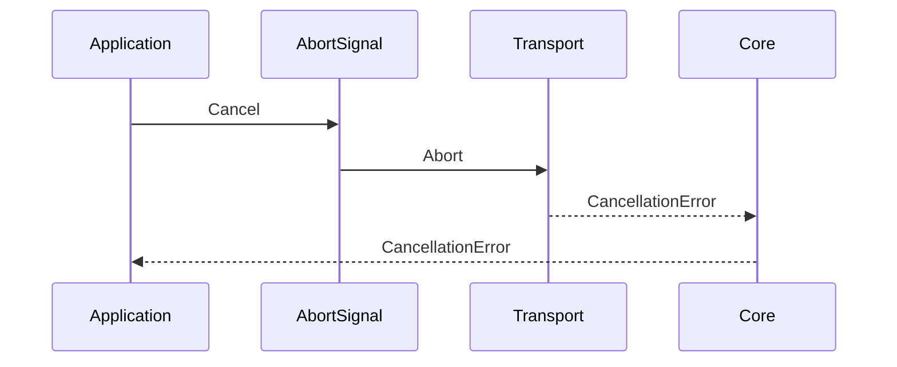

# ADR-008 — Error Model, Failure Semantics & Exception Architecture

**Status:** Accepted

**Version:** 1.0

**Date:** 2026-07-02

**Project:** RepoFerry

**Authors:** RepoFerry Architecture Team

**Related ADRs**

- ADR-001 — Vision & High-Level Architecture
- ADR-004 — Core Architecture
- ADR-005 — Provider Architecture
- ADR-006 — Authentication
- ADR-007 — Transport
- ADR-009 — Caching
- ADR-010 — Observability

---

# 1. Context

Failures are unavoidable.

Repositories may disappear.

Networks fail.

Authentication expires.

Providers return unexpected responses.

Transport connections terminate.

Applications require failures that are:

- predictable,
- actionable,
- provider-neutral,
- diagnosable,
- stable across versions.

This ADR defines how failures are represented throughout RepoFerry.

---

# 2. Terminology

| Term | Meaning |
|------|---------|
| Error | A failure exposed through the public API |
| Cause | Original failure preserved internally |
| Translation | Converting failures between architectural boundaries |
| Diagnostic Context | Additional metadata attached to failures |
| Retryability | Indicates whether retry should be attempted |
| Stable Error Code | Versioned identifier independent of class names |

---

# 3. Decision

RepoFerry adopts an **Exception-based public API** with:

- immutable errors,
- stable error hierarchy,
- stable error codes,
- structured diagnostics,
- preserved causes,
- provider-neutral semantics.

Errors are translated exactly once at each architectural boundary.

Applications interact exclusively with RepoFerry errors.

---

# 4. Error Philosophy

Errors communicate recoverable and non-recoverable failures.

Errors are part of RepoFerry's public contract.

Changing their meaning constitutes a breaking change.

Errors should help developers answer:

- What happened?
- Why?
- Can it be retried?
- Where did it fail?
- How should it be handled?

---

## Exception vs Result

Two approaches were considered.

### Result Objects

```text
Result<T,Error>
```

Advantages:

- explicit failure handling,
- functional composition.

Disadvantages:

- verbose APIs,
- unfamiliar JavaScript ergonomics,
- awkward async composition.

---

### Exceptions

```text
throw Error
```

Advantages:

- idiomatic JavaScript,
- integrates naturally with async/await,
- simpler public API.

Recommendation:

RepoFerry exposes exceptions.

---

# 5. Error Architecture

Errors are translated through architectural boundaries.

```mermaid
flowchart TD

Infrastructure Failure

↓

Transport Error

↓

Provider Error

↓

Core Error

↓

RepoFerry Error

↓

Application
```

Each layer translates exactly once.

No implementation-specific failures escape upward.

---

# 6. Translation Principles

Translation follows five rules.

1. Translate once.
2. Preserve original cause.
3. Remove implementation details.
4. Add architectural context.
5. Never lose diagnostic information.

---

# 7. Public Error Hierarchy

Every public error derives from:

```text
RepoFerryError
```

Hierarchy:

```text
RepoFerryError

├── ValidationError

├── AuthenticationError

├── AuthorizationError

├── TransportError

├── TimeoutError

├── CancellationError

├── RateLimitError

├── NotFoundError

├── ConflictError

├── CapabilityNotSupportedError

├── ConfigurationError

├── ProviderError

├── RepositoryError

└── UnexpectedError
```

---

## UnexpectedError

Unexpected failures are represented by:

```text
UnexpectedError
```

This indicates an internal defect or unforeseen runtime condition.

Applications should generally:

- log,
- report,
- avoid automatic recovery.

UnexpectedError intentionally communicates:

> "This is likely a RepoFerry bug."

---

# 8. Stable Error Codes

Every public error exposes an immutable error code.

Examples:

```text
REPOFERRY_VALIDATION

REPOFERRY_AUTHENTICATION

REPOFERRY_PERMISSION_DENIED

REPOFERRY_TIMEOUT

REPOFERRY_CANCELLED

REPOFERRY_RATE_LIMITED

REPOFERRY_NOT_FOUND

REPOFERRY_CONFIGURATION

REPOFERRY_PROVIDER

REPOFERRY_UNEXPECTED
```

Applications should prefer:

```ts
error.code
```

over class-name comparisons.

Stable error codes are part of the public compatibility contract.

---

# 9. Error Responsibilities

Errors own:

- human-readable message,
- stable error code,
- retryability,
- diagnostic context,
- original cause.

Errors never own:

- logging,
- retries,
- transport,
- recovery.

---

# 10. Internal Dependency Graph

```mermaid
flowchart TD

Infrastructure

↓

Transport

↓

Provider

↓

Core

↓

RepoFerryError

↓

Application
```

Dependencies always flow upward.

Errors never bypass architectural boundaries.

---

# 11. Architectural Constraints

1. Every public error derives from RepoFerryError.
2. Stable error codes never change in minor releases.
3. Translation occurs once per boundary.
4. Internal exceptions never escape.
5. SDK exceptions never escape Providers.
6. Transport exceptions never escape Transport.
7. Errors remain immutable.
8. Public error contracts follow Semantic Versioning.
9. UnexpectedError represents implementation defects.
10. Sensitive information never appears in public errors.

Architecture tests verify these guarantees.

See ADR-012.


---

# 12. Error Context

Every public error carries structured diagnostic context.

Diagnostic context helps applications:

- diagnose failures,
- correlate requests,
- enrich logs,
- integrate with observability systems.

Context is immutable.

---

## Context Organization

Diagnostic context is grouped into logical sections.

### Operation Context

Contains information about the failed operation.

Examples:

- operation name,
- capability,
- retry count,
- elapsed time.

---

### Repository Context

Contains repository identity.

Examples:

- provider,
- repository,
- reference,
- path.

---

### Provider Context

Contains provider-neutral provider diagnostics.

Examples:

- provider name,
- provider request identifier,
- provider status,
- provider error code.

Provider-specific SDK objects are never exposed.

---

### Transport Context

Contains transport execution metadata.

Examples:

- transport identifier,
- timeout,
- cancellation state,
- protocol-neutral request metadata.

---

# 13. Error Metadata

Every public error exposes immutable metadata.

Examples include:

| Property | Purpose |
|----------|---------|
| code | Stable public identifier |
| retryability | Retry guidance |
| category | Error classification |
| severity | Diagnostic importance |
| timestamp | Failure creation time |

Metadata supports diagnostics without exposing implementation details.

---

## Retryability

Retryability communicates whether retry should be considered.

Values:

```text
Never

Maybe

Always
```

Definitions:

| Value | Meaning |
|--------|---------|
| Never | Retry is never appropriate |
| Maybe | Retry depends on runtime policy |
| Always | Retry is generally appropriate |

Retry middleware combines Retryability with RetryPolicy.

See ADR-007.

---

# 14. Timeout & Cancellation

RepoFerry distinguishes timeout from cancellation.

---

## Timeout

Timeout represents a request that exceeded an allowed execution duration.

Timeout always results in:

```text
TimeoutError
```

Timeouts may be retryable depending on policy.

---

## Cancellation

Cancellation represents an intentional interruption.

Cancellation produces:

```text
CancellationError
```

Cancellation is not considered a successful completion.

Cancellation is generally not retried automatically.

---

# 15. Provider Errors

Provider SDK failures are translated before leaving Provider boundaries.

Example:

```text
Provider SDK Exception

↓

Provider Error

↓

RepoFerryError
```

Applications never observe SDK exception types.

---

## Provider Diagnostics

Providers may contribute safe diagnostic metadata.

Examples:

- requestId,
- activityId,
- providerCode,
- responseStatus.

Unsafe SDK objects remain internal.

---

# 16. Transport Errors

Transport failures remain transport-neutral.

Examples include:

- network unavailable,
- DNS failure,
- TLS failure,
- connection refused,
- timeout,
- streaming interruption.

Transport implementation details remain hidden.

---

## Translation

```text
Socket Error

↓

TransportError

↓

RepoFerryError
```

Translation occurs exactly once.

---

# 17. Validation Errors

Validation occurs before repository operations execute.

Validation failures include:

- invalid repository URL,
- invalid configuration,
- unsupported operation,
- invalid path,
- malformed reference,
- invalid authentication configuration.

Validation failures are deterministic.

---

# 18. Error Wrapping

RepoFerry preserves original causes.

Example:

```text
Infrastructure Failure

↓

TransportError

↓

ProviderError

↓

RepoFerryError
```

Each layer retains its immediate cause.

Applications may inspect causes for diagnostics but should depend only on RepoFerry contracts.

---

# 19. Diagnostics Integration

Errors integrate naturally with DiagnosticsService.

See ADR-010.

Failure events include:

- operation,
- provider,
- repository,
- retry count,
- latency,
- correlation identifiers,
- stable error code.

Errors never emit diagnostics directly.

Diagnostics observe errors.

---

# 20. Logging Responsibilities

Errors never log themselves.

Responsibilities remain separated.

| Component | Responsibility |
|-----------|----------------|
| Error | Represent failure |
| Diagnostics | Publish events |
| Logger | Persist events |

RepoFerry remains logging-framework neutral.

---

# 21. Serialization

Public errors support safe serialization.

Serialization exists for:

- diagnostics,
- testing,
- telemetry,
- support.

Serialized representations must be:

- deterministic,
- provider-neutral,
- version-tolerant.

---

## Canonical Representation

Equivalent errors serialize identically.

Canonical serialization improves:

- caching,
- hashing,
- snapshot testing,
- diagnostics.

---

## Compatibility

Serialized representations may add optional fields.

They must not:

- rename existing fields,
- remove existing fields,
- change field semantics,

outside a major release.

---

# 22. Testing Strategy

Error behavior is verified through multiple testing layers.

---

## Unit Tests

Verify:

- hierarchy,
- metadata,
- retryability,
- serialization,
- immutability.

---

## Contract Tests

Verify:

- stable error codes,
- public hierarchy,
- canonical serialization,
- provider translation.

---

## Integration Tests

Verify:

- Transport translation,
- Provider translation,
- Authentication failures,
- Retry behavior,
- Diagnostics.

---

## Regression Tests

Every reported bug becomes a permanent regression test.

See ADR-012.

---

# 23. Sequence Diagrams

## Transport Failure



---

## Provider Failure



---

## Authentication Failure



---

## Validation Failure



---

## Retry Exhaustion



---

## Cancellation



---

# 24. Architectural Consequences

## Benefits

The error architecture provides:

- predictable failures,
- stable contracts,
- provider neutrality,
- deterministic diagnostics,
- safe serialization,
- long-term compatibility.

---

## Trade-offs

The architecture introduces:

- translation layers,
- immutable metadata,
- stable error codes.

These trade-offs intentionally favor maintainability over implementation simplicity.

---

# 25. Alternatives Considered

## Result Objects

**Rejected**

Reason:

Less idiomatic for JavaScript and TypeScript ecosystems.

---

## Provider Exceptions as Public API

**Rejected**

Reason:

Would tightly couple applications to provider implementations.

---

## Mutable Errors

**Rejected**

Reason:

Mutation complicates concurrency, diagnostics, and caching.

---

## InternalError

**Rejected**

Reason:

UnexpectedError better communicates that the failure represents an implementation defect rather than an actionable runtime condition.

---

# 26. References

This ADR defines the error architecture of RepoFerry.

Related documents:

- ADR-001 — Vision & High-Level Architecture
- ADR-004 — Core Architecture
- ADR-005 — Provider Architecture
- ADR-006 — Authentication
- ADR-007 — Transport
- ADR-009 — Caching
- ADR-010 — Observability
- ADR-012 — Testing
- ADR-015 — Governance

---

# ADR Summary

ADR-008 establishes the error model of RepoFerry.

It defines:

- immutable public errors,
- provider-neutral exception hierarchy,
- stable `REPOFERRY_*` error codes,
- structured diagnostic context,
- retryability metadata,
- provider and transport error translation,
- canonical serialization,
- error wrapping,
- diagnostics integration,
- architectural constraints.

The central architectural principle is:

> **Failures are translated exactly once per architectural boundary, exposed through stable RepoFerry contracts, and enriched with deterministic diagnostics without leaking implementation details.**

Public error types, stable error codes, and serialization formats are part of RepoFerry's Semantic Versioning contract and evolve according to the compatibility guarantees established throughout the architecture.