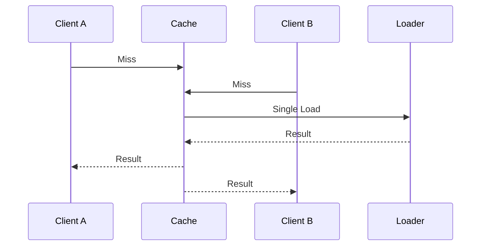
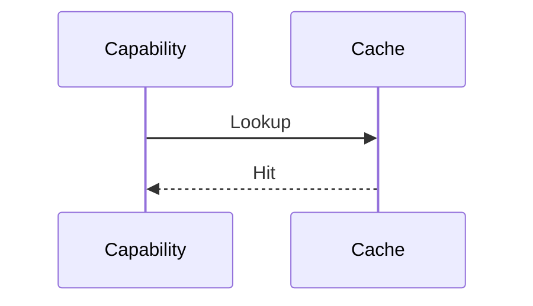
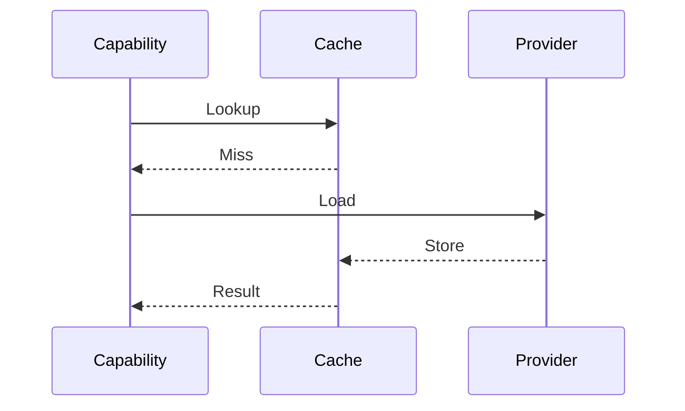
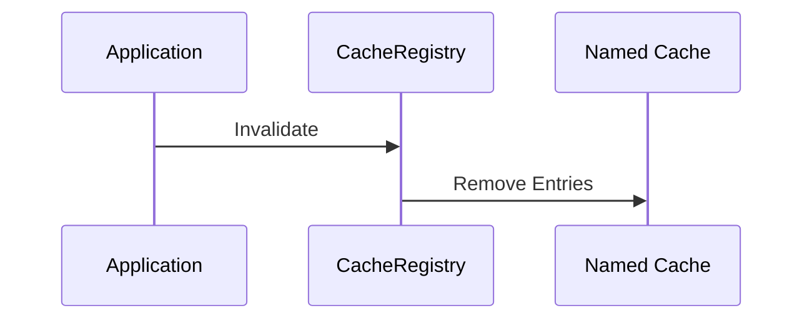
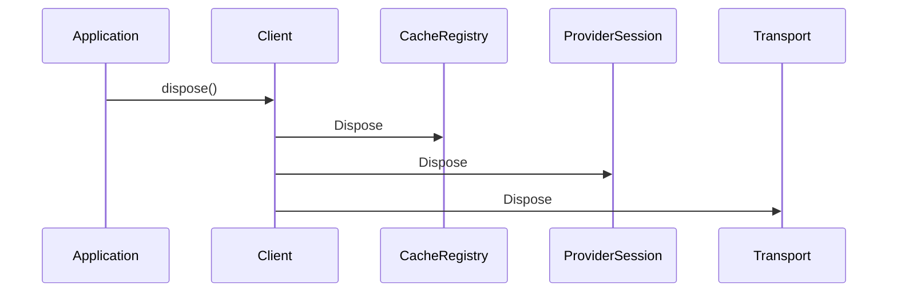

# ADR-009 — Caching, Performance & Resource Management

**Status:** Accepted

**Version:** 1.0

**Date:** 2026-07-02

**Project:** GitBridge

**Authors:** GitBridge Architecture Team

**Related ADRs**

- ADR-004 — Core Architecture
- ADR-005 — Provider Architecture
- ADR-006 — Authentication
- ADR-007 — Transport
- ADR-008 — Error Model
- ADR-010 — Observability
- ADR-012 — Testing

---

# 1. Context

Repository operations frequently access the same immutable resources.

Examples include:

- repository metadata,
- directory trees,
- README files,
- blobs,
- references.

Repeated retrieval without caching introduces unnecessary latency, network traffic, and provider rate-limit consumption.

GitBridge requires a provider-neutral caching architecture that improves performance while preserving correctness and predictable behavior.

---

# 2. Decision

GitBridge adopts a **client-scoped, registry-driven caching architecture**.

Caching is:

- optional,
- deterministic,
- immutable,
- provider-neutral,
- replaceable.

Core owns cache orchestration.

Individual cache implementations remain pluggable.

---

# 3. Performance Philosophy

Performance is measured by predictable behavior rather than raw throughput.

Primary goals:

- minimize unnecessary provider requests,
- reduce latency,
- reduce memory allocations,
- preserve correctness,
- support large repositories,
- scale to long-running applications.

GitBridge avoids premature optimization.

Optimization is introduced only when it preserves architectural simplicity.

---

# 4. Cache Architecture

Caching is organized around four abstractions.

```mermaid
flowchart TD

CacheRegistry

↓

Named Cache

↓

CacheProvider

+

CachePolicy

↓

Storage
```

Each abstraction owns one responsibility.

---

# 5. Cache Ownership

Caching belongs to Core.

Responsibilities include:

- cache registration,
- cache lifecycle,
- cache lookup,
- invalidation,
- diagnostics.

Providers may request caching but never own global cache state.

Transport remains cache-neutral.

---

# 6. Cache Registry

Rather than embedding knowledge of individual cache types inside a CacheManager, GitBridge uses a **CacheRegistry**.

The registry coordinates independent named caches.

Examples:

```text
metadata

tree

blob

readme

search

history

releases
```

Future caches can be introduced without modifying registry logic.

---

## Responsibilities

CacheRegistry owns:

- cache discovery,
- registration,
- lookup,
- lifecycle,
- disposal.

It does **not** understand the semantics of individual cache contents.

---

# 7. CacheProvider

CacheProvider abstracts storage.

Examples:

- in-memory,
- Redis (future),
- persistent storage (future),
- custom providers.

CacheProvider is responsible only for:

- storing entries,
- retrieving entries,
- removing entries.

It does not determine caching behavior.

---

# 8. CachePolicy

CachePolicy owns cache behavior.

Responsibilities include:

- TTL,
- eviction,
- refresh,
- cache-aside,
- read-through behavior.

Separating CacheProvider from CachePolicy allows independent composition.

Example:

```text
Memory Storage

+

LRU Policy

+

TTL Policy
```

without coupling storage to eviction logic.

---

# 9. Cache Hierarchy

GitBridge defines logical cache layers.

```text
Client Cache

├── Repository Metadata
├── Tree
├── Blob
├── README
├── Search
├── History
├── Releases
├── Provider Session
└── Authentication Context
```

Each cache has independent lifecycle and policy.

---

## Objects That Should Never Be Cached

The following objects remain transient:

- active streams,
- cancellation tokens,
- transport requests,
- transport responses,
- diagnostics events.

Caching mutable runtime state would introduce correctness risks.

---

# 10. Cache Principles

GitBridge follows six caching principles.

### Deterministic

Identical requests produce identical cache lookups.

---

### Immutable

Cached values are immutable.

Mutation after insertion is prohibited.

---

### Explicit

Caching is explicit and configurable.

Hidden global caches are not permitted.

---

### Provider Neutral

Cache entries never contain provider SDK objects.

Only domain models are cached.

---

### Replaceable

Applications may replace CacheProvider without modifying Core.

---

### Observable

Every cache operation emits diagnostics.

See ADR-010.

---

# 11. Internal Dependency Graph

```mermaid
flowchart TD

Core

↓

CacheRegistry

↓

Named Cache

↓

CachePolicy

↓

CacheProvider

↓

Storage
```

Dependencies always point toward abstractions.

---

# 12. Architectural Constraints

1. Core owns cache orchestration.
2. Providers never own global caches.
3. CacheProvider owns storage only.
4. CachePolicy owns behavior only.
5. CacheRegistry never understands cache semantics.
6. Cached objects remain immutable.
7. Hidden global caches are prohibited.
8. Cache contracts evolve through Semantic Versioning.
9. Provider SDK models never enter caches.
10. Diagnostics observe cache behavior without modifying it.

---

# 13. Cache Keys

Cache keys uniquely identify cached resources.

Keys must remain:

- deterministic,
- provider-neutral,
- collision-resistant,
- stable.

---

## Cache Identity

A cache key is composed from the following logical components.

```text
Provider

↓

Repository

↓

Reference

↓

Capability

↓

Path

↓

Operation

↓

Configuration Variant
```

Including **Capability** prevents collisions between operations targeting the same path.

Example:

```text
blob / README.md
```

is distinct from

```text
tree / README.md
```

---

## Key Principles

Cache keys:

- never contain provider SDK objects,
- never depend on object identity,
- are canonical,
- serialize deterministically.

---

# 14. Cache Policies

GitBridge supports multiple cache behaviors.

Examples include:

- Cache Aside,
- Read Through,
- Write Through,
- Lazy Loading,
- TTL-based expiration.

---

## Default Policy

The default policy is **Cache Aside**.

Flow:

```text
Lookup

↓

Hit → Return

↓

Miss

↓

Load

↓

Store

↓

Return
```

This minimizes complexity while remaining predictable.

---

# 15. Cache Invalidation

Cache invalidation is deterministic.

GitBridge supports:

- TTL expiration,
- manual invalidation,
- repository disposal,
- provider refresh,
- future event-driven invalidation.

---

## Stale Data

Stale entries may be refreshed.

Background refresh must never overwrite newer data.

Freshness is always compared before replacement.

---

## Ownership

Cache invalidation is owned by Core.

Providers may request invalidation but never perform global invalidation themselves.

---

# 16. Object Lifecycles

The following lifecycles apply.

| Object | Lifetime |
|---------|----------|
| RepoKitClient | Scoped |
| Repository | Scoped |
| RepositoryRef | Lightweight / Immutable |
| Capability | Lazy |
| ProviderSession | Scoped |
| AuthenticationContext | Scoped |
| Transport | Shared |
| CacheRegistry | Client Scoped |

---

## Repository

Repository objects are reusable.

They own no mutable business state.

Disposal invalidates associated runtime resources.

---

## RepositoryRef

RepositoryRef is immutable.

It represents a logical snapshot of a repository at a specific reference.

RepositoryRef instances are inexpensive to create.

---

# 17. Memory Management

GitBridge favors predictable memory usage.

Strategies include:

- bounded caches,
- immutable values,
- streaming,
- lazy initialization.

---

## Eviction

Eviction is policy-driven.

Possible reasons include:

- TTL,
- LRU,
- manual invalidation,
- client disposal,
- memory pressure (future).

Eviction reasons are exposed through diagnostics.

See ADR-010.

---

# 18. Concurrency

Concurrent operations should cooperate whenever practical.

GitBridge supports:

- concurrent reads,
- shared cache lookups,
- request deduplication,
- immutable cache entries.

---

## Single-flight Loading

Concurrent cache misses for the same key share a single in-flight operation.



---

## Failure Handling

If the shared request fails:

```text
Request

↓

Failure

↓

Remove In-flight Promise

↓

Do NOT cache failure
```

Transient failures must never become cached results.

---

# 19. Performance Optimizations

GitBridge includes several architectural optimizations.

---

## Lazy Initialization

Objects are initialized only when required.

Unused capabilities allocate no runtime resources.

---

## Connection Reuse

Transport implementations should reuse connections whenever possible.

See ADR-007.

---

## Request Deduplication

Duplicate concurrent requests should share work whenever safe.

---

## Background Refresh

Future cache implementations may refresh entries asynchronously.

Background refresh never replaces newer data.

---

## Incremental Loading

Large repository structures may be loaded incrementally.

Streaming remains preferred for large payloads.

---

# 20. Resource Management

Runtime resources require deterministic ownership.

GitBridge exposes:

```text
client.dispose()
```

for releasing scoped resources.

---

## Disposal Rules

`dispose()` must be:

- deterministic,
- idempotent,
- safe to call multiple times.

Repeated disposal must never produce additional side effects.

---

## Disposal Responsibilities

Disposal releases:

- ProviderSessions,
- CacheRegistry,
- Transport resources,
- future background workers.

Disposed clients reject new operations.

---

# 21. Cache Extensibility

Caching is replaceable.

Future providers include:

- Redis,
- SQLite,
- IndexedDB,
- offline storage,
- custom enterprise caches.

Core depends only on CacheProvider contracts.

---

# 22. Performance Metrics

Performance metrics remain provider-neutral.

Operational metrics include:

- cache hit rate,
- cache miss rate,
- latency,
- retry rate,
- streaming throughput.

Diagnostic metrics include:

- eviction reason,
- cache size,
- in-flight requests,
- single-flight deduplications.

Metrics integrate with ADR-010.

---

# 23. Sequence Diagrams

## Cache Hit



---

## Cache Miss



---

## Cache Invalidation



---

## Repository Disposal



---

# 24. Architectural Consequences

## Benefits

The caching architecture provides:

- deterministic behavior,
- provider neutrality,
- replaceable storage,
- configurable policies,
- efficient concurrency,
- low memory overhead.

---

## Trade-offs

The architecture introduces:

- cache coordination,
- immutable value requirements,
- explicit lifecycle management.

These trade-offs intentionally favor correctness and long-term maintainability.

---

# 25. Alternatives Considered

## Global Cache

**Rejected**

Reason:

Introduces hidden shared state and unpredictable behavior.

---

## Provider-Owned Caches

**Rejected**

Reason:

Duplicates caching logic and violates Core ownership.

---

## Caching Mutable Objects

**Rejected**

Reason:

Would compromise correctness and concurrency guarantees.

---

## CacheManager Owning Cache Types

**Rejected**

Reason:

A registry-based approach is more extensible and avoids modifications when introducing new cache categories.

---

# 26. References

This ADR defines the caching architecture of GitBridge.

Related documents:

- ADR-004 — Core Architecture
- ADR-005 — Provider Architecture
- ADR-007 — Transport
- ADR-008 — Error Model
- ADR-010 — Observability
- ADR-012 — Testing
- ADR-013 — Build & Release

---

# ADR Summary

ADR-009 establishes the caching, performance, and resource management architecture of GitBridge.

It defines:

- client-scoped caching,
- CacheRegistry orchestration,
- CacheProvider storage abstraction,
- CachePolicy behavior abstraction,
- capability-aware cache keys,
- deterministic invalidation,
- immutable cached values,
- object lifecycles,
- single-flight request deduplication,
- predictable resource disposal,
- performance metrics,
- architectural constraints.

The central architectural principle is:

> **Caching is an optional Core responsibility built on replaceable storage, configurable policies, immutable values, and deterministic lifecycles, ensuring predictable performance without sacrificing correctness or provider neutrality.**