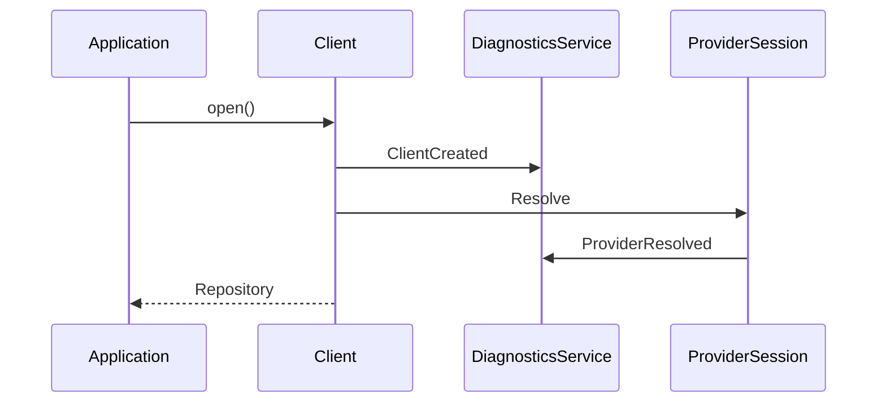
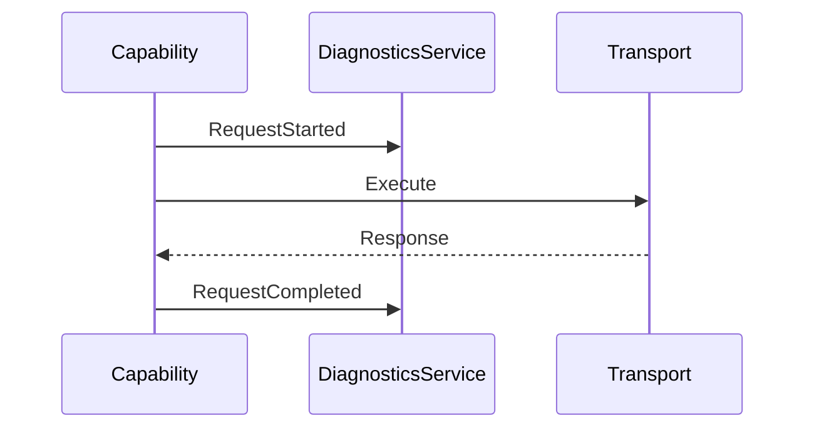
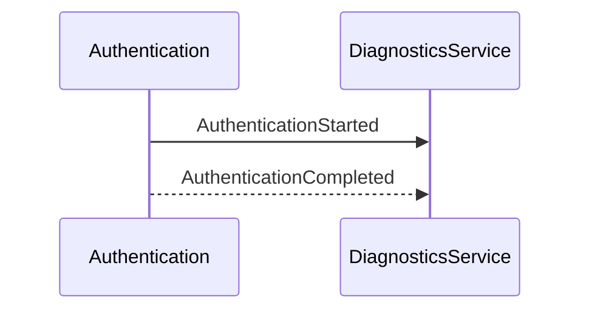
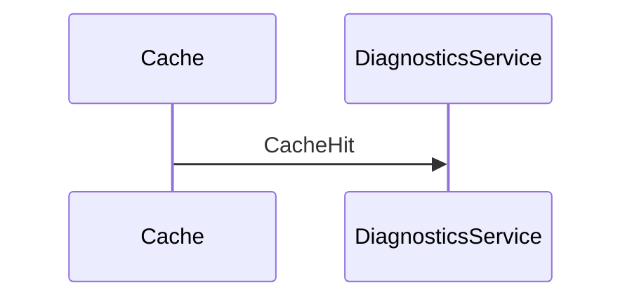
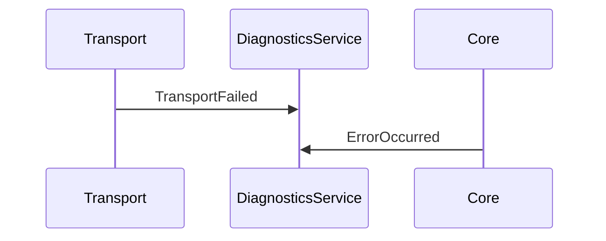
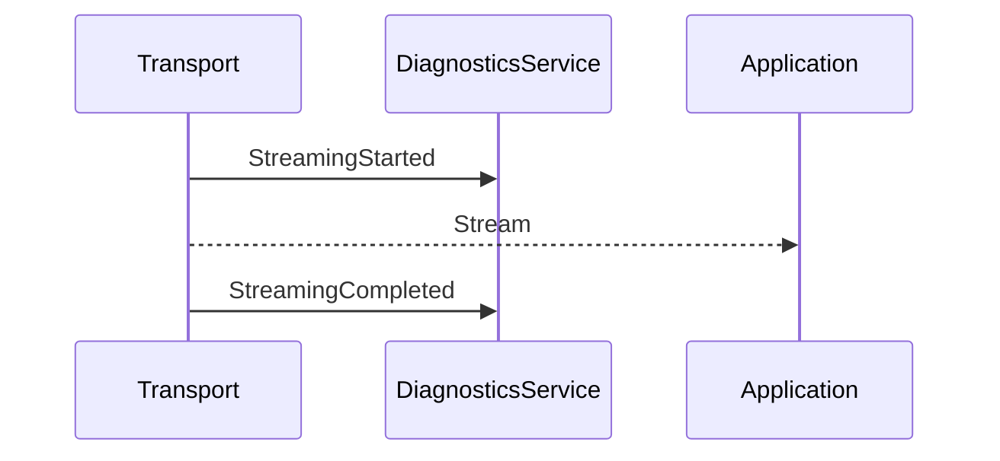

# ADR-010 — Observability, Diagnostics & Telemetry

**Status:** Accepted

**Version:** 1.0

**Date:** 2026-07-02

**Project:** RepoFerry

**Authors:** RepoFerry Architecture Team

**Related ADRs**

- ADR-004 — Core Architecture
- ADR-006 — Authentication
- ADR-007 — Transport
- ADR-008 — Error Model
- ADR-009 — Caching
- ADR-012 — Testing

---

# 1. Context

RepoFerry is intended for use in production applications, automation systems, developer tools, and long-running services.

Consumers require visibility into runtime behavior without coupling RepoFerry to any particular logging, tracing, or monitoring framework.

Observability must therefore be:

- optional,
- provider-neutral,
- low-overhead,
- composable,
- extensible.

---

# 2. Decision

RepoFerry adopts a **provider-neutral observability architecture** built around a `DiagnosticsService`.

Observability consists of five independent concerns:

- Diagnostics Events
- Structured Logging Hooks
- Metrics
- Distributed Tracing
- Extension Hooks

None of these concerns affect runtime behavior.

---

# 3. Observability Philosophy

Observability answers:

> "What happened inside RepoFerry?"

It does **not** change:

- business logic,
- provider behavior,
- transport execution,
- caching,
- authentication.

Observability is observational, never operational.

---

## Architectural Principles

RepoFerry follows these principles:

1. Diagnostics are optional.
2. No logging framework dependency.
3. Events never mutate runtime behavior.
4. Metrics remain provider-neutral.
5. Diagnostics have negligible overhead when disabled.
6. Telemetry contracts evolve through Semantic Versioning.

---

# 4. Overall Architecture

```mermaid
flowchart TD

Core

↓

DiagnosticsService

├── EventDispatcher

├── MetricCollector

└── TraceCoordinator

↓

Subscribers
```

Each component owns a single responsibility.

---

# 5. DiagnosticsService

`DiagnosticsService` coordinates the observability subsystem.

Responsibilities include:

- publishing diagnostic events,
- coordinating metrics,
- coordinating traces,
- managing subscribers.

It does **not**:

- log,
- persist metrics,
- export traces.

Those responsibilities belong to consumers or adapters.

---

# 6. Diagnostic Events

Every runtime observation is represented by a `DiagnosticEvent`.

Hierarchy:

```text
DiagnosticEvent

├── RepositoryEvent

├── TransportEvent

├── AuthenticationEvent

├── CacheEvent

├── ErrorEvent

└── ProviderEvent
```

A common base event provides:

- timestamp,
- event identifier,
- schemaVersion,
- correlation identifiers,
- diagnostic context.

---

## Event Versioning

Every event includes:

```text
schemaVersion
```

This allows diagnostic consumers to evolve independently from RepoFerry releases.

New optional fields may be added without breaking existing subscribers.

---

# 7. Event Pipeline

RepoFerry adopts an **Observer / Publisher–Subscriber** model.

```mermaid
flowchart LR

Runtime

↓

DiagnosticsService

↓

EventDispatcher

↓

Subscribers
```

Events are published asynchronously.

Subscribers never influence runtime execution.

---

## Ordering Guarantees

Ordering is guaranteed **within a single operation**.

Ordering is **not guaranteed across unrelated operations**.

This avoids unnecessary synchronization while preserving deterministic traces.

---

## Safe Observer

Subscribers execute inside an isolation boundary.

```text
DiagnosticEvent

↓

Safe Observer

↓

try/catch

↓

Internal Diagnostics

↓

Continue
```

No subscriber failure may interrupt the pipeline.

---

# 8. Structured Logging

RepoFerry never logs directly.

Instead, DiagnosticsService exposes structured logging hooks.

Applications choose:

- console,
- Winston,
- Pino,
- Bunyan,
- Serilog,
- custom adapters.

Logging remains entirely external.

---

# 9. Metrics Architecture

Metrics are divided into two categories.

## Operational Metrics

Measure RepoFerry behavior.

Examples:

- request count,
- retry count,
- cache hits,
- cache misses,
- latency,
- streaming throughput.

---

## Diagnostic Metrics

Measure the observability subsystem itself.

Examples:

- subscriber latency,
- dropped events,
- queue depth,
- event processing failures.

Separating these categories simplifies production monitoring.

---

# 10. Internal Dependency Graph

```mermaid
flowchart TD

Runtime

↓

DiagnosticsService

├── EventDispatcher

├── MetricCollector

└── TraceCoordinator

↓

External Observability Systems
```

RepoFerry depends only on abstractions.

No telemetry framework is referenced directly.

---

# 11. Architectural Constraints

1. Core never depends on a logging framework.
2. Events never modify runtime behavior.
3. Diagnostics remain optional.
4. Every event derives from `DiagnosticEvent`.
5. Every event includes `schemaVersion`.
6. Subscribers execute inside Safe Observer.
7. Metrics remain provider-neutral.
8. Provider SDK objects never appear in events.
9. Diagnostics contracts follow Semantic Versioning.
10. Observability overhead approaches zero when disabled.

---

# 12. Distributed Tracing

RepoFerry supports distributed tracing through provider-neutral abstractions.

Tracing allows applications to correlate repository operations across:

- Core,
- Providers,
- Authentication,
- Transport,
- external systems.

RepoFerry does not implement a tracing backend.

Instead, it emits tracing information through extensible contracts.

---

## Trace Hierarchy

Tracing follows the logical execution hierarchy established in ADR-004.

```text
Client

↓

Repository

↓

RepositoryRef

↓

Capability

↓

ProviderSession

↓

Transport
```

Each operation creates nested spans representing progressively lower architectural layers.

---

## Trace Context

Trace context contains:

- Trace ID,
- Span ID,
- Parent Span ID,
- Correlation ID,
- Operation name,
- Start time,
- End time.

Trace identifiers remain immutable.

---

## OpenTelemetry Compatibility

The tracing model is intentionally compatible with OpenTelemetry concepts.

RepoFerry does not depend on OpenTelemetry packages.

Instead, adapters may translate RepoFerry trace contracts into:

- OpenTelemetry,
- Application Insights,
- Datadog,
- Jaeger,
- Zipkin,
- future tracing systems.

---

# 13. Diagnostic Context

Every DiagnosticEvent carries immutable context.

Context is grouped into four logical sections.

---

## Operation Context

Describes the executing operation.

Examples:

- operation,
- capability,
- retry count,
- elapsed time.

---

## Repository Context

Describes the repository.

Examples:

- provider,
- repository,
- reference,
- path.

---

## Provider Context

Contains provider-neutral metadata.

Examples:

- provider identifier,
- provider request ID,
- provider response status.

Provider SDK models never appear.

---

## Transport Context

Contains infrastructure metadata.

Examples:

- timeout,
- cancellation state,
- transport identifier,
- streaming flag.

---

# 14. Performance Overhead

Observability must impose negligible overhead when disabled.

Optimization principles include:

- lazy event construction,
- no-op implementations,
- deferred metadata generation,
- zero allocations where practical.

Future sampling strategies may further reduce runtime cost.

---

# 15. Public Diagnostics API

RepoFerry exposes diagnostics through explicit services.

Examples:

```text
client.diagnostics

client.metrics

client.tracing
```

Applications subscribe to events using provider-neutral abstractions.

RepoFerry never exposes EventEmitter directly.

---

## Subscription Model

Subscribers register listeners with DiagnosticsService.

Responsibilities include:

- receiving events,
- exporting metrics,
- forwarding traces,
- integrating with logging frameworks.

Subscribers remain external to RepoFerry.

---

# 16. Provider Integration

Providers participate in diagnostics by publishing provider-neutral events.

Examples:

- ProviderResolved,
- RepositoryMatched,
- CapabilityExecuted,
- ProviderRequestCompleted.

Providers never emit SDK-specific diagnostics.

Provider SDK objects remain internal.

---

# 17. Transport Integration

Transport emits infrastructure events.

Examples:

- TransportRequestStarted,
- TransportRequestCompleted,
- RetryStarted,
- RetryCompleted,
- TimeoutOccurred,
- CancellationOccurred,
- StreamingStarted,
- StreamingCompleted.

Transport diagnostics never expose HTTP-specific concepts.

---

# 18. Error Diagnostics

Errors integrate naturally with ADR-008.

Every public error may produce:

- ErrorOccurred,
- RetryAttempted,
- RetryExhausted.

Diagnostics observe errors after translation.

Internal exceptions never generate public diagnostic events.

---

# 19. Extensibility

Observability contracts are intentionally minimal.

Future integrations include:

- Prometheus,
- Grafana,
- OpenTelemetry,
- Application Insights,
- Datadog,
- custom exporters.

Extensions consume DiagnosticEvents without modifying Core.

---

# 20. Sequence Diagrams

## Repository Open



---

## Successful Request



---

## Retry


---

## Authentication



---

## Cache Hit



---

## Transport Failure



---

## Streaming



---

# 21. Architectural Consequences

## Benefits

The observability architecture provides:

- provider-neutral diagnostics,
- structured metrics,
- trace propagation,
- logging independence,
- production visibility,
- minimal overhead.

---

## Trade-offs

The architecture introduces:

- event abstractions,
- tracing contracts,
- diagnostics coordination.

These trade-offs intentionally favor extensibility and long-term maintainability.

---

# 22. Alternatives Considered

## Direct Logging

**Rejected**

Reason:

Would couple RepoFerry to logging frameworks.

---

## EventEmitter API

**Rejected**

Reason:

Node-specific and insufficiently expressive for long-term evolution.

---

## Synchronous Subscribers

**Rejected**

Reason:

Subscriber failures could impact runtime behavior.

Safe Observer isolation prevents this.

---

## Framework-specific Metrics

**Rejected**

Reason:

Observability must remain ecosystem-neutral.

---

# 23. References

This ADR defines the observability architecture of RepoFerry.

Related documents:

- ADR-004 — Core Architecture
- ADR-006 — Authentication
- ADR-007 — Transport
- ADR-008 — Error Model
- ADR-009 — Caching
- ADR-012 — Testing
- ADR-013 — Build & Release

---

# ADR Summary

ADR-010 establishes the observability architecture of RepoFerry.

It defines:

- DiagnosticsService orchestration,
- hierarchical DiagnosticEvents,
- schema-versioned event contracts,
- Safe Observer isolation,
- structured logging hooks,
- operational and diagnostic metrics,
- distributed tracing,
- immutable diagnostic context,
- provider-neutral telemetry,
- extensibility for future monitoring systems,
- architectural constraints.

The central architectural principle is:

> **Observability is a passive, provider-neutral capability that exposes runtime behavior through stable contracts without influencing execution, allowing RepoFerry to integrate with any logging, metrics, or tracing ecosystem while remaining framework-independent.**