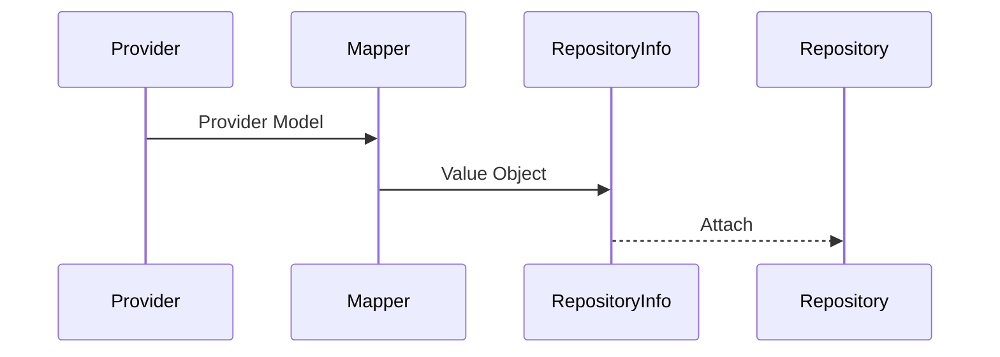
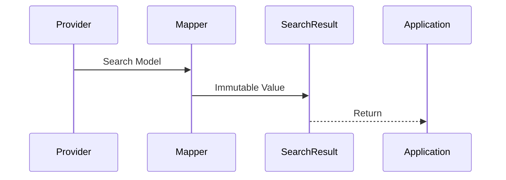
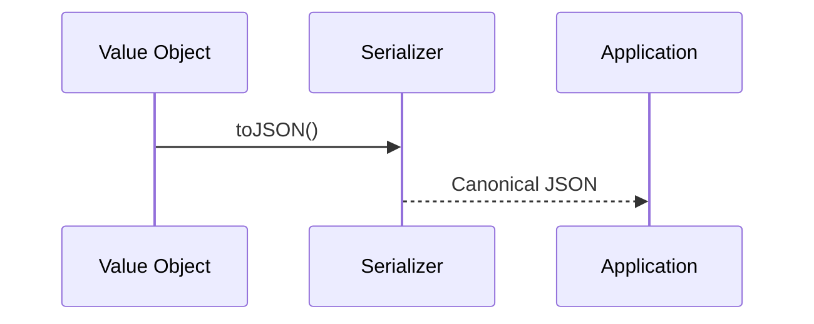
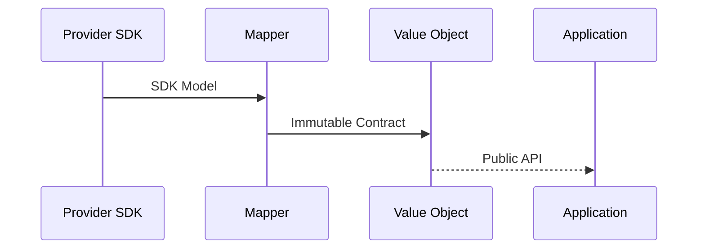

# ADR-011 — Type System, Serialization & Public Contracts

**Status:** Accepted

**Version:** 1.0

**Date:** 2026-07-02

**Project:** RepoFerry

**Authors:** RepoFerry Architecture Team

**Related ADRs**

- ADR-002 — Domain Model & Public API
- ADR-004 — Core Architecture
- ADR-005 — Provider Architecture
- ADR-008 — Error Model
- ADR-010 — Observability
- ADR-012 — Testing

---

# 1. Context

The TypeScript type system is part of RepoFerry's public API.

Every exported type contributes to the project's Semantic Versioning contract.

Changing public types affects:

- compilation,
- IntelliSense,
- serialization,
- documentation,
- application compatibility.

This ADR defines the public type system and long-term compatibility strategy.

---

# 2. Decision

RepoFerry adopts a **provider-neutral, immutable, interface-first type system**.

The public API distinguishes between:

- Service Objects
- Value Objects

Public contracts favor:

- interfaces,
- readonly models,
- semantic naming,
- explicit contracts.

---

# 3. Type Philosophy

Types are not implementation details.

They define:

- API contracts,
- developer experience,
- serialization,
- compatibility.

Public types evolve conservatively.

Internal implementation types remain private.

---

## Architectural Principles

RepoFerry follows these principles.

1. Public contracts are stable.
2. Value objects are immutable.
3. Service objects own behavior.
4. Provider SDK models never escape.
5. Serialization is canonical.
6. Type evolution follows Semantic Versioning.

---

# 4. Public Type Architecture

```mermaid
flowchart TD

Public Contracts

├── Service Objects

├── Value Objects

├── Configuration

├── Errors

└── Extension Contracts

↓

Applications
```

Internal types remain isolated.

Provider types never become public contracts.

---

# 5. Service Objects vs Value Objects

This distinction is a foundational architectural principle.

---

## Service Objects

Service objects own behavior.

Examples:

```text
Repository

RepositoryRef

RepoFerryClient
```

Characteristics:

- identity,
- lifecycle,
- operations,
- runtime state.

Service objects are **not** intended for serialization.

---

## Value Objects

Value objects represent immutable data.

Examples:

```text
RepositoryInfo

Commit

Branch

TreeNode

SearchResult

Release

Owner
```

Characteristics:

- immutable,
- serializable,
- no lifecycle,
- no identity beyond contained data.

---

## Architectural Rule

Service Objects must never masquerade as Value Objects.

Likewise, Value Objects must never own runtime behavior.

This separation simplifies:

- caching,
- serialization,
- testing,
- identity management.

---

# 6. Domain Models

RepoFerry defines provider-neutral value models.

Examples include:

```text
RepositoryInfo

RepositoryOwner

Organization

Commit

Branch

Tag

Release

Tree

TreeNode

Blob

DirectoryEntry

SearchResult
```

These models represent business concepts rather than provider implementations.

---

## Identity

Value objects derive identity from their contents.

Equivalent values are interchangeable.

Service objects derive identity from lifecycle and runtime ownership.

---

## Lifecycle

Value objects are created through mapping.

They become immutable immediately after construction.

Service objects remain managed by Core.

---

# 7. Public Contracts

Public contracts should generally be exposed as interfaces.

Preferred design:

```text
Interface

↓

Mapper / Factory

↓

Readonly Object
```

Public classes should be introduced only when genuine runtime behavior is required.

This minimizes runtime complexity while maximizing flexibility.

---

# 8. Immutability

Public value models are immutable.

Where practical they are exposed as:

```text
Readonly<T>
```

or equivalent immutable interfaces.

Benefits include:

- thread safety,
- predictable caching,
- deterministic serialization,
- simpler reasoning.

Mutation is prevented at compile time wherever practical.

---

# 9. Generic Design

Generics express **domain variability**, not implementation variability.

Appropriate examples include:

```text
SearchResult<T>

PagedResult<T>

CapabilityResult<T>
```

Generics should never expose provider-specific implementation details.

---

## Conditional Types

Conditional types remain internal unless they materially improve public ergonomics.

Avoid exposing complex type-level programming in the public API.

---

## Utility Types

Utility types may support public contracts when they improve readability.

Preference is given to explicit, discoverable APIs over clever type tricks.

---

# 10. Semantic Type Aliases

RepoFerry favors semantic aliases over branded types.

Examples:

```text
RepositoryName

BranchName

CommitSha

OwnerName

TagName
```

These remain aliases over primitive types while improving readability and documentation.

Branded types were intentionally rejected to avoid unnecessary complexity.

---

# 11. Internal Dependency Graph

```mermaid
flowchart TD

Public Interfaces

↓

Service Objects

↓

Value Objects

↓

Serialization

↓

Applications
```

Dependencies always point toward stable contracts.

---

# 12. Architectural Constraints

1. Public types are part of Semantic Versioning.
2. Service Objects own behavior.
3. Value Objects remain immutable.
4. Public contracts favor interfaces.
5. Provider SDK models never become public types.
6. Public classes require explicit architectural justification.
7. Semantic aliases improve readability without adding runtime cost.
8. Public contracts remain provider-neutral.
9. Generics represent domain variability only.
10. Serialization uses Value Objects exclusively.

---

# 13. Serialization

Only **Value Objects** participate in serialization.

Service Objects remain runtime abstractions and are never intended to be serialized.

Examples:

| Serializable | Not Serializable |
|--------------|------------------|
| RepositoryInfo | Repository |
| Commit | RepositoryRef |
| Branch | RepoFerryClient |
| SearchResult | ProviderSession |
| TreeNode | Transport |

---

## Serialization Principles

Public value models must:

- serialize deterministically,
- remain provider-neutral,
- preserve semantic meaning,
- avoid runtime-specific state.

Serialization must never include:

- caches,
- provider SDK models,
- transport implementations,
- authentication secrets,
- diagnostics internals.

---

## Canonical Representation

Equivalent Value Objects must serialize identically.

Canonical serialization improves:

- snapshot testing,
- hashing,
- caching,
- persistence,
- diagnostics.

---

# 14. Public Contracts

Public contracts are exposed through interfaces.

Preferred design:

```text
Interface

↓

Factory / Mapper

↓

Readonly Value Object
```

Runtime implementations remain internal.

Applications program against contracts rather than implementations.

---

## Interface Guidelines

Interfaces should:

- model business concepts,
- remain implementation-independent,
- evolve conservatively,
- prioritize readability.

Interfaces should not expose:

- provider SDK models,
- transport concerns,
- caching behavior,
- runtime lifecycle.

---

# 15. API Evolution

Public types evolve according to Semantic Versioning.

---

## Adding Fields

Adding optional fields is permitted in minor releases.

Optional fields represent either:

- Unknown
- Not Applicable

They must **never** mean:

> "The provider forgot to populate this field."

---

## Removing Fields

Removing public fields requires a major release.

---

## Renaming Fields

Renaming public fields requires a major release.

Deprecation should precede removal whenever practical.

---

## Reserved Fields

Future extension points may reserve optional properties.

Reserved fields remain undocumented until activated.

---

# 16. Provider Neutrality

Public models represent repository concepts rather than provider concepts.

Examples:

```text
Commit

Branch

Release

RepositoryInfo
```

These models intentionally avoid provider-specific terminology.

---

## Mapping Boundary

Provider models are translated before entering Core.

```text
Provider Model

↓

Mapper

↓

RepoFerry Value Object
```

Applications never observe provider SDK models.

---

# 17. Provider Extension Contracts

Some providers expose additional capabilities.

Examples include:

- GitHub Discussions,
- GitLab Epics,
- Azure Work Items.

These capabilities are represented through **Provider Extension Contracts**.

Core models remain unchanged.

Extensions compose alongside the Core API rather than modifying it.

---

# 18. Public Enums

RepoFerry prefers **string literal unions** over runtime enums.

Example:

```text
"file"

"directory"

"symlink"
```

Advantages include:

- zero runtime overhead,
- better tree shaking,
- improved interoperability,
- simpler serialization.

Runtime enums should be introduced only when behavior requires them.

---

# 19. Validation

Public models never validate themselves.

Validation occurs during:

- configuration,
- mapping,
- provider translation,
- API entry points.

Separating validation from models preserves immutability and single responsibility.

---

# 20. IntelliSense & Discoverability

Developer experience is a primary design goal.

Public APIs should:

- group related functionality,
- use descriptive names,
- avoid excessive nesting,
- minimize generic complexity.

Examples:

```text
repo.files

repo.tree

repo.history

repo.releases
```

instead of large, unrelated method collections.

---

## Naming

Names should favor domain terminology.

Examples:

- Repository
- RepositoryRef
- Branch
- Commit
- Tree

Implementation terminology should remain internal.

---

# 21. Type Versioning

Public types evolve conservatively.

Compatibility rules:

- optional fields may be added,
- required fields are stable,
- removed fields require major versions,
- renamed fields require major versions.

Type contracts are versioned together with the public API.

---

## Deprecated Fields

Deprecated fields remain functional until the next major release.

Documentation must include:

- deprecation notice,
- migration guidance,
- removal timeline.

---

# 22. Serialization Compatibility

Serialized representations follow forward-compatible principles.

Future versions may:

- add optional fields,
- add metadata,
- extend extension contracts.

Future versions must not:

- remove serialized fields,
- rename serialized fields,
- alter existing field semantics,

outside a major release.

---

## Unknown Fields

Consumers should safely ignore unknown serialized properties.

This enables forward compatibility across versions.

---

# 23. Sequence Examples

## Repository Creation



---

## Search Result



---

## Serialization



---

## Provider Mapping



---

# 24. Architectural Consequences

## Benefits

The type architecture provides:

- stable contracts,
- provider neutrality,
- excellent IntelliSense,
- deterministic serialization,
- immutable models,
- long-term compatibility.

---

## Trade-offs

The architecture introduces:

- additional mapping,
- immutable interfaces,
- separation of Service and Value Objects.

These trade-offs intentionally favor maintainability over implementation convenience.

---

# 25. Alternatives Considered

## Public Classes

**Rejected**

Reason:

Classes unnecessarily expose runtime behavior and reduce implementation flexibility.

---

## Branded Types

**Rejected**

Reason:

Semantic aliases provide sufficient clarity without increasing type complexity.

---

## Mutable Value Objects

**Rejected**

Reason:

Mutation complicates caching, serialization, concurrency, and reasoning.

---

## Provider Models as Public Contracts

**Rejected**

Reason:

Would permanently couple RepoFerry to provider implementations.

---

# 26. References

This ADR defines the public type system of RepoFerry.

Related documents:

- ADR-002 — Domain Model & Public API
- ADR-004 — Core Architecture
- ADR-005 — Provider Architecture
- ADR-008 — Error Model
- ADR-010 — Observability
- ADR-012 — Testing
- ADR-013 — Build & Release

---

# ADR Summary

ADR-011 establishes the public type system of RepoFerry.

It defines:

- interface-first public contracts,
- Service Object vs Value Object separation,
- immutable value models,
- semantic type aliases,
- canonical serialization,
- provider-neutral domain models,
- Provider Extension Contracts,
- string literal unions,
- API evolution rules,
- serialization compatibility,
- architectural constraints.

The central architectural principle is:

> **Public types are long-lived contracts. Service Objects own behavior, Value Objects represent immutable data, and provider-specific implementation details are translated into stable, provider-neutral models before reaching applications.**