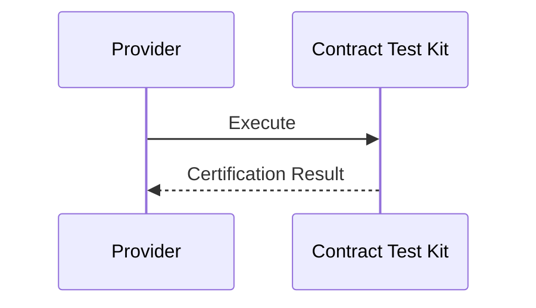
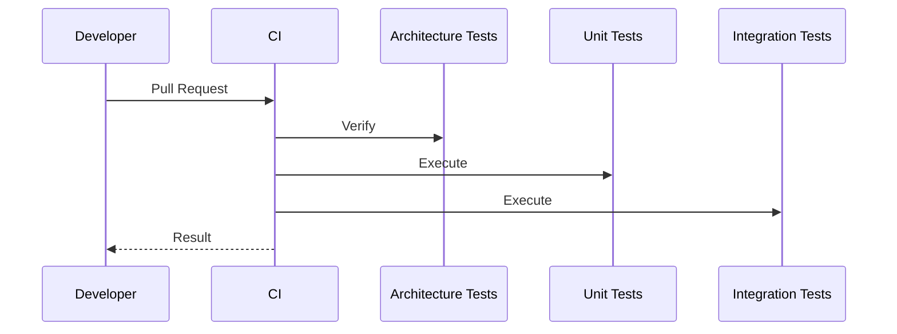
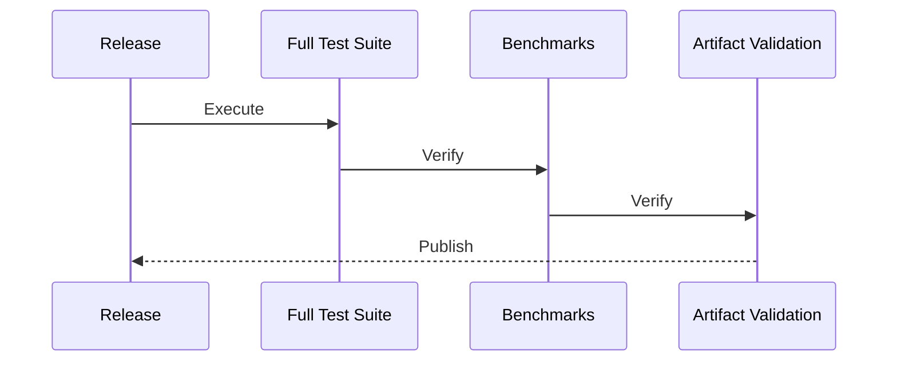
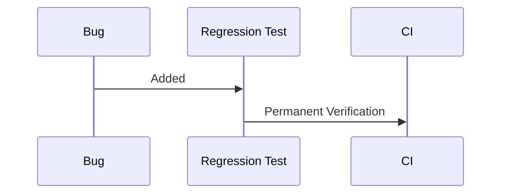

# ADR-012 — Testing, Contract Verification & Quality Gates

**Status:** Accepted

**Version:** 1.0

**Date:** 2026-07-02

**Project:** GitBridge

**Authors:** GitBridge Architecture Team

**Related ADRs**

- ADR-003 — Package Architecture
- ADR-005 — Provider Architecture
- ADR-008 — Error Model
- ADR-009 — Caching
- ADR-010 — Observability
- ADR-011 — Type System
- ADR-013 — Build & Release

---

# 1. Context

Testing is not merely an implementation concern.

For GitBridge, testing verifies that:

- architectural boundaries remain intact,
- provider implementations satisfy contracts,
- public APIs remain compatible,
- performance does not regress,
- future contributors can evolve the project safely.

Testing therefore forms part of GitBridge's architectural governance.

---

# 2. Decision

GitBridge adopts a **multi-layer verification architecture**.

Verification consists of:

- Architecture Tests
- Unit Tests
- Integration Tests
- Provider Contract Tests
- API Compatibility Tests
- Type Tests
- Performance Tests
- Regression Tests
- End-to-End Tests

Every layer validates a different architectural concern.

---

# 3. Testing Philosophy

Correctness means:

- producing correct results,
- preserving public contracts,
- maintaining architectural boundaries,
- remaining deterministic,
- preserving backward compatibility.

Coverage percentage is not a primary objective.

Confidence is.

---

## Architectural Principles

GitBridge follows these principles.

1. Tests verify architecture.
2. Public contracts are automatically validated.
3. Providers prove compliance through certification.
4. Tests remain deterministic.
5. No unnecessary network dependency.
6. Quality gates prevent regressions.

---

# 4. Overall Testing Architecture

```mermaid
flowchart TD

Architecture Tests

↓

Unit Tests

↓

Integration Tests

↓

Provider Contract Tests

↓

API Compatibility Tests

↓

Performance Tests

↓

End-to-End Tests
```

Each layer validates progressively larger portions of the runtime.

---

# 5. Testing Pyramid

GitBridge emphasizes fast deterministic tests.

Approximate distribution:

```text
Architecture Tests      ███████

Unit Tests              ███████████████████

Integration Tests       ████████

Contract Tests          ███████

Type Tests              ██████

Performance Tests       ███

End-to-End Tests        ██
```

Fast feedback is prioritized over exhaustive E2E coverage.

---

# 6. Unit Testing

Unit tests verify isolated behavior.

Characteristics:

- deterministic,
- fast,
- independent,
- repeatable.

Unit tests should never require:

- network,
- filesystem,
- real provider SDKs.

---

## Mocking Strategy

Mock:

- Provider interfaces,
- Transport contracts,
- Authentication strategies,
- Cache providers.

Avoid mocking domain models.

Value Objects remain real immutable objects.

---

# 7. Architecture Tests

Architecture Tests are a first-class testing category.

They automatically verify the architectural rules established by ADR-003 through ADR-005.

Examples include:

- import rules,
- layer boundaries,
- package dependencies,
- dependency direction,
- visibility constraints.

---

## Examples

Architecture Tests verify rules such as:

```text
Core

×

Provider
```

```text
Provider

×

Transport Internals
```

```text
Public API

×

Internal Types
```

Violations fail CI immediately.

Architecture Tests protect long-term maintainability.

---

# 8. Provider Contract Testing

Provider Contract Tests certify every provider implementation.

Every provider must prove compliance with the Provider Contract defined in ADR-005.

Certification validates:

- required capabilities,
- optional capabilities,
- error translation,
- pagination,
- authentication,
- diagnostics,
- transport behavior.

---

## Optional Capabilities

Optional features remain discoverable.

Contract tests verify:

- capability advertisement,
- correct unsupported behavior,
- compatibility with Core abstractions.

Providers never fake unsupported capabilities.

---

# 9. Contract Test Kit

GitBridge provides a reusable Contract Test Kit.

Example:

```text
Provider

↓

Contract Test Kit

↓

Certification Result
```

Official providers and community providers use the same certification framework.

---

## Versioning

The Contract Test Kit is itself a public contract.

It follows Semantic Versioning.

Example:

```text
Contract Test Kit v1

↓

Provider Compatible
```

Future revisions:

```text
Contract Test Kit v2
```

must preserve compatibility expectations according to SemVer.

---

# 10. Internal Dependency Graph

```mermaid
flowchart TD

Architecture Tests

↓

Unit Tests

↓

Integration Tests

↓

Provider Certification

↓

CI Pipeline
```

Each verification layer depends only on lower-level contracts.

---

# 11. Architectural Constraints

1. Every provider passes Contract Tests.
2. Architecture Tests execute on every pull request.
3. Unit tests never require network access.
4. Public contracts require compatibility verification.
5. Tests remain deterministic.
6. Contract Test Kit follows Semantic Versioning.
7. Provider certification is reusable.
8. Test infrastructure remains provider-neutral.
9. Architecture violations fail CI.
10. Testing reinforces accepted ADRs.

---

# 12. Integration Testing

Integration tests verify interactions between architectural layers.

Unlike unit tests, they exercise multiple collaborating components while still remaining deterministic.

Examples include:

- Core ↔ Provider integration
- Provider ↔ Transport integration
- Authentication ↔ ProviderSession
- Cache ↔ Capability interaction
- Error translation
- Observability event emission

Integration tests may use:

- fake providers,
- mock transports,
- local repositories,
- deterministic fixtures.

They should avoid relying on external network services wherever practical.

---

# 13. End-to-End Testing

End-to-End (E2E) tests validate the complete GitBridge runtime against real provider environments.

Supported targets include:

- GitHub
- GitLab
- Local Provider
- Mock Provider

Future:

- Azure DevOps
- Gitea
- Bitbucket

---

## Execution Strategy

E2E tests are intentionally limited.

They execute:

- nightly,
- before releases,
- on-demand.

They do **not** execute for every pull request.

This keeps contributor feedback fast while still validating real-world behavior.

---

# 14. API Compatibility Testing

Public compatibility is automatically verified.

Compatibility testing covers:

- exported APIs,
- public type declarations,
- serialized models,
- documented behavior.

---

## API Diffing

Every release compares the current public API against the previous stable release.

Detected breaking changes require:

- explicit approval,
- Semantic Versioning validation,
- updated migration guidance.

Undocumented breaking changes fail the release pipeline.

---

# 15. Type Testing

TypeScript types are part of GitBridge's public API.

Type tests verify:

- IntelliSense,
- generic inference,
- overload resolution,
- compile-time failures,
- conditional type behavior.

Type regressions are treated as API regressions.

---

## Goals

Type tests ensure that consumers experience predictable compile-time behavior across releases.

---

# 16. Performance Testing

Performance is continuously measured.

Verification includes:

- latency,
- allocation counts,
- memory usage,
- streaming throughput,
- large repository traversal,
- cache efficiency.

---

## Baselines

Benchmarks compare against the **previous stable release**, not the previous commit.

This minimizes CI noise and highlights meaningful regressions.

---

## Thresholds

Performance regressions beyond agreed thresholds require investigation before release.

---

# 17. Regression Testing

Every confirmed bug becomes a permanent regression test.

Regression suites prevent historical failures from reappearing.

---

## Golden Repositories

GitBridge maintains multiple reference repositories representing different usage patterns.

Examples:

- Small Repository
- Large Repository
- Binary Repository
- Monorepo
- Unicode Repository
- Huge History Repository

Future additions include:

- Submodule Repository
- Git LFS Repository

Golden repositories provide deterministic datasets for regression testing.

---

## Snapshot Testing

Snapshot tests are used selectively.

Appropriate targets include:

- serialized value models,
- generated documentation,
- diagnostics output,
- machine-readable artifacts.

Snapshot tests must **never** verify:

- implementation objects,
- internal runtime state,
- random output,
- transient values.

Snapshot abuse is intentionally discouraged.

---

# 18. Mutation Testing

Mutation testing measures the quality of the test suite itself.

GitBridge treats mutation testing as:

- optional,
- nightly,
- non-release-blocking.

Mutation testing provides valuable feedback but is too expensive for every pull request.

---

# 19. Consumer Compatibility

GitBridge maintains representative consumer applications.

Examples:

```text
examples/

├── basic-node
├── browser
├── cli
├── nextjs
└── custom-provider
```

Every release compiles these applications.

This verifies that public APIs remain usable by real consumers.

---

# 20. Quality Gates

Every release must satisfy mandatory quality gates.

Required gates include:

- successful build,
- formatting,
- linting,
- Architecture Tests,
- Unit Tests,
- Integration Tests,
- Provider Contract Tests,
- Type Tests,
- API Compatibility Tests,
- documentation validation.

Release candidates additionally require:

- E2E validation,
- benchmark verification.

---

# 21. Continuous Integration

GitBridge follows a layered CI strategy.

---

## Pull Requests

Fast validation:

- build,
- lint,
- Architecture Tests,
- Unit Tests,
- Integration Tests,
- Type Tests.

---

## Nightly

Extended validation:

- E2E,
- mutation testing,
- large repository benchmarks,
- future Node versions,
- TypeScript beta.

---

## Release

Full verification:

- complete test suite,
- performance verification,
- documentation validation,
- package verification,
- artifact validation.

---

# 22. Test Infrastructure

Shared infrastructure includes:

- fake providers,
- mock transports,
- repository fixtures,
- Golden Repositories,
- reusable assertions,
- Contract Test Kit.

Infrastructure itself remains provider-neutral.

---

# 23. Sequence Diagrams

## Provider Certification



---

## Pull Request Validation



---

## Release Pipeline



---

## Regression Flow



---

# 24. Architectural Consequences

## Benefits

The testing architecture provides:

- deterministic verification,
- provider certification,
- architectural enforcement,
- public API stability,
- performance visibility,
- long-term maintainability.

---

## Trade-offs

The architecture introduces:

- additional CI complexity,
- larger test infrastructure,
- provider certification overhead.

These trade-offs intentionally prioritize confidence over simplicity.

---

# 25. Alternatives Considered

## Network-Based Unit Tests

**Rejected**

Reason:

Unit tests must remain deterministic and fast.

---

## Coverage Percentage Targets

**Rejected**

Reason:

Coverage is an imperfect proxy for confidence.

GitBridge prioritizes architectural verification instead.

---

## Snapshot Everything

**Rejected**

Reason:

Snapshot overuse produces brittle tests with poor diagnostic value.

---

## Performance Tests on Every Pull Request

**Rejected**

Reason:

Expensive benchmarks significantly slow contributor feedback.

Nightly execution provides a better balance.

---

# 26. References

This ADR defines the testing architecture of GitBridge.

Related documents:

- ADR-003 — Package Architecture
- ADR-005 — Provider Architecture
- ADR-008 — Error Model
- ADR-009 — Caching
- ADR-010 — Observability
- ADR-011 — Type System
- ADR-013 — Build & Release

---

# ADR Summary

ADR-012 establishes the testing, verification, and quality architecture of GitBridge.

It defines:

- Architecture Tests as first-class verification,
- deterministic unit testing,
- provider certification through a reusable Contract Test Kit,
- integration and end-to-end testing,
- API and type compatibility verification,
- performance benchmarking,
- regression testing,
- classified Golden Repositories,
- mutation testing,
- consumer compatibility verification,
- layered CI quality gates,
- architectural constraints.

The central architectural principle is:

> **Testing is an architectural capability that continuously verifies GitBridge's contracts, boundaries, compatibility, and long-term maintainability. Confidence comes from layered verification rather than coverage alone, ensuring every release preserves architectural integrity and developer trust.**