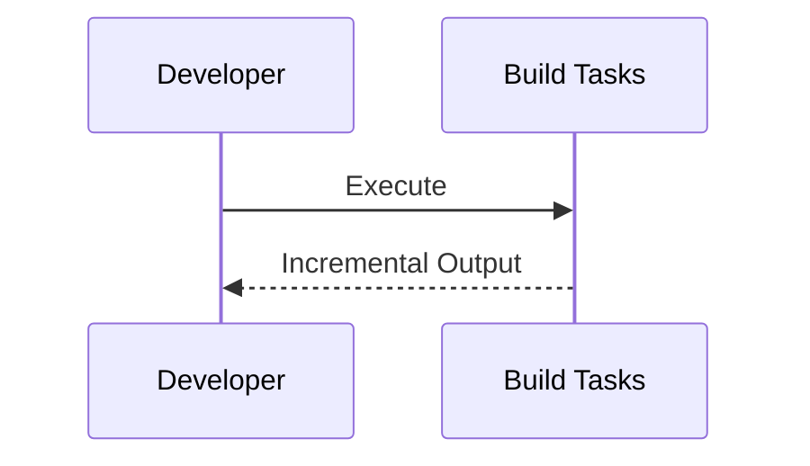
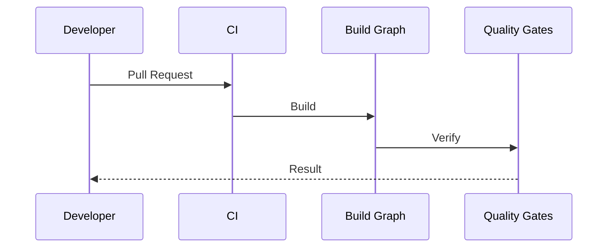
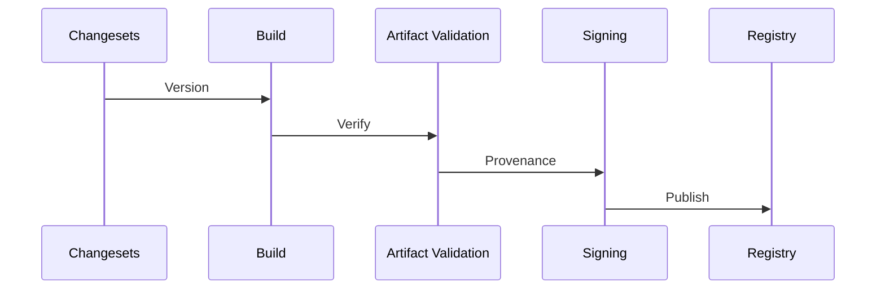
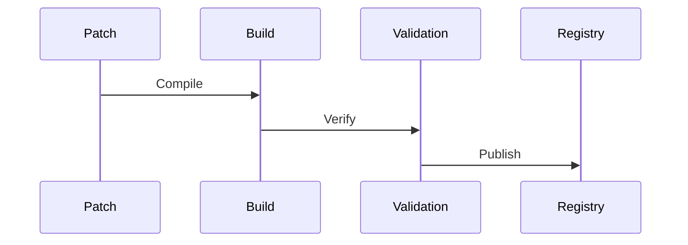

# ADR-013 — Build System, Packaging, Versioning & Release Engineering

**Status:** Accepted

**Version:** 1.0

**Date:** 2026-07-02

**Project:** GitBridge

**Authors:** GitBridge Architecture Team

**Related ADRs**

- ADR-003 — Package Architecture
- ADR-011 — Type System & Public Contracts
- ADR-012 — Testing & Quality Gates
- ADR-015 — Governance

---

# 1. Context

GitBridge is designed as a long-lived open-source ecosystem consisting of multiple packages that evolve together.

The build and release architecture must support:

- deterministic builds,
- reproducible releases,
- excellent local development,
- automated publishing,
- strong supply-chain guarantees,
- long-term maintainability.

Build engineering is therefore treated as an architectural concern rather than a tooling detail.

---

# 2. Decision

GitBridge adopts a **lockstep-versioned pnpm monorepo** with task-oriented build orchestration.

The architecture emphasizes:

- deterministic outputs,
- incremental builds,
- reproducible artifacts,
- stable package boundaries,
- automated release engineering.

Implementation tooling remains replaceable.

---

# 3. Build Philosophy

The build system exists to reliably transform source code into production-ready artifacts.

It should:

- remain deterministic,
- minimize developer feedback time,
- scale with package count,
- integrate with CI,
- support future tooling changes.

The architecture depends on **build tasks**, not a specific build tool.

---

## Architectural Principles

1. Deterministic outputs.
2. Reproducible builds.
3. Lockstep package versioning.
4. Build graph mirrors package graph.
5. Tooling remains replaceable.
6. Build pipelines reinforce architectural boundaries.

---

# 4. Monorepo Build Architecture

GitBridge is organized as a **multi-package monorepo** managed with **pnpm workspaces**.

Task orchestration is abstracted behind build tasks.

Current implementation recommendation:

- pnpm
- Turborepo

Future replacements (e.g., Nx) should not require architectural changes.

---

## Build Graph

```mermaid
flowchart TD

Source

↓

Package Graph

↓

Build Graph

↓

Artifacts

↓

Validation

↓

Publication
```

The build graph always follows package dependency direction.

---

# 5. Package Strategy

Packages are divided into four stability categories.

### Stable

Long-term supported public packages.

Examples:

- `gitbridge`
- `@gitbridge/core`
- `@gitbridge/provider-github`

---

### Preview

Public packages that may evolve before full stabilization.

---

### Experimental

Opt-in packages with no compatibility guarantees.

---

### Internal

Packages never intended for direct consumer use.

Examples:

- `@gitbridge/internal-build`
- `@gitbridge/internal-testing`

Internal packages are never documented as public APIs.

---

# 6. Package Exports

Every exported symbol must have a clearly defined owner package.

Export ownership prevents accidental re-export sprawl.

---

## Export Principles

- expose only documented APIs,
- avoid deep imports,
- prefer explicit exports,
- preserve tree shaking.

Consumers import from stable package entry points only.

---

## Subpath Exports

Subpath exports may be introduced when they improve discoverability without exposing implementation details.

Private modules remain inaccessible.

---

# 7. Module Format Strategy

GitBridge publishes **dual ESM/CJS packages**.

Reasons:

- modern ecosystem compatibility,
- Node.js interoperability,
- bundler support,
- gradual ecosystem transition.

CJS-only is rejected.

ESM-only may become viable in a future major release.

---

# 8. Type Declaration Strategy

Every public package ships:

- `.d.ts`,
- declaration maps,
- source maps.

Declarations are generated directly from public contracts defined in ADR-011.

Internal implementation types are excluded from published artifacts.

---

# 9. Internal Dependency Graph

```mermaid
flowchart TD

Packages

↓

Build Tasks

↓

Artifacts

↓

Verification

↓

Publication
```

The build system orchestrates package relationships but never changes architectural dependencies.

---

# 10. Architectural Constraints

1. Build outputs are deterministic.
2. Package graph defines build order.
3. Public packages expose only documented APIs.
4. Internal packages are never consumed directly.
5. Every exported symbol has an owner package.
6. Build tooling remains replaceable.
7. Type declarations mirror public contracts.
8. Package formats remain consistent.
9. Build artifacts remain reproducible.
10. Build architecture reinforces ADR-003 package boundaries.

---

# 11. Versioning Strategy

GitBridge follows **Semantic Versioning (SemVer)** for all public packages.

During the initial evolution of the ecosystem, all public packages use **lockstep versioning**.

Example:

```text
gitbridge                    1.2.0
@gitbridge/core              1.2.0
@gitbridge/provider-github   1.2.0
@gitbridge/testing           1.2.0
```

Lockstep versioning simplifies:

- documentation,
- issue reporting,
- dependency management,
- compatibility guarantees,
- contributor onboarding.

Independent package versioning may be considered only when it provides measurable benefits.

---

## Release Channels

GitBridge supports progressive release channels.

```text
Canary

↓

Alpha

↓

Beta

↓

Release Candidate

↓

Stable

↓

LTS (Future)
```

Purpose of each stage:

| Channel | Purpose |
|----------|----------|
| Canary | Continuous validation from the latest main branch |
| Alpha | Early feature validation |
| Beta | Feature-complete testing |
| Release Candidate | Final validation before stable |
| Stable | Production-ready release |
| LTS | Long-term supported maintenance branch (future) |

---

# 12. Release Management

GitBridge automates release engineering wherever practical.

Release workflow:

```text
Changesets

↓

Version Calculation

↓

Artifact Generation

↓

Artifact Validation

↓

Artifact Signing / Provenance

↓

Publication
```

Each stage has a clearly defined responsibility.

---

## Changesets

Changesets provide:

- version calculation,
- changelog generation,
- release planning,
- package coordination.

They serve as the canonical source for release intent.

---

# 13. Dependency Governance

Dependencies are treated as architectural decisions.

Every runtime dependency must have a documented justification.

A dedicated document records:

- dependency purpose,
- architectural owner,
- replacement considerations.

---

## Dependency Categories

GitBridge classifies dependencies as:

- Runtime
- Development
- Peer
- Optional

Runtime dependencies are minimized aggressively.

---

## Version Policy

Recommendations:

- prefer exact major compatibility,
- avoid unnecessary version ranges,
- update regularly,
- audit continuously.

---

# 14. Build Performance

Developer feedback time is a key metric.

Optimization strategies include:

- incremental builds,
- local caching,
- remote caching (future),
- parallel execution,
- package graph optimization.

The architecture optimizes task execution rather than tool-specific behavior.

---

# 15. CI/CD Integration

Build engineering integrates directly with ADR-012.

Every pull request verifies:

- compilation,
- formatting,
- linting,
- Architecture Tests,
- unit tests,
- integration tests.

Release pipelines additionally verify:

- package integrity,
- API compatibility,
- performance baselines,
- documentation.

---

# 16. Artifact Quality

Every published artifact must satisfy minimum quality requirements.

Artifacts include:

- compiled JavaScript,
- type declarations,
- source maps,
- declaration maps,
- README,
- LICENSE,
- package metadata.

---

## Tree Shaking

Public packages should be tree-shakeable wherever practical.

Packages must accurately declare:

```text
sideEffects
```

to maximize bundler optimization.

---

# 17. Build Manifest

Every release generates a machine-readable manifest.

Example:

```text
build-manifest.json
```

Contents include:

- package versions,
- Git commit,
- build timestamp,
- Node.js version,
- TypeScript version,
- Changeset identifiers,
- artifact hashes.

The manifest improves:

- reproducibility,
- debugging,
- provenance,
- support.

---

# 18. Long-Term Maintenance

GitBridge favors predictable long-term evolution.

Policies include:

- documented Node.js support,
- deprecation lifecycle,
- migration guides,
- package retirement strategy,
- compatibility windows.

Future LTS releases may extend support beyond the standard cadence.

---

# 19. Supply Chain & Provenance

Release security is a first-class concern.

Every release should support:

- npm provenance,
- package signing,
- dependency auditing,
- SBOM generation,
- license verification,
- artifact integrity checks.

Supply-chain verification integrates into the release pipeline rather than individual packages.

---

# 20. Sequence Diagrams

## Local Development



---

## Pull Request



---

## Stable Release



---

## Hotfix Release



---

# 21. Architectural Consequences

## Benefits

The build architecture provides:

- deterministic builds,
- reproducible artifacts,
- simplified package management,
- reliable release automation,
- long-term maintainability.

---

## Trade-offs

The architecture introduces:

- lockstep version coordination,
- release governance,
- build infrastructure complexity.

These trade-offs intentionally prioritize ecosystem stability over short-term flexibility.

---

# 22. Alternatives Considered

## Independent Package Versioning

**Rejected (for now)**

Reason:

Introduces unnecessary compatibility matrices and documentation complexity during early project growth.

---

## ESM Only

**Rejected**

Reason:

Dual ESM/CJS support provides better ecosystem compatibility today.

---

## Tool-Coupled Build Architecture

**Rejected**

Reason:

The architecture depends on build tasks rather than Turborepo-specific concepts, allowing future tooling replacement.

---

## Undocumented Runtime Dependencies

**Rejected**

Reason:

Every runtime dependency must have an explicit architectural justification.

---

# 23. References

This ADR defines the build, packaging, and release engineering architecture of GitBridge.

Related documents:

- ADR-003 — Package Architecture
- ADR-011 — Type System & Public Contracts
- ADR-012 — Testing & Quality Gates
- ADR-015 — Governance

---

# ADR Summary

ADR-013 establishes the build and release engineering architecture of GitBridge.

It defines:

- lockstep package versioning,
- progressive release channels,
- package stability levels,
- task-oriented build architecture,
- deterministic build outputs,
- explicit export ownership,
- dual ESM/CJS publishing,
- dependency governance,
- artifact quality standards,
- build manifests,
- supply-chain verification,
- long-term maintenance policies,
- architectural constraints.

The central architectural principle is:

> **Build and release engineering are architectural capabilities. GitBridge produces deterministic, reproducible, and verifiable artifacts through task-oriented build orchestration, lockstep versioning, disciplined dependency governance, and automated quality gates, ensuring a sustainable open-source ecosystem that can evolve confidently for years.**