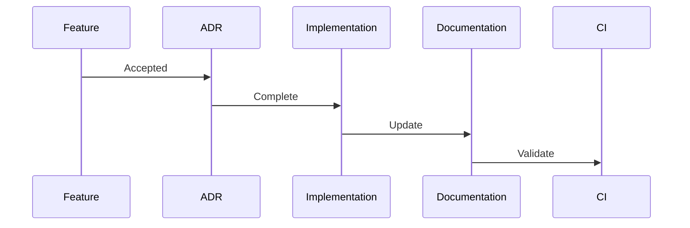
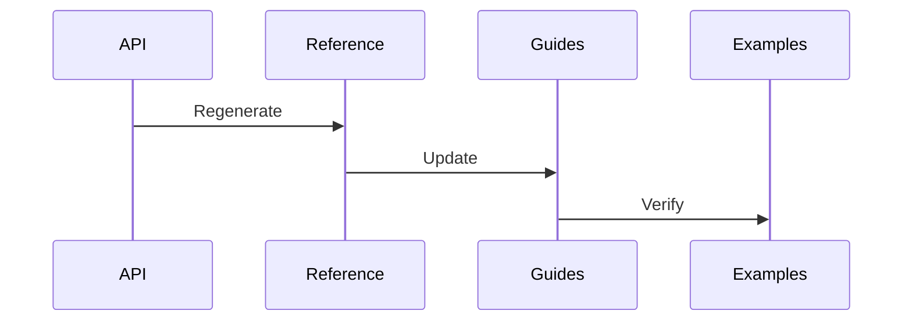
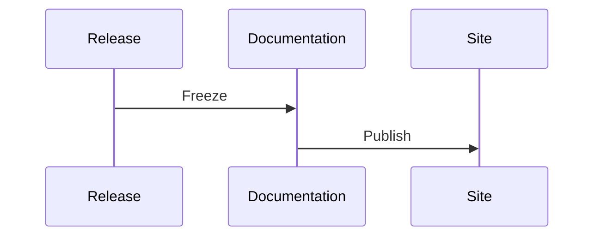
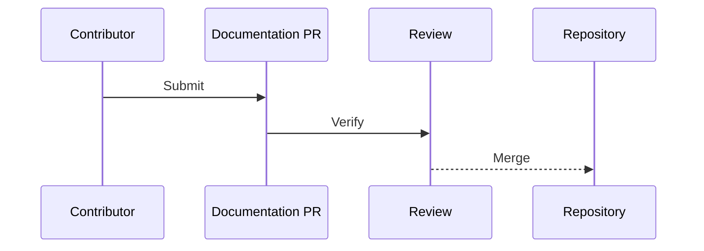

# ADR-014 — Documentation, Examples & Developer Experience

**Status:** Accepted

**Version:** 1.0

**Date:** 2026-07-02

**Project:** SourceAxis

**Authors:** SourceAxis Architecture Team

**Related ADRs**

- ADR-001 through ADR-013
- ADR-015 — Governance

---

# 1. Context

Documentation is a product feature.

For SourceAxis, documentation determines:

- onboarding experience,
- API discoverability,
- contributor productivity,
- architectural consistency,
- long-term maintainability.

Documentation is therefore treated as a first-class architectural artifact.

---

# 2. Decision

SourceAxis adopts a **documentation-first architecture**.

Documentation consists of multiple complementary layers rather than a single reference.

These layers evolve together with the codebase and are continuously verified.

---

# 3. Documentation Philosophy

Documentation should answer different questions for different audiences.

Examples:

- "How do I start?"
- "Why was this designed this way?"
- "How does this work internally?"
- "How do I contribute?"

No single document should attempt to answer every question.

---

## Architectural Principles

SourceAxis documentation follows these principles.

1. Documentation is part of the product.
2. Architecture is documented through ADRs.
3. Examples are executable documentation.
4. Documentation evolves with the code.
5. Generated documentation and handwritten guidance complement each other.
6. Documentation quality is enforced automatically.

---

# 4. Documentation Architecture

```mermaid
flowchart TD

README

↓

Getting Started

↓

Concepts

↓

Guides

↓

Tutorials

↓

API Reference

↓

Architecture

↓

ADRs
```

Each layer provides progressively deeper information.

---

# 5. Documentation Hierarchy

Learning progresses through clearly defined stages.

```text
Quick Start

↓

Concepts

↓

Guides

↓

Tutorials

↓

Cookbook

↓

API Reference

↓

Architecture

↓

ADRs
```

This progression minimizes cognitive overload while supporting advanced users.

---

# 6. Repository Documentation Structure

Recommended structure:

```text
docs/

├── architecture/
├── adr/
├── api/
├── concepts/
├── guides/
├── tutorials/
├── cookbook/
├── examples/
├── contributing/
├── migration/
└── reference/
```

Each directory has a single responsibility.

---

# 7. README Strategy

The root `README.md` serves as the project's landing page.

It should include:

- project overview,
- installation,
- quick start,
- key features,
- links to deeper documentation.

It intentionally omits detailed architectural discussions.

The README acts as a navigation hub rather than a complete manual.

---

# 8. Documentation Diagrams

Architecture diagrams are first-class documentation artifacts.

Core diagrams include:

- System Overview
- Package Dependency Graph
- Request Lifecycle
- Provider Architecture
- Authentication Flow
- Transport Pipeline
- Error Flow
- Cache Architecture
- Observability Flow

Diagrams are version-controlled and reviewed with the same rigor as code.

Mermaid is the preferred format.

---

# 9. ARCHITECTURE.md

`ARCHITECTURE.md` is **not** an independent design document.

It is a concise architectural guide **derived from accepted ADRs**.

It summarizes:

- system structure,
- runtime architecture,
- package relationships,
- extension points,
- architectural principles.

Architectural decisions remain authoritative only in ADRs.

This prevents architectural drift.

---

# 10. Internal Dependency Graph

```mermaid
flowchart TD

README

↓

Guides

↓

API Reference

↓

ARCHITECTURE.md

↓

Accepted ADRs
```

Documentation flows from stable architectural decisions.

---

# 11. Architectural Constraints

1. Documentation never contradicts accepted ADRs.
2. `ARCHITECTURE.md` is derived from ADRs.
3. Diagrams are version-controlled artifacts.
4. README remains concise.
5. Examples use public APIs only.
6. Documentation evolves with the codebase.
7. Every documentation section has a defined audience.
8. Architecture discussions belong in ADRs.
9. Guides reference API documentation rather than duplicating it.
10. Documentation quality is enforced through CI.

---

# 12. API Reference

SourceAxis adopts a **hybrid API documentation strategy**.

Documentation is divided into two complementary parts.

## Generated Documentation

Generated documentation is responsible for:

- API surface,
- function signatures,
- parameters,
- return types,
- type definitions,
- package exports.

This documentation is produced automatically from the public contracts defined in ADR-011.

---

## Handwritten Documentation

Handwritten documentation explains:

- architectural concepts,
- design rationale,
- best practices,
- common workflows,
- usage guidance.

Generated documentation should **never** attempt to explain architecture.

Those explanations belong in:

- Concepts
- Guides
- Tutorials
- Architecture documentation

---

# 13. Example Applications

Examples are executable documentation.

Every example must:

- compile,
- use only public APIs,
- remain synchronized with the latest release.

---

## Example Maturity Levels

Examples are classified by experience level.

### Beginner

Introduces basic concepts.

Examples:

- Opening a repository
- Reading a file
- Listing a directory

---

### Intermediate

Combines multiple capabilities.

Examples:

- Repository traversal
- Search
- Authentication
- Caching

---

### Advanced

Demonstrates architectural extension.

Examples:

- Custom Provider
- Middleware
- Diagnostics
- Streaming

---

### Reference Applications

SourceAxis maintains at least one real-world consumer application.

This validates that the public API remains practical outside of isolated examples.

The specific application may evolve over time.

---

# 14. Tutorials & Cookbook

Learning content is organized by purpose.

## Tutorials

Teach concepts progressively.

Goal:

Learning.

---

## Cookbook

Provides reusable recipes.

Goal:

Problem solving.

Examples:

- Authenticate with GitHub
- Read a README
- Traverse a repository tree
- Download binary files

---

## Best Practices

Documents recommended usage patterns.

---

## Anti-patterns

Highlights common mistakes.

---

## Migration Guides

Explain changes between major versions.

---

# 15. Contributor Experience

Contributor documentation should minimize onboarding time.

Topics include:

- local development,
- repository structure,
- architectural overview,
- coding standards,
- testing workflow,
- release workflow,
- ADR process.

Architecture should be understandable before implementation details.

---

# 16. Documentation Quality

Documentation quality is continuously verified.

Mandatory quality gates include:

- link validation,
- example compilation,
- API synchronization,
- version consistency,
- documentation build.

---

## Documentation Review Checklist

Every documentation pull request should satisfy:

- ✓ Compiles successfully
- ✓ Uses public APIs only
- ✓ Matches the current release
- ✓ References relevant ADRs where appropriate
- ✓ Avoids duplicated content
- ✓ Clearly identifies the target audience

---

# 17. Documentation Versioning

Documentation evolves with the codebase.

Versioned documentation includes:

- API reference,
- migration guides,
- release notes,
- breaking changes.

Stable releases preserve corresponding documentation.

Older documentation remains accessible when practical.

---

# 18. Documentation Tooling

Recommended tooling includes:

- Markdown,
- Mermaid,
- static site generation,
- API generation,
- search indexing.

Future enhancements may include:

- interactive playgrounds,
- live code execution,
- embedded examples.

Tooling integrates into CI through ADR-012 quality gates.

---

# 19. Community Contributions

Community documentation follows the same review standards as code.

Responsibilities include:

- accuracy,
- consistency,
- clarity,
- maintainability.

Every documentation contribution undergoes architectural review when appropriate.

---

## Ownership

Documentation ownership follows package ownership.

Architecture documentation requires architecture review.

---

# 20. Cross-Linking Strategy

Documents form a navigable learning graph.

Typical progression:

```text
README

↓

Getting Started

↓

Concepts

↓

Guides

↓

API Reference

↓

Architecture

↓

Relevant ADR
```

Readers should always have a clear path toward deeper information.

---

# 21. Documentation Search

Documentation search should prioritize conceptual learning over keyword density.

Recommended ranking:

1. Concepts
2. Guides
3. Tutorials
4. Cookbook
5. API Reference
6. Architecture
7. ADRs

This aligns better with developer learning workflows.

---

# 22. Documentation Lifecycle

## New Feature



---

## API Change



---

## Release



---

## Contributor Documentation Update



---

# 23. Architectural Consequences

## Benefits

The documentation architecture provides:

- progressive learning,
- strong discoverability,
- executable examples,
- architectural consistency,
- contributor friendliness,
- long-term maintainability.

---

## Trade-offs

The architecture introduces:

- documentation maintenance,
- automated validation,
- documentation ownership.

These trade-offs intentionally prioritize documentation quality over short-term convenience.

---

# 24. Alternatives Considered

## Handwritten API Documentation Only

**Rejected**

Reason:

Manual API documentation inevitably drifts from the implementation.

---

## Generated Documentation Only

**Rejected**

Reason:

Generated documentation lacks conceptual explanations and architectural guidance.

---

## Examples Without Classification

**Rejected**

Reason:

Experience-level classifications improve discoverability and onboarding.

---

## Independent ARCHITECTURE.md

**Rejected**

Reason:

Architectural summaries must be derived from accepted ADRs to prevent drift.

---

# 25. References

This ADR defines the documentation architecture of SourceAxis.

Related documents:

- ADR-001 through ADR-013
- ADR-015 — Governance

---

# ADR Summary

ADR-014 establishes the documentation and developer experience architecture of SourceAxis.

It defines:

- layered documentation,
- hybrid API documentation,
- executable examples,
- example maturity levels,
- architecture diagrams as first-class artifacts,
- contributor documentation,
- documentation quality gates,
- documentation versioning,
- cross-linking strategy,
- search prioritization,
- architectural constraints.

The central architectural principle is:

> **Documentation is part of the product. SourceAxis communicates through layered, executable, continuously verified documentation where accepted ADRs remain the architectural source of truth, `ARCHITECTURE.md` provides a derived system overview, and every example, guide, and API reference works together to create a coherent developer experience that scales with the ecosystem.**
