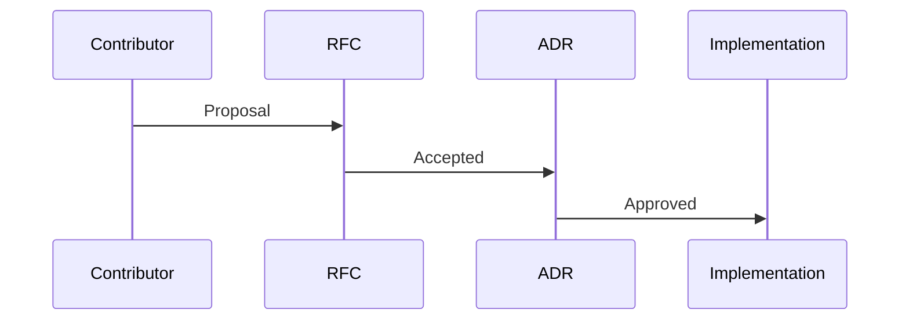
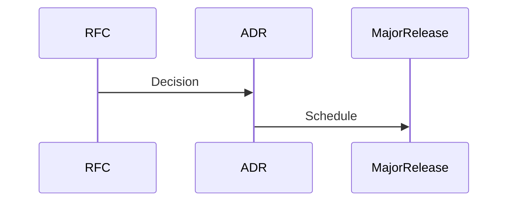
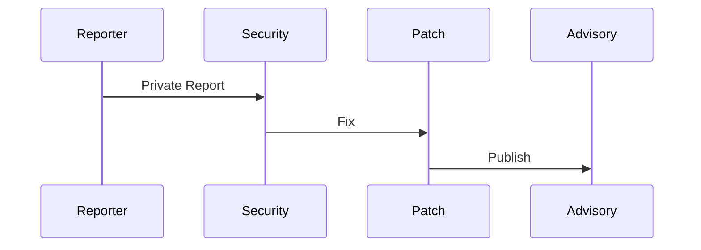
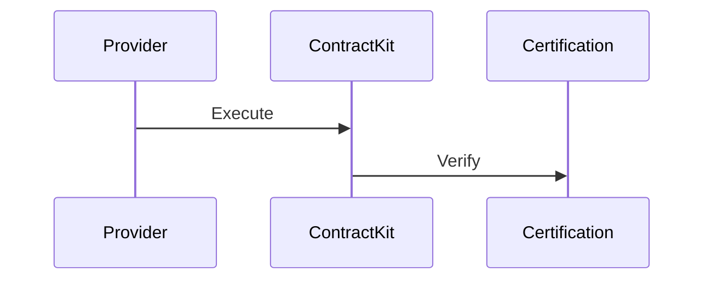
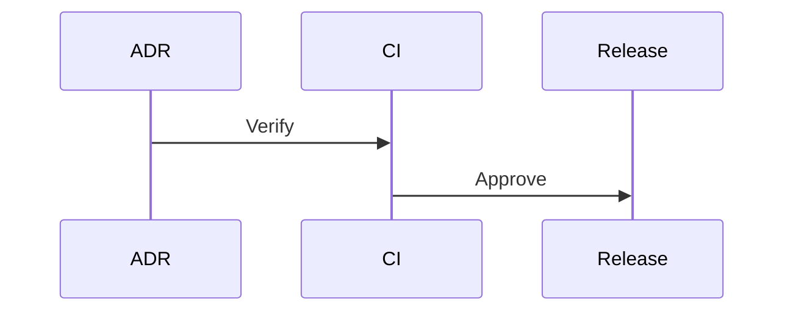

# ADR-015 — Security, Compatibility & Long-Term Evolution

**Status:** Accepted

**Version:** 1.0

**Date:** 2026-07-02

**Project:** RepoFerry

**Authors:** RepoFerry Architecture Team

**Related ADRs**

- ADR-001 through ADR-014

---

# 1. Context

RepoFerry is designed to become a long-lived open-source ecosystem.

Long-term success depends not only on technical architecture but also on disciplined governance.

Without explicit governance:

- architecture drifts,
- compatibility erodes,
- contributor confidence decreases,
- technical debt accumulates.

This ADR defines the governance model for the project.

---

# 2. Decision

RepoFerry adopts an explicit governance model based on:

- accepted Architecture Decision Records,
- Semantic Versioning,
- architecture verification,
- security-first development,
- responsible evolution.

Governance is considered part of the architecture.

---

# 3. Governance Philosophy

Governance answers questions such as:

- Who makes architectural decisions?
- How do architectural changes occur?
- How are breaking changes approved?
- How is long-term quality preserved?

Governance protects architectural integrity while remaining welcoming to contributors.

---

## Architectural Principles

RepoFerry governance follows these principles.

1. Architecture evolves intentionally.
2. Public contracts remain stable.
3. Security is everyone's responsibility.
4. Breaking changes require explicit approval.
5. Documentation evolves with the architecture.
6. Architectural integrity is continuously verified.

---

# 4. Architecture Constitution

The accepted ADRs form the **Architecture Constitution** of RepoFerry.

```text
ADR-001

↓

ADR-002

↓

...

↓

ADR-015
```

Implementation must conform to the Constitution.

Architectural changes require:

- a new ADR, or
- an approved ADR amendment.

The Constitution provides the project's long-term architectural foundation.

---

# 5. Security Principles

Security is designed into the project from the beginning.

Core principles include:

- least privilege,
- secure defaults,
- dependency minimization,
- defense in depth,
- responsible disclosure,
- continuous auditing.

Security considerations influence every architectural layer.

---

## Secure Defaults

RepoFerry favors secure behavior by default.

Applications may opt into less restrictive behavior explicitly.

---

# 6. Public Compatibility Policy

RepoFerry provides compatibility guarantees for:

- public APIs,
- exported types,
- serialized value models,
- documented behavior,
- provider contracts,
- testing contracts.

Anything publicly documented becomes part of the compatibility contract.

---

## Breaking Changes

Examples of breaking changes include:

- removing public APIs,
- changing required fields,
- altering serialized contracts,
- changing documented semantics,
- removing provider capabilities.

Breaking changes require a major release.

---

# 7. Deprecation Policy

Public functionality progresses through clearly defined lifecycle stages.

```text
Experimental

↓

Preview

↓

Stable

↓

Deprecated

↓

Removed
```

Deprecation requires:

- documentation,
- migration guidance,
- advance notice,
- scheduled removal.

---

# 8. Security Response Process

RepoFerry follows responsible disclosure.

Workflow:

```text
Private Report

↓

Investigation

↓

Patch

↓

Security Advisory

↓

Public Disclosure
```

Critical vulnerabilities receive priority over feature development.

---

## SECURITY.md

RepoFerry maintains a dedicated `SECURITY.md`.

It documents:

- supported versions,
- reporting process,
- disclosure policy,
- expected response timelines.

---

# 9. Dependency Governance

Dependencies are continuously reviewed.

Evaluation includes:

- necessity,
- security,
- maintenance,
- licensing,
- ecosystem health.

Runtime dependencies receive the highest scrutiny.

Every runtime dependency must have documented architectural justification.

---

# 10. Internal Dependency Graph

```mermaid
flowchart TD

Architecture Constitution

↓

Governance

↓

Implementation

↓

Verification

↓

Release
```

Governance guides implementation rather than reacting to it.

---

# 11. Architectural Constraints

1. Accepted ADRs define the Architecture Constitution.
2. Architectural changes require new ADRs or approved amendments.
3. Public compatibility follows Semantic Versioning.
4. Security issues follow responsible disclosure.
5. Runtime dependencies require architectural justification.
6. Documentation reflects accepted ADRs.
7. Governance decisions remain transparent.
8. Compatibility guarantees are continuously verified.
9. Security is considered throughout the architecture.
10. Governance evolves through documented processes.

---

# 12. Provider Ecosystem Governance

RepoFerry distinguishes between multiple categories of providers.

## Official Providers

Official providers are maintained by the RepoFerry maintainers.

Examples include:

- GitHub
- GitLab
- Bitbucket
- Azure DevOps

Official providers must:

- pass the Provider Contract Test Kit,
- satisfy all Architecture Tests,
- follow Semantic Versioning,
- comply with every accepted ADR.

---

## Community Providers

Community providers are maintained outside the core project.

Examples:

- Gitea
- Gogs
- Forgejo
- Custom enterprise providers

Community providers remain independent but may voluntarily certify against the Provider Contract Test Kit.

Certification indicates compatibility—not project ownership.

---

## Experimental Providers

Experimental providers are intended for evaluation and feedback.

They carry no long-term compatibility guarantees until promoted.

---

## Provider Lifecycle

```text
Experimental

↓

Community

↓

Certified

↓

Official
```

---

# 13. Extension Ecosystem

RepoFerry is designed to support future extensions without modifying Core.

Potential extensions include:

- Providers
- Middleware
- Authentication strategies
- Cache providers
- Diagnostics exporters
- Documentation tooling

Extensions evolve independently while depending only on stable public contracts.

---

# 14. ADR Governance

Architecture Decision Records follow a defined lifecycle.

```text
Proposed

↓

Accepted

↓

Amended

↓

Superseded

↓

Deprecated

↓

Archived
```

### Lifecycle Definitions

| State | Meaning |
|--------|---------|
| Proposed | Draft under discussion |
| Accepted | Approved and authoritative |
| Amended | Updated without replacing the original decision |
| Superseded | Replaced by a newer ADR |
| Deprecated | No longer recommended for future work |
| Archived | Historical reference only |

Accepted ADRs are immutable except through documented amendments.

---

# 15. RFC Process

Major architectural or ecosystem changes begin with a Request for Comments (RFC).

The relationship is intentionally lightweight.

```text
Idea

↓

RFC

↓

Community Discussion

↓

ADR (if accepted)

↓

Implementation
```

Not every RFC becomes an ADR.

Not every ADR requires an RFC.

### RFC Guidance

RFC recommended:

- new provider architecture,
- plugin system,
- major public APIs,
- ecosystem-wide changes.

ADR directly:

- architectural clarifications,
- internal governance,
- minor structural improvements.

---

# 16. Community Governance

RepoFerry values transparent and collaborative decision making.

### Decision Levels

| Decision | Approval |
|-----------|----------|
| Documentation | Maintainer |
| Examples | Maintainer |
| Internal Refactoring | Package Owner |
| Public API | Architecture Review |
| Breaking Change | RFC → ADR → Major Release |
| Security Release | Security Maintainers |

Governance effort should be proportional to impact.

---

## Maintainer Responsibilities

Maintainers are responsible for:

- architecture stewardship,
- release quality,
- community support,
- security response,
- documentation accuracy.

---

## Contributor Expectations

Contributors should:

- follow accepted ADRs,
- use public APIs,
- preserve architectural boundaries,
- write appropriate tests,
- update documentation when required.

---

# 17. Long-Term Versioning Strategy

RepoFerry follows strict Semantic Versioning.

Long-term evolution emphasizes predictable change.

### Major Releases

Major releases may introduce breaking changes when justified by:

- architectural improvements,
- ecosystem evolution,
- security requirements.

Every breaking change requires:

- documented rationale,
- migration guide,
- release notes,
- compatibility analysis.

---

## Support Windows

Future LTS releases may provide extended support.

Normal releases prioritize forward evolution.

---

# 18. Architectural Integrity

Architectural integrity is continuously verified.

Protection mechanisms include:

- Architecture Tests,
- Package Boundary Tests,
- Dependency Rules,
- Contract Tests,
- Documentation synchronization,
- Public API verification.

Architecture is protected automatically—not solely through code review.

---

# 19. Release Governance

Releases follow a structured approval process.

```text
Implementation

↓

Quality Gates

↓

Architecture Verification

↓

Release Approval

↓

Publication
```

### Emergency Releases

Security patches may bypass feature schedules while still satisfying verification requirements.

---

## Release Audits

Before publication, releases verify:

- package integrity,
- API compatibility,
- documentation,
- architectural compliance,
- provenance,
- artifact validation.

---

# 20. Sustainability

RepoFerry is designed to outlive individual maintainers.

Key sustainability goals include:

- low bus factor,
- maintainer onboarding,
- knowledge preservation,
- documented processes,
- healthy contributor ecosystem.

Future funding models may support long-term maintenance without changing technical governance.

---

## Project Health

Project health is measured independently from code quality.

Examples include:

- release cadence,
- contributor growth,
- issue response time,
- documentation activity,
- community engagement.

---

## Code Quality

Code quality metrics include:

- architecture tests,
- coverage,
- benchmark regressions,
- API compatibility,
- documentation quality.

Separating these metrics provides a more accurate picture of project maturity.

---

# 21. Governance Lifecycle

## New Feature



---

## Breaking Change



---

## Security Vulnerability



---

## Provider Certification



---

## Major Release



---

# 22. Architectural Consequences

## Benefits

The governance architecture provides:

- long-term stability,
- transparent evolution,
- sustainable maintenance,
- architectural consistency,
- strong community trust,
- predictable compatibility.

---

## Trade-offs

The architecture introduces:

- additional review processes,
- governance documentation,
- formal decision workflows.

These trade-offs intentionally prioritize long-term sustainability over short-term speed.

---

# 23. Alternatives Considered

## Informal Governance

**Rejected**

Reason:

Large OSS projects require explicit decision-making processes.

---

## No ADR Process

**Rejected**

Reason:

Architectural knowledge would become fragmented and difficult to preserve.

---

## Independent Provider Governance

**Rejected**

Reason:

Official providers should follow the same architectural standards as the core ecosystem.

---

## Architecture by Convention

**Rejected**

Reason:

Explicit governance scales better than undocumented conventions.

---

# 24. References

This ADR defines the governance architecture of RepoFerry.

Related documents:

- ADR-001 through ADR-014

---

# ADR Summary

ADR-015 establishes the long-term governance model for RepoFerry.

It defines:

- the Architecture Constitution,
- security-first governance,
- compatibility guarantees,
- deprecation lifecycle,
- provider ecosystem governance,
- extension governance,
- RFC process,
- ADR lifecycle,
- community governance,
- release governance,
- sustainability strategy,
- architectural integrity verification.

## Architecture Freeze

With the acceptance of ADR-015, the architecture enters an **Architecture Freeze**.

From this point:

- implementation begins,
- accepted ADRs are considered stable,
- only critical architectural defects may modify accepted ADRs,
- enhancements become post-v1 ADRs.

Future architectural evolution continues through new ADRs.

Examples:

- ADR-016 — Offline Repository Support
- ADR-017 — Git LFS Support
- ADR-018 — GraphQL Provider
- ADR-019 — Plugin Marketplace

This preserves architectural history while enabling future evolution.

---

# Final Architecture Summary

The RepoFerry architecture is now fully defined through fifteen accepted Architecture Decision Records.

Together they establish:

- project vision,
- public API philosophy,
- package architecture,
- core runtime,
- provider model,
- authentication,
- transport,
- error semantics,
- caching,
- observability,
- public type system,
- testing strategy,
- build & release engineering,
- documentation architecture,
- governance.

These ADRs collectively form the **Architecture Constitution** of RepoFerry.

All implementation work must conform to this constitution unless superseded through the formal ADR process.

---

# Next Phase

The architecture phase is complete.

Recommended execution plan:

### Phase 1 — Architecture Freeze ✅

Lock ADR-001 through ADR-015 as version **1.0**.

### Phase 2 — Documentation Sprint

Generate:

- `ARCHITECTURE.md`
- ADR index
- documentation site structure
- architecture diagrams
- contributor architecture guide

### Phase 3 — Implementation Planning

Translate ADRs into an executable engineering backlog.

### Phase 4 — Milestone Planning

Define milestones from **v0.1** through **v1.0** with package-level deliverables.

### Phase 5 — Coding Phase

Begin implementation package-by-package, continuously validating against the Architecture Constitution and all established quality gates.